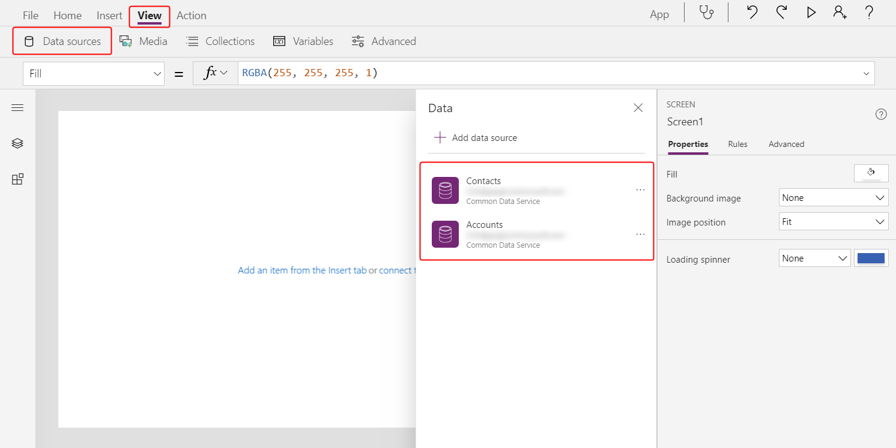
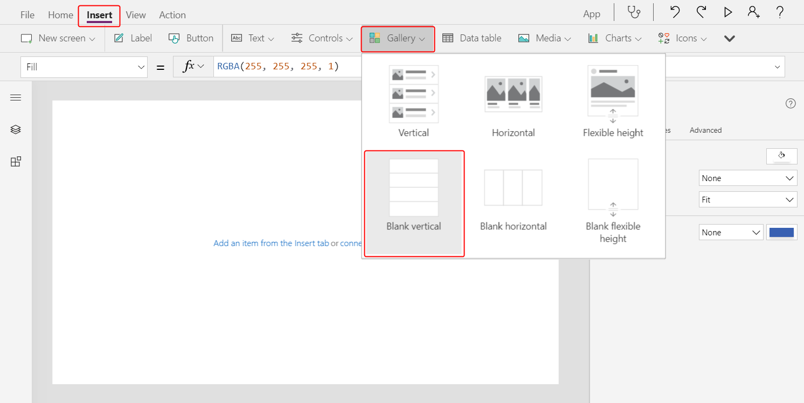
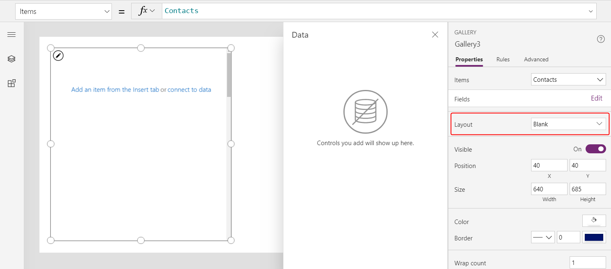
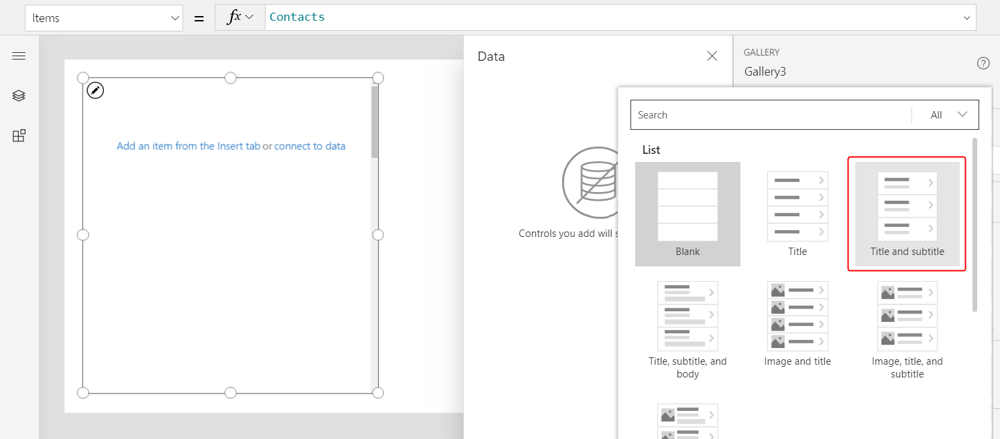
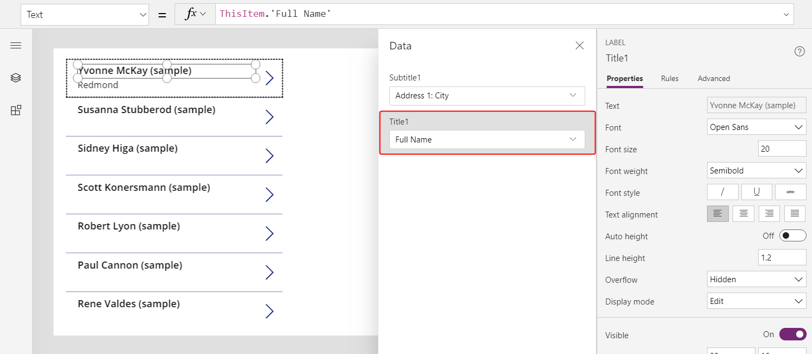
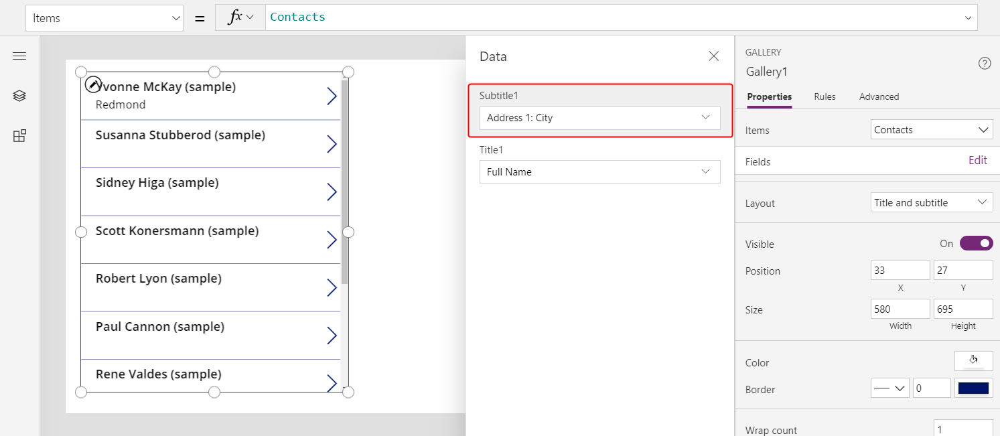
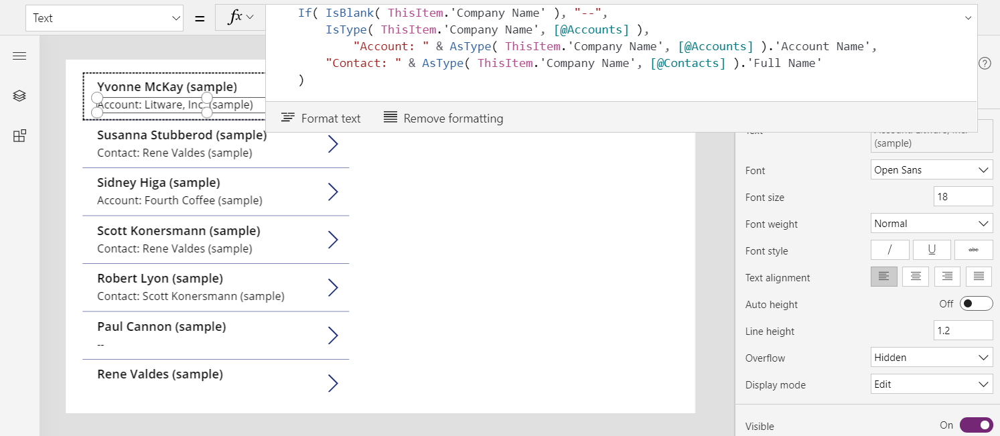

# AsType and IsType functions in Power Apps

Checks a record reference for a specific table type (**IsType**) and treats the reference as a specific type (**AsType**).

## Description

Read [Understand record references and polymorphic lookups](../working-with-references.md) for a broader introduction and more details.

A lookup field usually refers to records in a particular table. Because the table type is well established, you can access the fields of the lookup by using a simple dot notation. For example, **First( Accounts ).'Primary Contact'.'Full Name'** walks from the **Accounts** table to the **Primary Contact** record in the **Contacts** table and extracts the **Full Name** field.

Microsoft Dataverse also supports polymorphic lookup fields, which can refer to records from a set of tables, as in these examples.

| Lookup field | Can refer to |
|--------------|--------------|
| **Owner** | **Users** or **Teams** |
| **Customer** | **Accounts** or **Contacts** |
| **Regarding** | **Accounts**, **Contacts**, **Knowledge Articles**, etc. |

In canvas-app formulas, use record references to work with polymorphic lookups. Because a record reference can refer to different tables, you don't know which fields will be available when you write a formula. The *Record.Field* notation isn't available. Those formulas must adapt to the records that the app encounters when it runs.

The **IsType** function tests whether a record reference refers to a specific table type. The function returns a Boolean TRUE or FALSE.

The **AsType** function treats a record reference as a specific table type, sometimes referred to as *casting*. You can use the result as if it were a record of the table and again use the *Record.Field* notation to access all of the fields of that record. An error occurs if the reference isn't of the specific type.

Use these functions together to first test the table type of a record and then treat it as a record of that type so that the fields are available:

```powerapps-dot
If( IsType( First( Accounts ).Owner, Users ),
    AsType( First( Accounts ).Owner, Users ).'Full Name',
    AsType( First( Accounts ).Owner, Teams ).'Team Name'
)
```

You need these functions only if you're accessing the fields of a record reference. For example, you can use record references in the [**Filter**](function-filter-lookup.md) function without **IsType** or **AsType**:

```powerapps-dot
Filter( Accounts, Owner = First( Users ) )
```

Similarly, you can use record references with the [**Patch**](function-patch.md) function:

```powerapps-dot
Patch( Accounts, First( Accounts ), { Owner: First( Teams ) } )
```  

If used in a record context, such as within a [**Gallery**](../controls/control-gallery.md) or [**Edit form**](../controls/control-form-detail.md) control, you might need to use the [global disambiguation operator](operators.md#disambiguation-operator) to reference the table type. For example, this formula would be effective for a gallery that's displaying a list of contacts where **Company Name** is a **Customer** lookup:

```powerapps-dot
If( IsType( ThisItem.'Company Name', Accounts ),
    AsType( ThisItem.'Company Name', Accounts ).'Account Name',
    AsType( ThisItem.'Company Name', Contacts ).'Full Name'
)
```

For both functions, you specify the type through the name of the data source that's connected to the table. For the formula to work, you must also add a data source to the app for any types that you want to test or cast. For example, you must add the **Users** table as a data source if you want to use **IsType** and **AsType** with an **Owner** lookup and records from that table. You can add only the data sources that you actually use in your app; you don't need to add all the tables that a lookup could reference.

If the record reference is *blank*, **IsType** returns FALSE, and **AsType** returns *blank*. All fields of a *blank* record will be *blank*.

## Syntax

**AsType**( *RecordReference*, *TableType* )

- *RecordReference* - Required. A record reference, often a lookup field that can refer to a record in any of multiple tables.
- *TableType* - Required. The specific table for which to test.

**IsType**( *RecordReference*, *TableType* )

- *RecordReference* - Required. A record reference, often a lookup field that can refer to a record in any of multiple tables.
- *TableType* - Required. The specific table to which the record should be cast.

## Example

[Understand record references and polymorphic lookups](../working-with-references.md) contains extensive examples.

1. Create a blank canvas app for tablets.

1. On the left-pane, select **Data** > **Add data**. And then, add **Accounts** and **Contacts** tables.

    

1. On the left-pane, select **+** (Insert) > **Layout** > **Blank vertical gallery**.

    

1. Select **Connect to data**, and then select **Contacts** as the data source.

1. Set the gallery's layout to **Title and subtitle**.

    > [!div class="mx-imgBorder"]
    > 

    > [!div class="mx-imgBorder"]
    > 

1. In the **Data** pane, open the **Title1** list, and then select **Full Name**.

    > [!div class="mx-imgBorder"]
    > 

1. Select the **Subtitle1** label control.

    > [!div class="mx-imgBorder"]
    > 

1. Set the **Text** property of **Subtitle1** to this formula:

    ```powerapps-dot
    If( IsBlank( ThisItem.'Company Name' ), "--",
        IsType( ThisItem.'Company Name', Accounts ),
            "Account: " & AsType( ThisItem.'Company Name', Accounts ).'Account Name',
        "Contact: " & AsType( ThisItem.'Company Name', Contacts ).'Full Name'
    )
    ```

    > [!div class="mx-imgBorder"]
    > 

    The subtitle in the gallery shows these values:
    - "--" if the **'Company Name'** is *blank*.
    - "Account: " and then the **Account Name** field from the **Accounts** table if the **Company Name** field refers to an account.
    - "Contact: " and then the **Full Name** field from the **Contacts** table if the **Company Name** field refers to a contact.

    Your results might differ from those in this topic because it uses sample data that was modified to show additional types of results.


[!INCLUDE[footer-include](../../../includes/footer-banner.md)]