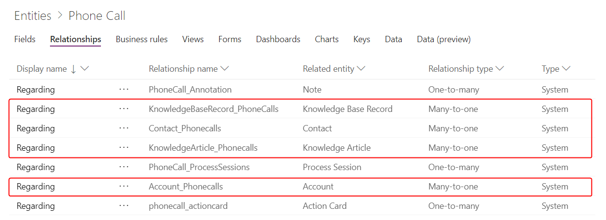

# AsType and IsType functions in PowerApps
Tests the type and casts to a specific type for Common Data Service polymorphic values.  

## Description

### Owner and Customer lookups

Normally a Many-to-One lookup field can refer to records of only one other entity.  For example, the **'Primary Contact'** field of an Account record can refer to only records in the **Contacts** entity.  The Common Data Service supports *polymorphic* lookups: a lookup that can refer to a record from a set of other entities.  For example, the **Owner** field of an **Account** record can refer to a record in the **Users** entity or the **Teams** entity.  

As each polymorphic lookup can refer to records in different entities, the type of the lookup cannot be established at authoring time.  You will need to test and establish the specific type of the lookup in your formulas.  Use the **IsType** function to test which entity a polymorphic lookup refers to and then use the **AsType** function to reference the fields using a specific type.  A common pattern to display the name of a user or a team:

```powerapps-dot
If( IsType( First(Accounts).Owner, Users ), 
    AsType( First(Accounts).Owner, Users ).'Full Name',
    AsType( First(Acoounts).Owner, Teams ).'Team Name' 
)
```

The CDS data types that can be polymorphic are:

| CDS Data Type | Possible entities |
|---------------|-------------------|
| **Owner** | **Users** or **Teams** |
| **Customer** | **Accounts** or **Contacts** |

### Regarding lookups

Many entities in the Common Data Service include a polymorphic lookup column **Regarding** that can refer to any entity.  They are often used with activity entities where, for example, a record in the **'Phone Calls'** entity can refer to a record in the **Accounts**, **Contacts**, **Knowledge Base Records**, and **Knowledge Articles** entities.  View the relationships for the entity and search for the **Regarding** Many-to-one relationships to see the possible entities that can be referred to:  


The **IsType** and **AsType** functions are used to test the type of the regarding entity and to access its information:

```powerapps-dot
If( IsType( First('Phone Calls').Regarding, Accounts ), 
    AsType( First('Phone Calls').Regarding, Accounts ).'Account Name' )
```     

### Activities entity 

Records of the **Activities** entity are also polymorphic: an activity record can be of type **'Phone Calls'**, **Tasks**, **Faxes**, etc.  **Activities** share a common set of columns, such as **Subject**, that is available for all records and can be accessed in the same manner as a non-polymorphic entity directly through a dot reference.  In addition each record may have have type specific columns that can only be accessed through the **AsType** function, such as **'Phone Number'** for **'Phone Calls'**.  For example, this formula will display the **Subject** for any activity type and in addition will add the phone number if the activity was a phone call.

```powerapps-dot
First(Activities).Subject &
If( IsType( First(Activities), 'Phone Calls' ), 
    ", Phone Number: " & AsType( First(Activities), 'Phone Calls' ).'Phone Number' 
)
```   
If used in a record context, such as in a [**Gallery**](../controls/control-gallery.md) control, use the [global disambiguation operator](operators.md#disamgiuation-operator) to reference the entity.  In the example above, use **[@'Phone Calls']** instead of **'Phone Calls'**.

At this time there is no support for the **Activity Party** data type.

### Details

For both functions, the type is specified through the name of the data source connected to the entity.  This requires creating a data source for any types that you wish to test or cast.  For example, in order to use **IsType** and **AsType** with records from the **Users** entity, first create a connection to the Common Data Service and add a data source for the **Users** entity.

The **IsType** function returns a Boolean value: true if the polymorphic value is of the specified type and false otherwise.

The **AsType** function returns the polymorphic value as a record of the specified type.  The function will return an error if the value is not of the specified type.  A *blank* record is returned if the polymorphic value is *blank*.

## Syntax
**AsType**( *PolymorphicValue*, *EntityType* )

* *PolymorphicValue* - Required. The lookup field of a Many-to-one polymorphic relationship.
* *EntityType* - Required. The specific entity to test for. 

**IsType**( *PolymorphicValue*, *EntityType* )

* *PolymorphicValue* - Required. The lookup field of a Many-to-one polymorphic relationship.
* *EntityType* - Required. The specific entity to cast to.

## Example

