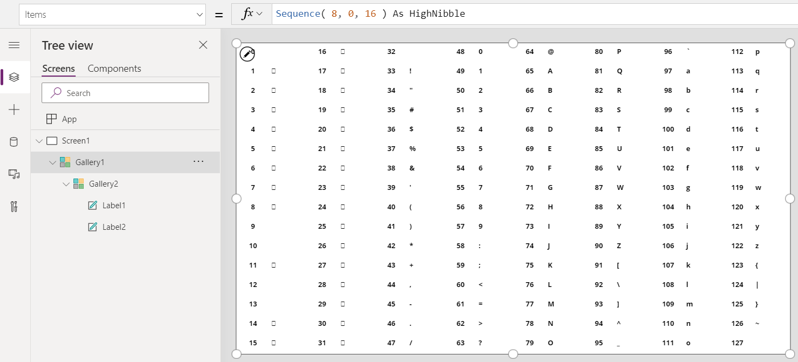
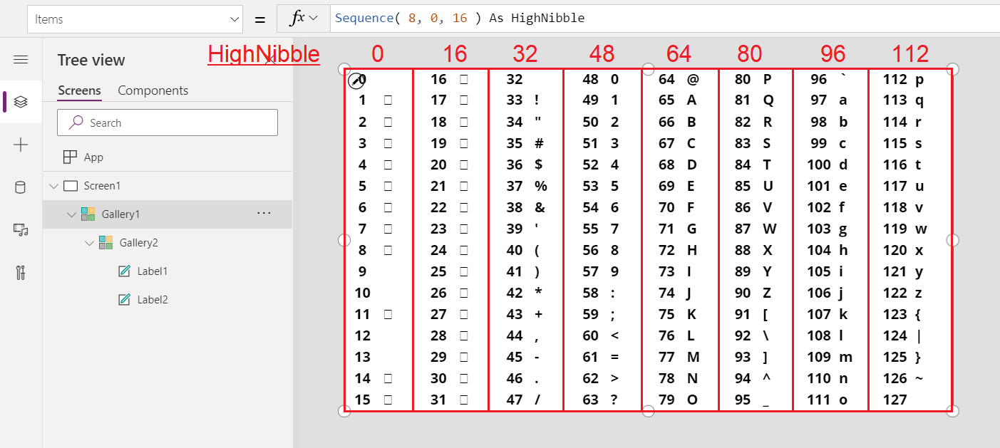
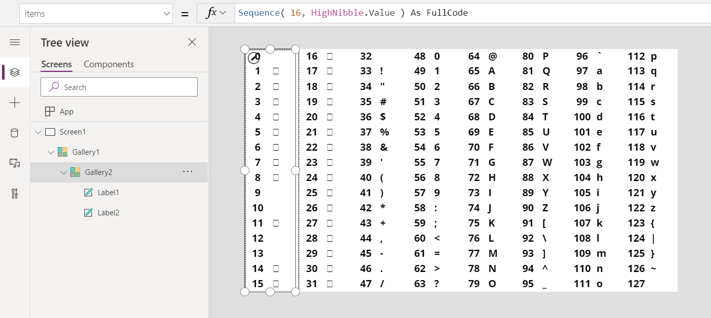
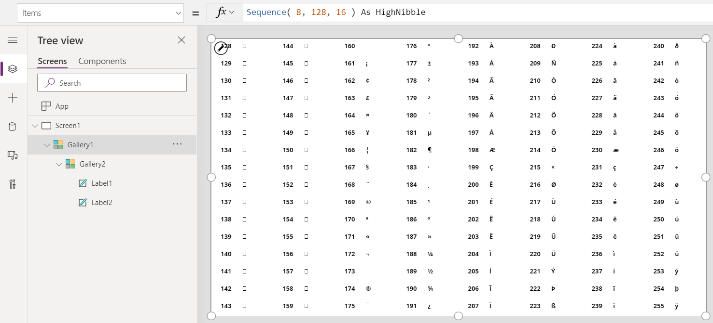
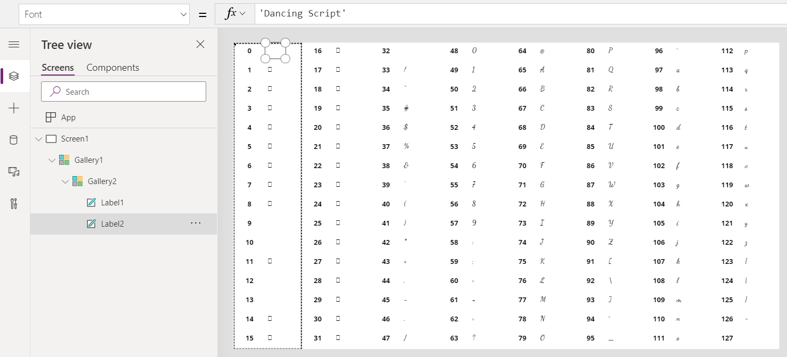

# Char function in Power Apps

Translates a character code into a string.

## Description

The **Char** function translates a number into a string with the corresponding ASCII character.

## Syntax

**Char**( *CharacterCode* )

- *CharacterCode* - Required. ASCII character code to translate.

## Examples

| Formula | Description | Result |
| --- | --- | --- |
| **Char( 65 )** |Returns the character that corresponds to ASCII code 65. |"A" |
| **Char( 105 )** |Returns the character that corresponds to ASCII code 105. |"i" |
| **Char( 35 )** |Returns the character that corresponds to ASCII code 35. |"#" |

### Display a character map

1. On an empty screen in a tablet app, add a [**Gallery**](../controls/control-gallery.md) control with a **Blank Horizontal** layout, and then set these properties:

    - **Items**: `Sequence( 8, 0, 16 ) As HighNibble`
    - **Width**: `Parent.Width`
    - **Height**: `Parent.Height`
    - **TemplateSize**: `Parent.Width / 8`
    - **TemplatePadding**: 0
    - **X**: 0
    - **Y**: 0

1. Inside that gallery, add a **Gallery** control with a **Blank Vertical** layout, and then set these properties:

    - **Items**: `Sequence( 16, HighNibble.Value ) As FullCode`
    - **Width**: `Parent.Width / 8`
    - **Height**: `Parent.Height`
    - **TemplateSize**: `Parent.Height / 16`
    - **TemplatePadding**: 0
    - **X**: 0
    - **Y**: 0

1. Inside the second (vertical) gallery, add a **Label** control, and set these properties:

    - **Text**: `FullCode.Value`
    - **Width**: `Parent.Width / 2`
    - **X**: 0
    - **Y**: 0
    - **Align**: `Center`
    - **FontWeight**: `Bold`
    - **Size**: 24

1. Inside the second (vertical) gallery, add another **Label** control, and set these properties:

    - **Text**: `Char( FullCode.Value )`
    - **Width**: `Parent.Width / 2`
    - **X**: `Parent.Width / 2`
    - **Y**: 0
    - **FontWeight**: `Bold`
    - **Size**: 24 

You've created a chart of the first 128 ASCII characters. Characters that appear as a small square can't be printed.

If you want to see how **FullCode.Value** gets its values.  Let's begin with the outer horizontal gallery.  Its **Items** property uses the **Sequence** function to create 8 columns, starting with 0 with increments of 16:

Nested within this gallery is another vertical gallery.  Its **Items** property fills in the gap left by the increment of 16 from the outer gallery:

To show the extended ASCII characters, it is a simple matter of changing the starting point for the chart, set in the Sequence function for the outer gallery:

`Sequence( 8, 128, 16 ) As HighNibble`

Finally, to show the characters in a different font, set the **Font** property of the second label to a value such as **'Dancing Script'**.

[!INCLUDE[footer-include](../../../includes/footer-banner.md)]