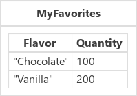

# Collect, Clear, and ClearCollect functions in Power Apps

Creates and clears [collections](../working-with-data-sources.md#collections) and adds [records](../working-with-tables.md#records) to any [data source](../working-with-data-sources.md).

## Description

### Collect

The **Collect** function adds records to a data source. The items to be added can be:

- A single value: The value is placed in the **[Value](function-value.md)** field of a new record.  All other properties are left [blank](function-isblank-isempty.md).
- A record: Each named property is placed in the corresponding property of a new record.  All other properties are left blank.
- A [table](../working-with-tables.md): Each record of the table is added as a separate record of the data source as described above. The table isn't added as a nested table to a record. To do this, wrap the table in a record first.

When used with a collection, additional [columns](../working-with-tables.md#columns) will be created as needed. The columns for other data sources are fixed by the data source and new columns can't be added.  

If the data source doesn't already exist, a collection is created.

Collections are sometimes used to hold global variables or make a temporary copy of a data source. Canvas apps are based on formulas that automatically recalculate as the user interacts with an app. Collections don't enjoy this benefit and their use can make your app harder to create and understand. Before using a collection in this manner, review [working with variables](../working-with-variables.md).

You can also use the **[Patch](function-patch.md)** function to create records in a data source.

**Collect** returns the modified data source as a table.  **Collect** can only be used in a [behavior formula](../working-with-formulas-in-depth.md).

### Clear

The **Clear** function deletes all the records of a collection.  The columns of the collection will remain.

Note that **Clear** only operates on collections and not other data sources.  You can use **[RemoveIf](function-remove-removeif.md)( *DataSource*, true )** for this purpose.  Use caution as this will remove all records from the data source's storage and can affect other users.

You can use the **[Remove](function-remove-removeif.md)** function to selectively remove records.

**Clear** has no return value.  It can only be used in a behavior formula.

### ClearCollect

The **ClearCollect** function deletes all the records from a collection. And then adds a different set of records to the same collection.  With a single function, **ClearCollect** offers the combination of **Clear** and then **Collect**.

**ClearCollect** returns the modified collection as a table.  **ClearCollect** can only be used in a behavior formula.

### Delegation
[!INCLUDE [delegation-no](../../../includes/delegation-no.md)]

## Syntax

**Collect**( *DataSource*, *Item*, ... )

* *DataSource* – Required. The data source that you want to add data to.  If it doesn't already exist, a new collection is created.
* *Item(s)* - Required.  One or more records or tables to add to the data source.  

**Clear**( *Collection* )

* *Collection* – Required. The collection that you want to clear.

**ClearCollect**( *Collection*, *Item*, ... )

* *Collection* – Required. The collection that you want to clear and then add data to.
* *Item(s)* - Required.  One or more records or tables to add to the data source.  

## Examples

### Clearing and adding records to a data source

In these examples, you'll erase and add to a collection that's named **IceCream**. The data source begins with these contents:

| Formula | Description | Result |
| --- | --- | --- |
| **ClearCollect( IceCream, {&nbsp;Flavor:&nbsp;"Strawberry",&nbsp;Quantity:&nbsp;300&nbsp;} )** |Clears all data from the **IceCream** collection and then adds a record that includes a quantity of strawberry ice cream. |   The **IceCream** collection has also been modified. |
| **Collect( IceCream, {&nbsp;Flavor:&nbsp;"Pistachio",&nbsp;Quantity:&nbsp;40&nbsp;}, {&nbsp;Flavor:&nbsp;"Orange",&nbsp;Quantity:&nbsp;200&nbsp;}  )** |Adds two records to the **IceCream** collection that includes a quantity of pistachio and orange ice cream. |  The **IceCream** collection has also been modified. |
| **Clear( IceCream )** |Removes all records from the **IceCream** collection. |  The **IceCream** collection has also been modified. |

For step-by-step examples of how to create a collection, see [Create and update a collection](../create-update-collection.md).

### Records and tables

These examples examine how record and table arguments to **Collect** and **ClearCollect** are handled.

| Formula | Description | Result |
| --- | --- | --- |
| **ClearCollect( IceCream, {&nbsp;Flavor:&nbsp;"Chocolate",&nbsp;Quantity:&nbsp;100&nbsp;}, {&nbsp;Flavor:&nbsp;"Vanilla",&nbsp;Quantity:&nbsp;200&nbsp;}  )** | Clear all data and then adds two records to the **IceCream** collection that includes a quantity of chocolate and vanilla ice cream.  The records to be added are provided as individual arguments to the function.|    The **IceCream** collection has also been modified. |
| **ClearCollect( IceCream, Table( {&nbsp;Flavor:&nbsp;"Chocolate",&nbsp;Quantity:&nbsp;100&nbsp;}, {&nbsp;Flavor:&nbsp;"Vanilla",&nbsp;Quantity:&nbsp;200&nbsp;} ) )** | Same as the previous example except that the records are combined in a table and passed in through a single argument. The contents of the table are extracted record by record before being added to the **IceCream** collection. |   The **IceCream** collection has also been modified. |
| **ClearCollect( IceCream, {&nbsp;MyFavorites: Table( {&nbsp;Flavor:&nbsp;"Chocolate",&nbsp;Quantity:&nbsp;100&nbsp;}, {&nbsp;Flavor:&nbsp;"Vanilla",&nbsp;Quantity:&nbsp;200&nbsp;} ) } )** | Same as the previous example except that the table is wrapped in a record.  The records of the table aren't extracted and instead the entire table is added as a cell of the record. |   The **IceCream** collection has also been modified. |

[!INCLUDE[footer-include](../../../includes/footer-banner.md)]