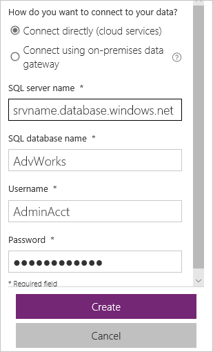
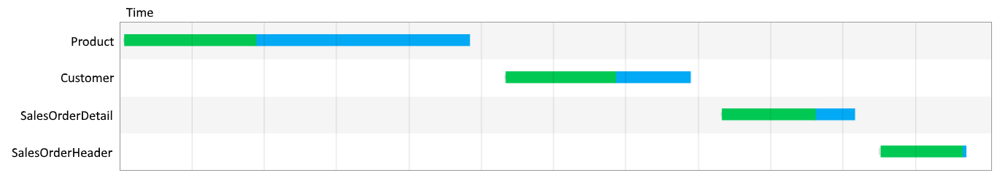
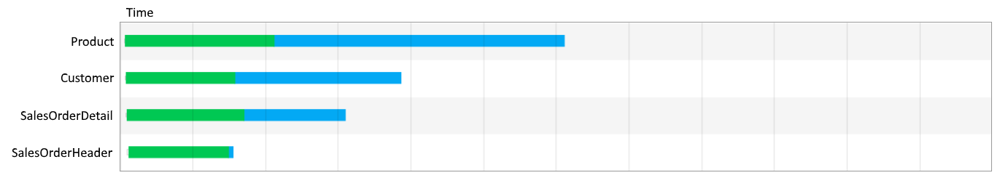
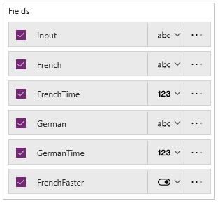
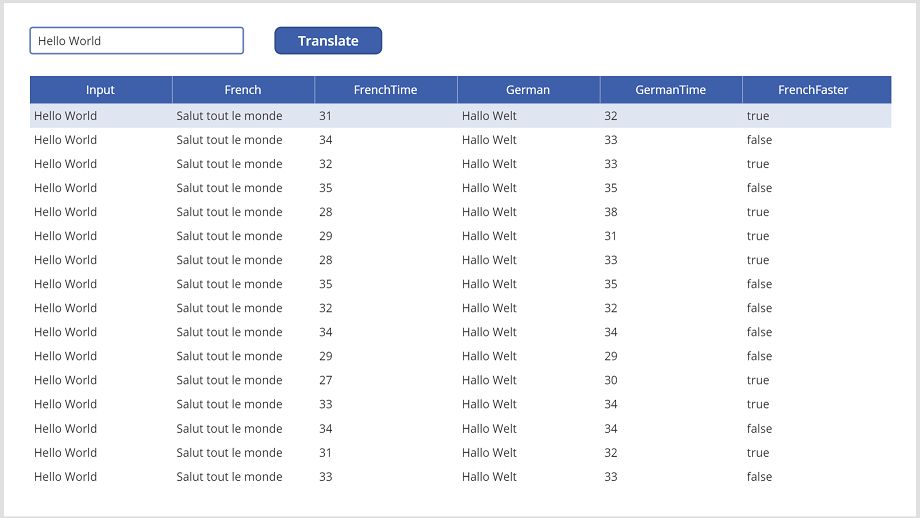

# Concurrent function in Power Apps
Evaluates multiple formulas concurrently with one another.

## Description
The **Concurrent** function evaluates multiple formulas at the same time. Normally, multiple formulas are evaluated by chaining them together with the [**;**](operators.md) operator, which evaluates each sequentially in order. When the app performs operations concurrently, users wait less for the same result.

In the [**OnStart**](../controls/control-screen.md) property of your app, use **Concurrent** to improve performance when the app loads data. When data calls don't start until the previous calls finish, the app must wait for the sum of all request times. If data calls start at the same time, the app needs to wait only for the longest request time. Web browsers often improve performance by performing data operations concurrently.

You can't predict the order in which formulas within the **Concurrent** function start and end evaluation. Formulas within the **Concurrent** function shouldn't contain dependencies on other formulas within the same **Concurrent** function, and Power Apps shows an error if you try. From within, you can safely take dependencies on formulas outside the **Concurrent** function because they will complete before the **Concurrent** function starts. Formulas after the **Concurrent** function can safely take dependencies on formulas within: they'll all complete before the **Concurrent** function finishes and moves on to the next formula in a chain (if you use the **;** operator). Watch out for subtle order dependencies if you're calling functions or service methods that have side effects.

You can chain formulas together with the **;** operator within an argument to **Concurrent**. For example, **Concurrent( Set( a, 1 ); Set( b, a+1 ), Set( x, 2 ); Set( y, x+2 ) )** evaluates **Set( a, 1 ); Set( b, a+1 )** concurrently with **Set( x, 2 ); Set( y, x+2 )**. In this case, the dependencies within the formulas are fine: **a** will be set before **b**, and **x** will be set before **y**.

Depending on the device or browser in which the app is running, only a handful of formulas might actually be evaluated concurrently. **Concurrent** uses the available capabilities and won't finish until all formulas have been evaluated.

If you enable **Formula-level error management** (in advanced settings), the first error encountered in argument order is returned from **Concurrent**; otherwise, *blank* is returned. If all formulas are successful, *true* is returned. If one formula fails, the rest of that formula stops, but other formulas continue evaluating.

You can use **Concurrent** only in [behavior formulas](../working-with-formulas-in-depth.md).

## Syntax
**Concurrent**( *Formula1*, *Formula2* [, ...] )

* *Formula(s)* – Required. Formulas to evaluate concurrently. You must supply at least two formulas.

## Examples

#### Loading data faster

1. Create an app, and add four data sources from Microsoft Dataverse, SQL Server, or SharePoint. 

    This example uses four tables from the [sample Adventure Works database on SQL Azure](/azure/sql-database/sql-database-get-started-portal). After you create the database, connect to it from Power Apps using the fully qualified server name (for example, srvname.database.windows.net):

	

2. Add a **[Button](../controls/control-button.md)** control, and set its **OnSelect** property to this formula:

    ```powerapps-dot
    ClearCollect( Product, '[SalesLT].[Product]' );
    ClearCollect( Customer, '[SalesLT].[Customer]' );
    ClearCollect( SalesOrderDetail, '[SalesLT].[SalesOrderDetail]' ); 
    ClearCollect( SalesOrderHeader, '[SalesLT].[SalesOrderHeader]' )
    ```

3. In [Microsoft Edge](/microsoft-edge/devtools-guide/network) or [Google Chrome](https://developers.google.com/web/tools/chrome-devtools/network-performance/), turn on developer tools to monitor network traffic while your app is running.

1. (optional) Turn on network throttling to exaggerate the effects of this comparison.

4. While holding down the Alt key, select the button, and then watch the network traffic.

    The tools show four requests performed in series, similar to this example.  Actual times have been removed as they will vary wildly.  The graph shows that each call starts after the last has finished:

	

5. Save, close, and reopen the app.

    Power Apps caches data, so selecting the button again won't necessarily cause four new requests. Each time you want to test performance, close and reopen your app. If you turned network throttling on, you may want to turn it off until you're ready for another test.

1. Add a second **[Button](../controls/control-button.md)** control, and set its **OnSelect** property to this formula:

    ```powerapps-dot
    Concurrent( 
        ClearCollect( Product, '[SalesLT].[Product]' ), 
        ClearCollect( Customer, '[SalesLT].[Customer]' ),
        ClearCollect( SalesOrderDetail, '[SalesLT].[SalesOrderDetail]' ),
        ClearCollect( SalesOrderHeader, '[SalesLT].[SalesOrderHeader]' )
    )
    ```

	Note that you added the same **ClearCollect** calls to the first button, but they're wrapped in a **Concurrent** function and separated by commas this time.

2. Clear the network monitor in the browser.

1. If you were using network throttling before, turn it on again.

3. While holding down the Alt key, select the second button, and then watch the network traffic.

    The tools show four requests performed concurrently, similar to this example.  Again, actual times have been removed as they will vary wildly.  The graph shows that all the calls start at about the same time and do not wait for the previous one to finish:

	

	These graphs are based on the same scale. By using **Concurrent**, you halved the total amount of time these operations took to finish. 

5. Save, close, and reopen the app.

#### Race condition

1. Add a connection to the [Microsoft Translator](../connections/connection-microsoft-translator.md) service to your app.

2. Add a [**Text input**](../controls/control-text-input.md) control, and rename it **TextInput1** if it has a different name.

3. Add a **Button** control, and set its **OnSelect** property to this formula:

    ```powerapps-dot
    Set( StartTime, Value( Now() ) );
    Concurrent(
        Set( FRTrans, MicrosoftTranslator.Translate( TextInput1.Text, "fr" ) ); 
            Set( FRTransTime, Value( Now() ) ),
        Set( DETrans, MicrosoftTranslator.Translate( TextInput1.Text, "de" ) ); 
            Set( DETransTime, Value( Now() ) )
    );
    Collect( Results,
        { 
            Input: TextInput1.Text,
            French: FRTrans, FrenchTime: FRTransTime - StartTime, 
            German: DETrans, GermanTime: DETransTime - StartTime, 
            FrenchFaster: FRTransTime < DETransTime
        }
    )
    ```

4. Add a [**Data table**](../controls/control-data-table.md) control, and set its **Items** property to **Results**.

1. On the **Properties** tab of the right pane, select **Edit fields** to open the **Fields** pane.

1. In the list of fields, select the check box for each field to show them all in the data table.

1. (optional) Drag the **Input** field to the top of the list, and drag the **FrenchFaster** field to the bottom of the list.

	 

6. In the **Text input** control, type or paste a phrase to translate.

7. While holding down the Alt key, select the button multiple times to fill the table.

    The times are shown in milliseconds.
  
	 

	In some cases, the French translation is faster than the German translation, and vice versa. Both start at the same time, but one returns before the other for a variety of reasons, including network latency and server-side processing.

	A [race condition](https://en.wikipedia.org/wiki/Race_condition) would occur if the app depended on one translation ending first. Fortunately, Power Apps flags most timing dependencies that it can detect.


[!INCLUDE[footer-include](../../../includes/footer-banner.md)]