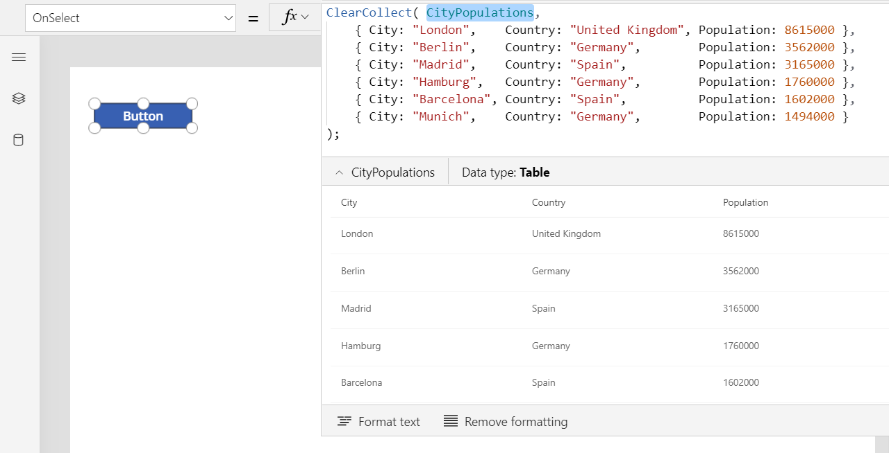
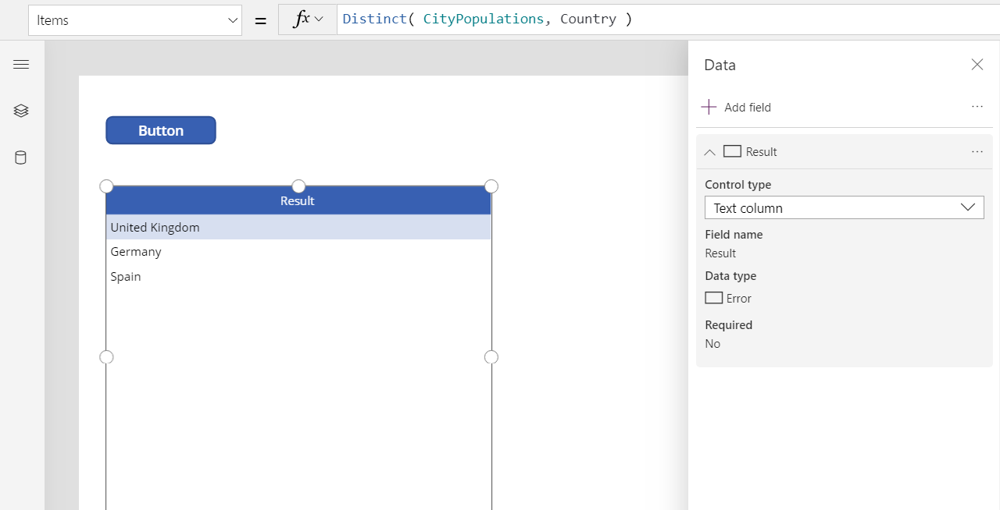
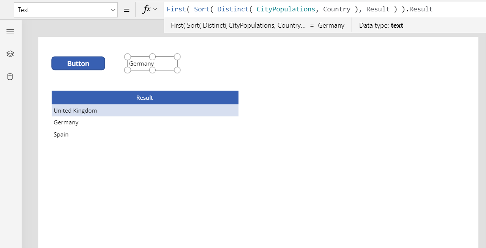

# Distinct function in Power Apps
Summarizes [records](../working-with-tables.md#records) of a [table](../working-with-tables.md), removing duplicates.

## Description
The **Distinct** function evaluates a formula across each record of a table and returns a one-column table of the results with duplicate values removed.  The name of the column is **Result**.  

[!INCLUDE [record-scope](../../../includes/record-scope.md)]

[!INCLUDE [delegation-no-one](../../../includes/delegation-no-one.md)]

## Syntax
**Distinct**( *Table*, *Formula* )

* *Table* - Required.  Table to evaluate across.
* *Formula* - Required.  Formula to evaluate for each record.

## Example

1. Insert a [**Button**](../controls/control-button.md) control, and set its **OnSelect** property to this formula.

    ```powerapps-dot
    ClearCollect( CityPopulations,
        { City: "London",    Country: "United Kingdom", Population: 8615000 },
        { City: "Berlin",    Country: "Germany",        Population: 3562000 },
        { City: "Madrid",    Country: "Spain",          Population: 3165000 },
        { City: "Hamburg",   Country: "Germany",        Population: 1760000 },
        { City: "Barcelona", Country: "Spain",          Population: 1602000 },
        { City: "Munich",    Country: "Germany",        Population: 1494000 }
    );
    ```

1. Select the button while holding down the Alt key.

    The formula is evaluatd and the **CityPopulations** collection is created which you can show by selecting **CityPopulations** in the formula bar:

    > [!div class="mx-imgBorder"]
    > 

1. Insert a [**Data table**](../controls/control-data-table.md) control, and set its **Items** property to this formula:

    ```powerapps-dot
    Distinct( CityPopulations, Country )
    ```

    You can view the result of this formula in the formula bar by selecting the entire formula:

    > [!div class="mx-imgBorder"]
    > 

1. Use the **Edit fields** link in the data table's properties pane to add the **Result** column:

    > [!div class="mx-imgBorder"]
    > 

1. Insert a [**Label**](../controls/control-text-box.md) control, and set its **Text** property to the formula:

    ```powerapps-dot
    First( Sort( Distinct( CityPopulations, Country ), Result ) ).Result
    ```

    This formula sorts the results from **Distinct** with the [**Sort**](function-sort.md) function, takes the first record from the resulting table with the [**First**](function-first-last.md) function, and extracts the **Result** field to obtain just the country name.

    > [!div class="mx-imgBorder"]
    > 

     


[!INCLUDE[footer-include](../../../includes/footer-banner.md)]