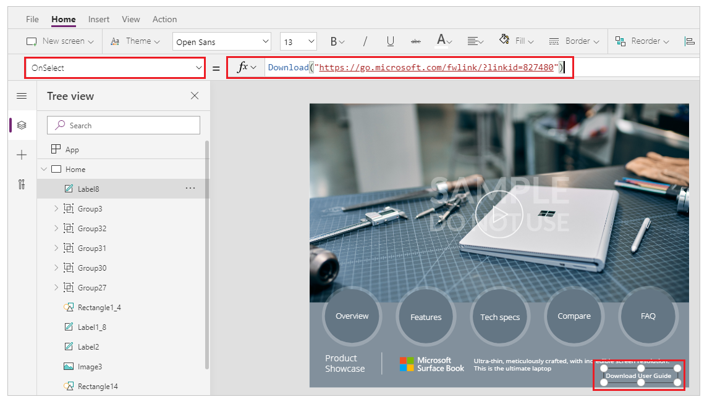

# Download function in Power Apps

Downloads a file from the web to the local device.

## Description

The **Download** function downloads a file from the web to the local device.

In native players (Windows, Android, and iOS), the user is prompted for a location to save the file.  

When used on the web, **Download** is dependent on the browser's settings to determine what happens with the file. For images, videos, and other file types that the browser natively supports, a new browser tab is opened to display the file.b Many browsers support saving the contents to the local file system.

Only on Windows, **Download** returns the location where the file was stored locally as a text string.

**Download** can only be used in [behavior formulas](../working-with-formulas-in-depth.md).

## Syntax

**Download**( *Address* )

* *Address* – Required.  The URL address of a web resource to download.

## Examples

### Simple Download

The following formula will download the user's guide for the Surface Book, a PDF file:

```powerapps-dot
Download( "https://go.microsoft.com/fwlink/?linkid=827480" )
```

When run in a mobile device, the user will be prompted for a location to save the file.  

When run in most web browsers, a new tab will be opened to display the PDF file as most browsers natively support this file type. 

### Step by Step

The **Product Showcase** tablet layout template was used for the following example. To create an app with this template, follow the steps from [create an app](../get-started-test-drive.md) article and select the **Product Showcase** template. You can also use your own app.

1. Go to [Power Apps](https://make.powerapps.com).
1. Select **Apps** from left navigation pane.
1. Select your app and then select **Edit**.
1. Select **Insert** from the menu and then select **Label**.
1. Move the label to the bottom right of the screen.
1. From the properties pane on the right-side, select **Color** as *white* and set **Border thickness** at *1*.
1. Select the **Text** property from right-side and enter text as *Download User Guide*.
1. From property list on top left, select **OnSelect**.
1. Enter formula as `Download("https://go.microsoft.com/fwlink/?linkid=827480")`. You can also use any other URL of your choice.

    

1. Save and publish the app.
1. Play the app.
1. Select the **Download User Guide** button to download the guide.

> [!NOTE]
> Your browser settings determine whether to download the file or open the file directly in a new tab. For more details, go to [Download function description](#description).

### See also

[Canvas app formula reference](../formula-reference.md)


[!INCLUDE[footer-include](../../../includes/footer-banner.md)]