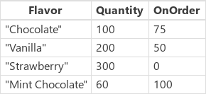
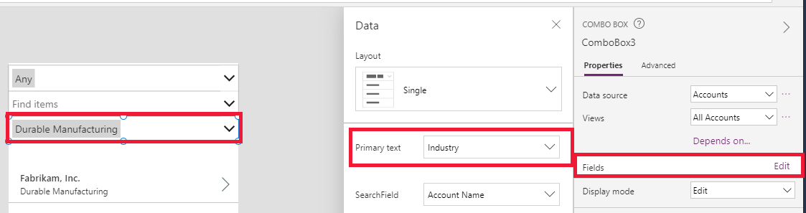
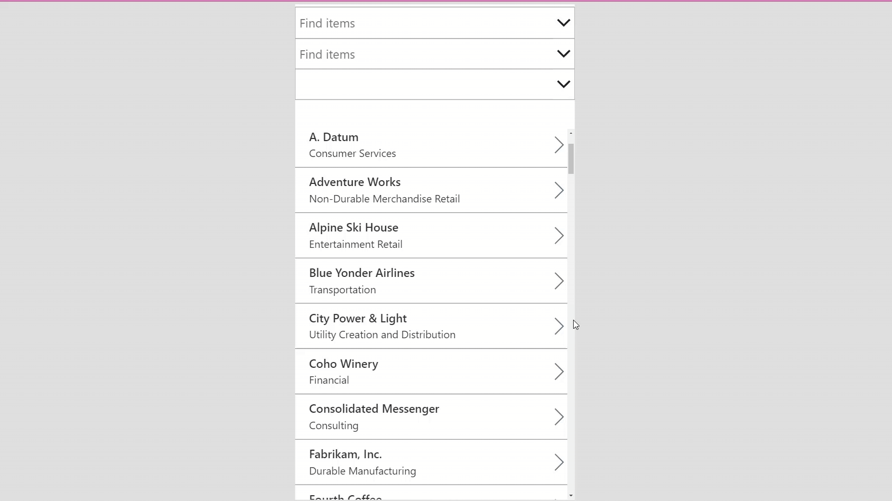

# Filter, Search, and LookUp functions in Power Apps
Finds one or more [records](../working-with-tables.md#records) in a [table](../working-with-tables.md).

## Description
The **Filter** function finds records in a table that satisfy a formula.  Use **Filter** to find a set of records that match one or more criteria and to discard those that don't.

The **LookUp** function finds the first record in a table that satisfies a formula.  Use **LookUp** to find a single record that matches one or more criteria.

For both, the formula is evaluated for each record of the table.  Records that result in *true* are included in the result.  Besides the normal formula [operators](operators.md), you can use the **[in](operators.md#in-and-exactin-operators)** and **[exactin](operators.md#in-and-exactin-operators)** operators for substring matches.

[!INCLUDE [record-scope](../../../includes/record-scope.md)]

The **Search** function finds records in a table that contain a string in one of their columns. The string may occur anywhere within the column; for example, searching for "rob" or "bert" would find a match in a column that contains "Robert". Searching is case-insensitive. Unlike **Filter** and **LookUp**, the **Search** function uses a single string to match instead of a formula.

**Filter** and **Search** return a table that contains the same columns as the original table and the records that match the criteria. **LookUp** returns only the first record found, after applying a formula to reduce the record to a single value. If no records are found, **Filter** and **Search** return an [empty](function-isblank-isempty.md) table, and **LookUp** returns *blank*.  

[Tables](../working-with-tables.md) are a value in Power Apps, just like a string or number. They can be passed to and returned from functions.  **Filter**, **Search**, and **LookUp** don't modify a table. Instead, they take a table as an argument and return a table, a record, or a single value from it. See [working with tables](../working-with-tables.md) for more details.

[!INCLUDE [delegation](../../../includes/delegation.md)]

## Syntax
**Filter**(Table*, *Formula1* [, *Formula2*, ... ] )

* *Table* - Required. Table to search.
* *Formula(s)* - Required. The formula by which each record of the table is evaluated. The function returns all records that result in **true**. You can reference columns within the table. If you supply more than one formula, the results of all formulas are combined with the **[And](function-logicals.md)** function.

**Search**(Table*, *SearchString*, *Column1* [, *Column2*, ... ] )

* *Table* - Required. Table to search.
* *SearchString* - Required. The string to search for. If *blank* or an empty string, all records are returned.
* *Column(s)* - Required. The names of columns within *Table* to search. Columns to search must contain text. Column names must be strings and enclosed in double quotes. However, the column names must be static and cannot be calculated with a formula. If *SearchString* is found within the data of any of these columns as a partial match, the full record will be returned.

> [!NOTE]
> For SharePoint and Excel data sources that contain column names with spaces, specify each space as **"\_x0020\_"**. For example, specify **"Column Name"** as **"Column_x0020_Name"**.

**LookUp**(Table*, *Formula* [, *ReductionFormula* ] )

* *Table* - Required. Table to search. In the UI, the syntax is shown as *source*  above the function box.
* *Formula* - Required.
  The formula by which each record of the table is evaluated. The function returns the first record that results in **true**. You can reference columns within the table. In the UI, the syntax is shown as *condition* above the function box.
* *ReductionFormula* - Optional. This formula is evaluated over the record that was found, and then reduces the record to a single value. You can reference columns within the table. If you don't use this parameter, the function returns the full record from the table. In the UI, the syntax is shown as *result* above the function box.

> [!NOTE]
> If you use a Collection to store the LookUp response, you may not be able to get some of the Columns. Use disambiguation operator (@) in Table name, like [@'_TableName_'] in such cases.

## Examples

The following examples use the **IceCream** [data source](../working-with-data-sources.md):



| Formula | Description | Result |
| --- | --- | --- |
| **Filter(IceCream, OnOrder > 0)** |Returns records where **OnOrder** is greater than zero. |  |
| **Filter(IceCream, Quantity + OnOrder > 225)** |Returns records where the sum of **Quantity** and **OnOrder** columns is greater than 225. | |
| **Filter(IceCream, "chocolate" in Lower(Flavor ))** |Returns records where the word "chocolate" appears in the **Flavor** name, independent of uppercase or lowercase letters. | |
| **Filter(IceCream, Quantity < 10  && OnOrder < 20)** |Returns records where the **Quantity** is less than 10 and **OnOrder** is less than 20.  No records match these criteria, so an empty table is returned. | |
| **Search(IceCream, "choc", "Flavor")** |Returns records where the string "choc" appears in the **Flavor** name, independent of uppercase or lowercase letters. | |
| **Search(IceCream, "", "Flavor")** |Because the search term is empty, all records are returned. | |
| **LookUp(IceCream, Flavor = "Chocolate", Quantity)** |Searches for a record with **Flavor** equal to "Chocolate", of which there is one.  For the first record that's found, returns the **Quantity** of that record. |100 |
| **LookUp(IceCream, Quantity > 150, Quantity + OnOrder)** |Searches for a record with **Quantity** greater than 150, of which there are multiple.  For the first record that's found, which is "Vanilla" **Flavor**, returns the sum of **Quantity** and **OnOrder** columns. |250 |
| **LookUp(IceCream, Flavor = "Pistachio", OnOrder)** |Searches for a record with **Flavor** equal to "Pistachio", of which there are none.  Because none is found, **Lookup** returns *blank*. |*blank* |
| **LookUp(IceCream, Flavor = "Vanilla")** |Searches for a record with **Flavor** equal to "Vanilla", of which there is one.  Since no reduction formula was supplied, the entire record is returned. |{ Flavor: "Vanilla", Quantity: 200, OnOrder: 75 } |

### Filtering with choice columns

The following example uses the **Account** table in Microsoft Dataverse as data source. This example shows how to **Filter** list of accounts based on selected Combo box control values:

#### Step by step

1. Open a blank app.
1. Add a new screen by selecting the **New Screen** option.
1. On the **Insert** tab, select **Gallery** and then select **Vertical**.
1. On the **Properties** tab of the right-hand pane, open **Data Source** and then select **Accounts**.
1. (Optional) In the **Layout** list, select different options.
1. On the **Insert** tab, select **Input** and then select **Combo box**. Repeat the step to add two more combo box controls.
1. For each combo box control, on the **Properties** tab of the right-hand pane, open **Data Source** and then select **Accounts**. Select **Edit** next to **Fields** option and then select the **Primary text** and **SearchField** values. The **Primary text** should be the choices column you want to add to the combo box. Repeat the step for other two combo box controls.

    

1. Now select **Gallery** control and set the **Items** property to the following formula:

   ```
   Filter(Accounts, 
    'Industry' = ComboBox3.Selected.Industry||IsBlank(ComboBox3.Selected.Industry), 
    'Relationship Type' = ComboBox2.Selected.'Relationship Type'||
    IsBlank(ComboBox2.Selected.'Relationship Type'), 
    'Preferred Method of Contact' = ComboBox1.Selected.'Preferred Method of Contact'||
    IsBlank(ComboBox1.Selected.'Preferred Method of Contact'))
   ```

    

### Search user experience

The following examples use the **IceCream** [data source](../working-with-data-sources.md):

In many apps, you can type one or more characters into a search box to filter a list of records in a large data set. As you type, the list shows only those records that match the search criteria.

The examples in the rest of this topic show the results of searching a list, named **Customers, that contain this data:


To create this data source as a collection, create a **[Button](../controls/control-button.md)** control and set its **OnSelect** property to this formula:

**ClearCollect(Customers, Table({ Name: "Fred Garcia", Company: "Northwind Traders" }, { Name: "Cole Miller", Company: "Contoso" }, { Name: "Glenda Johnson", Company: "Contoso" }, { Name: "Mike Collins", Company: "Adventure Works" }, { Name: "Colleen Jones", Company: "Adventure Works" }) )**

As in this example, you can show a list of records in a [**Gallery control**](../controls/control-gallery.md) at the bottom of a screen. Near the top of the screen, you can add a [**Text input**](../controls/control-text-input.md) control, named **SearchInput**, so that users can specify which records interest them.


As the user types characters in **SearchInput**, the results in the gallery are automatically filtered. In this case, the gallery is configured to show records for which the name of the customer (not the name of the company) starts with the sequence of characters in **SearchInput**. If the user types **co** in the search box, the gallery shows these results:


To filter based on the **Name** column, set the **Items** property of the gallery control to one of these formulas:

| Formula | Description | Result |
| --- | --- | --- |
| **Filter(Customers, StartsWith(Name, SearchInput.Text) )** |Filters the **Customers** data source for records in which the search string appears at the start of the **Name** column. The test is case insensitive. If the user types **co** in the search box, the gallery shows **Colleen Jones** and **Cole Miller**. The gallery doesn't show **Mike Collins** because the **Name** column for that record doesn't start with the search string. |  |
| **Filter(Customers, SearchInput.Text in Name)** |Filters the **Customers** data source for records in which the search string appears anywhere in the **Name** column. The test is case insensitive. If the user types **co** in the search box, the gallery shows **Colleen Jones,** **Cole Miller,** and **Mike Collins** because the search string appears somewhere in the **Name** column of all of those records. |  |
| **Search(Customers, SearchInput.Text, "Name")** |Similar to using the **in** operator, the **Search** function searches for a match anywhere within the **Name** column of each record. You must enclose the column name in double quotation marks. |  |

You can expand your search to include the **Company** column and the **Name** column:

| Formula | Description | Result |
| --- | --- | --- |
| **Filter(Customers, StartsWith(Name, SearchInput.Text) &#124;&#124; StartsWith(Company, SearchInput.Text) )** |Filters the **Customers** data source for records in which either the **Name** column or the  **Company** column starts with the search string (for example, **co**).  The [**&#124;&#124;** operator](operators.md) is *true* if either **StartsWith** function is *true*. |  |
| **Filter(Customers, SearchInput.Text in Name &#124;&#124; SearchInput. Text in Company)** |Filters the **Customers** data source for records in which either the **Name** column or the **Company** column contains the search string (for example, **co**) anywhere within it. |  |
| **Search(Customers, SearchInput.Text, "Name", "Company")** |Similar to using the **in** operator, the **Search** function searches the **Customers** data source for records in which either the **Name** column or the **Company** column contains the search string (for example, **co**) anywhere within it. The **Search** function is easier to read and write than **Filter** if you want to specify multiple columns and multiple **in** operators. You must enclose the names of the columns in double quotation marks. |  |


[!INCLUDE[footer-include](../../../includes/footer-banner.md)]
