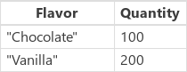
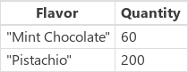

# First, FirstN, Index, Last, and LastN functions in Power Apps
Returns the first, last, or a specific [record](../working-with-tables.md#records), or a set of first or last records, from a table.

## Description
The **First** function returns the first record of a [table](../working-with-tables.md).

The **FirstN** function returns the first set of records of a table; the second argument specifies the number of records to return.

The **Last** function returns the last record of a table.

The **LastN** function returns the last set of records of a table; the second argument specifies the number of records to return.

The **Index** function returns a record of a table based on its ordered position in the table.  Record numbering begins with 1 so `First( table )` returning the same record as `Index( table, 1 )`.  **Index** returns an error if the requested record index is less than 1, greater than the number of records in the table, or the table is empty.

**First**, **Index**, and **Last** return a single record.  **FirstN** and **LastN** return a table, even if you specify only a single record.

### Delegation
[!INCLUDE [delegation-no](../../../includes/delegation-no.md)]

For example, when used with a data source containing a large table with 1 million records, **Last** will be subject to the non-delegation limit and will not return the last record of the entire data source.  Likewise, using **Index** to request a record in the middle of 1 million records will result in an error because the index is out of range based on the non-delegation limit.

## Syntax
**First**( *Table* )<br>**Last**( *Table* )

* *Table* - Required. Table to operate on.

**FirstN**( *Table* [, *NumberOfRecords* ] )<br>**LastN**( *Table* [, *NumberOfRecords* ] )

* *Table* - Required. Table to operate on.
* *NumberOfRecords* - Optional.  Number of records to return. If you don't specify this argument, the function returns one record.

**Index**( *Table*, *RecordIndex* )

* *Table* - Required. Table to operate on.
* *RecordIndex* - Required. The index of the record to return.  Record numbering begins with 1.

## Examples

For the following examples, we'll use the **IceCream** [data source](../working-with-data-sources.md), which contains the data in this table:

:::image type="content" source="media/function-first-last/icecream.png" alt-text="IceCream example.":::

This table can be placed in a collection with this formula (put in the OnStart formula for a Button control and press the button):

```powerapps-dot
Collect( IceCream, Table( { Flavor: "Chocolate", Quantity: 100 }, 
                          { Flavor: "Vanilla", Quantity: 200 },
                          { Flavor: "Strawberry", Quantity: 300 },
                          { Flavor: "Mint Chocolate", Quantity: 60 },
                          { Flavor: "Pistachio", Quantity: 200 } ) )
```

| Formula | Description | Result |
| --- | --- | --- |
| **First(&nbsp;IceCream&nbsp;)** | Returns the first record of **IceCream**. | { Flavor: "Chocolate", Quantity: 100 } |
| **Last(&nbsp;IceCream&nbsp;)** | Returns the last record of **IceCream**.  | { Flavor: "Pistachio", Quantity: 200 } |
| **Index(&nbsp;IceCream,&nbsp;3&nbsp;)** | Returns the third record of **IceCream**. | { Flavor: "Strawberry", Quantity: 300 } |
| **FirstN(&nbsp;IceCream,&nbsp;2&nbsp;)** | Returns a table containing the first two records of **IceCream**.  |  |
| **LastN(&nbsp;IceCream,&nbsp;2&nbsp;)** | Returns a table containt the last two records of **IceCream**. |  |
| **Index(&nbsp;IceCream,&nbsp;4&nbsp;).Quantity** | Returns the fourth record of the table, and extracts the Quanity column. | 60 |
| **Index(&nbsp;IceCream,&nbsp;10&nbsp;)** | Returns an error since the record requested is beyond the bounds of the table. | *Error* |


[!INCLUDE[footer-include](../../../includes/footer-banner.md)]
