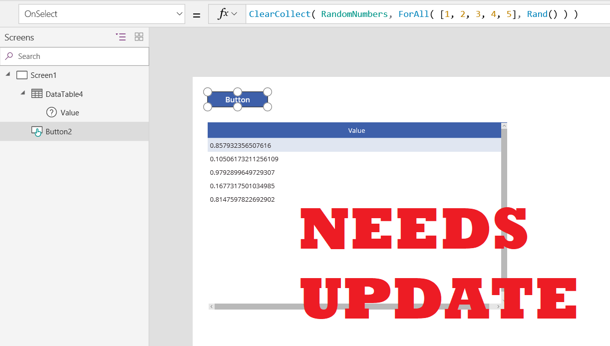
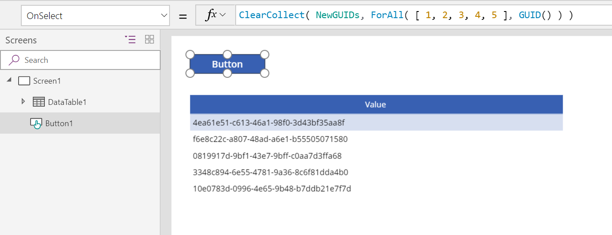

# GUID function in PowerApps
Converts a GUID ([Globally Unique Identifier](https://en.wikipedia.org/wiki/Universally_unique_identifier)) string to a GUID value or creates a new GUID value.

## Description
Use the **GUID** function to convert a string containing the hexadecimal representation of a GUID into a GUID value that can be passed to a database.  GUID values are used as keys in some database systems such as the Common Data Service and SQL Server.

The string passed must be 32 hexadecimal digits in the standard form "123e4567-e89b-12d3-a456-426655440000" or without dashes "123e4567e89b12d3a456426655440000".  Upper or lower case letters are acceptable.

The **GUID** function also creates a new GUID if no argument is provided.

To convert a GUID value to a string simply use it in a string context and it will be converted to a hexadecimal representation string with dashes and lower case letters. 

## Volatile Functions
**GUID** is a volatile function when used without an argument.  Each time the function is evaluated it returns a different value.  

When used in a data flow formula, a volatile function will only return a different value if the formula in which it appears is reevaluated.  If nothing else changes in the formula then it will have the same value throughout the execution of your app.

For example, a label control with **Label1.Text = GUID()** will not change while your app is active.  Only closing and reopening the app will result in a new value.

The function will be reevaluated if it is part of a formula in which something else has changed.  For example, if we change our example to involve a text input control with **Label1.Text = TextInput1.Text & " " & GUID()** then a new GUID is generated each time the text input's value changes and the label's text property is reevaluated.  

When used in a [behavior formula](../working-with-formulas-in-depth.md), **GUID** will be evaluated each time the behavior formula is evaluated.  See below for an example.

## Syntax
**GUID**( [ *GUIDString* ] )

* *GUIDString* – Optional.  A text string containing the hexadecimal representation of a GUID. A new GUID is created if no string is supplied.

## Examples

#### Basic Usage

To return a GUID value based on the hexadecimal string representation:

* **GUID( "0f8fad5b-d9cb-469f-a165-70867728950e" )**

You can also provide the GUID string without dashes, this formula returns the same GUID value:

* **GUID( "0f8fad5bd9cb469fa16570867728950e" )**

Used in context, to set the **Status** field of a new database record to a well established value:

* **Patch( Products, Default( Products ), { Status: GUID( "F9168C5E-CEB2-4faa-B6BF-329BF39FA1E4" ) } )**

Displaying GUIDs is not usually appropriate for users of your app, but they can be useful to you for debugging purposes.  In our example, to display the value of the **Status** in the record we just created, use a Label control and set it's **Text** property to:

* **First( Products ).Status**

which will display "f9168c5e-ceb2-4faa-b6bf-329bf39fa1e4".

#### Create a table of new GUIDs

1. Place a **[Button](../controls/control-button.md)** control on the canvas.  Set its **[OnSelect](../controls/properties-core.md)** property to **ClearCollect( NewGUIDs, ForAll( [ 1, 2, 3, 4, 5 ], GUID() )**.  The single column table [1, 2, 3, 4, 5] is only used to iterate 5 times, resulting in 5 random numbers.
2. Place a **[Data table](../controls/control-data-table.md)** control on the canvas.  Select the **NewGUIDs** collection as the data source for the data table and select the **Value** field to display.
3. Press the button.  You will see a list of new GUIDs in the data table:
    
4. Press the button again.  You will see a different list of new GUIDs:
    
5. In this example, a table of new GUIDs was created.  To create a single GUID, use **Set( NewGUID, GUID() )**.

