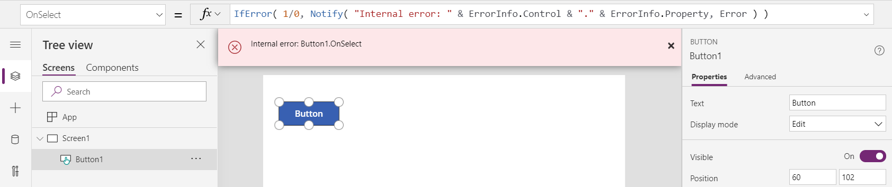

# IfError and IsError functions in Power Apps

Detects errors and provides an alternative value or takes action.

## Description

> [!NOTE]
> These functions are part of an experimental feature and are subject to change. The behavior that this topic describes is available only when the *Formula-level error management* feature is turned on. This app-level setting is off by default. To turn this feature on, open the *File* tab, select *App settings* in the left hand menu, and then select *Experimental features*. Your feedback is very valuable to us - please let us know what you think in the [Power Apps community forums](https://powerusers.microsoft.com/t5/Expressions-and-Formulas/bd-p/How-To).

### IfError

The **IfError** function tests values until it finds an error. If the function discovers an error, the function evaluates and returns a corresponding replacement value and stops further evaluation.  A default value can also be supplied for when no errors are found.  The structure of **IfError** resembles that of the **If** function: **IfError** tests for errors, while **If** tests for **true**.

Use **IfError** to replace an error with a valid value so that downstream calculations can proceed. For example, use this function if user input might result in a division by zero:

```powerapps-dot
IfError( 1/x, 0 )
```

This formula returns `0` if the value of `x` is zero, as `1/x` will produce an error.  If `x` is not zero then `1/x` is returned.  

### Stopping further processing

When [chaining](operators.md) formulas together in [behavior formulas](../working-with-formulas-in-depth.md), such as:

```powerapps-dot
Patch( DS1, ... );
Patch( DS2, ... )
```

the second [**Patch**](function-patch.md) function to `DS2` will be attempted even if the **Patch** to `DS1` fails.  The scope of an error is limited to each formula that is chained.

Use **IfError** to perform an action and only continue processing if the action was successful.  Applying **IfError** to this example:

```powerapps-dot
IfError(
    Patch( DS1, ... ), Notify( "problem in the first action" ),
    Patch( DS2, ... ), Notify( "problem in the second action" )
)
```

If the **Patch** of `DS1` encounters a problem, the first **Notify** executed, and no further processing occurs including the second **Patch** of `DS2`. If the first **Patch** succeeds, the second **Patch** will execute.  

If supplied, the optional *DefaultResult* argument is returned if no errors are discovered.  Without this argument, the last *Value* argument is returned.  Building on the last example, the return value from **IfError** can be checked to determine if there were any problems:

```powerapps-dot
IfError(
    Patch( DS1, ... ), Notify( "problem in the first action" );  false,
    Patch( DS2, ... ), Notify( "problem in the second action" ); false,
    true
)
```    

### Type compatibility

The types of all values that might be returned from **IfError** must be compatible.  

In the last example, **Patch** will return a record which is not compatible with the Booleans used for the *Replacement* formulas or the *DefaultResult*.  This is fine since there is no situation in which the return value from these **Patch** calls would be returned by **IfError**.

> [!NOTE]
> At present, the types of all arguments to **IfError** must be compatible.  This is in the process of being changed.

In the simple example described earlier:

```powerapps-dot
IfError( 1/x, 0 )
```

the types of `1/x` and `0` were compatible as both were text strings.  If they are not, the second argument will be coerced to match the type of the first argument. 

Excel will display **#DIV/0!** when a division by zero occurs.  To accomplish this with **IfError** it is tempting to write:

```powerapps-dot
IfError( 1/x, "#DIV/0!" )
```

Unfortunately this won't do the job.  The text string `"#DIV/0!"` will be coerced to the type of the first argument to **IfError** which is a number.  The result of **IfError** will be yet another error since the text string cannot be coerced.  To remedy this situation, convert the first argument to a text string so that **IfError** always returns a text string:  

```powerapps-dot
IfError( Text( 1/x ), "#DIV/0!" )
```  

### ErrorInfo

Within in the replacement formulas, the **ErrorInfo** record provides information about the error that was encountered.  This record includes:

| **ErrorInfo** field | Type | Description |
|---------------------|------|-------------|
| **Control** | Text string | Name of the current control, used to report where the error occured. |
| **Kind** | **ErrorKind** enum (number) | Categorized kind of the error. |
| **Message** | Text string | Message about the error, suitable to be displayed to the end user. |
| **Notify** | Boolean | If not caught by IfError, whether an end user notification banner should be displayed. |
| **Property** | Text string | Name of the current property, used to report where the error occured. |

For example, this formula as a [**Button**](../controls/control-button.md) control's **OnSelect** property

```powerapps-dot
IfError( 1/0, Notify( "Internal error: " & ErrorInfo.Control & "." & ErrorInfo.Property ) )
```

would display this banner when the button is activated


 
### IsError

The **IsError** function tests for an error value.  The return value is a Boolean *true* or *false*.

Using **IsError** will prevent any further processing of the error. 

## Syntax

**IfError**( *Value1*, *Replacement1* [, *Value2*, *Replacement2*, ... [, *DefaultResult* ] ] )

* *Value(s)* – Required. Formula(s) to test for an error value.
* *Replacement(s)* – Required. The formulas to evaluate and values to return if matching *Value* arguments returned an error.
* *DefaultResult* – Optional.  The formulas to evaluate if the formula doesn't find any errors.

**IsError**( *Value* )

* *Value* – Required. Formula to test for an error value.

## Examples

### Simple IfError

| Formula | Description | Result |
| --- | --- | --- |
| **IfError( 1, 2 )** |The first argument isn't an error. The function has no other errors to check and no default return value. The function returns the last *value* argument evaluated.   | 1 |
| **IfError( 1/0, 2 )** | The first argument returns an error value (due to division by zero). The function evaluates the second argument and returns it as the result. | 2 |
| **IfError( 1, 2, 3 )** | The first argument isn't an error. The function has no other errors to check but does have a default return value. The function returns the *DefaultResult* argument. | 3 |
| **IfError( 1, 2, 3, 4, 5 )** | The first argument isn't an error, so the function doesn't evaluate that argument's corresponding replacement. The third argument isn't an error either, so the function doesn't evaluate that argument's corresponding replacement. The fifth argument has no corresponding replacement and is the default result. The function returns that result because the formula contains no errors. | 5 |

### Simple IsError

| Formula | Description | Result |
| --- | --- | --- | 
| **IsError( 1 )** | The argument isn't an error.  | *false* | 
| **IsError( 1/0 )** | The argument is an error.  | *true* | 
| **IfError( 1/0, Notify( "There was an internal problem" ) )** | The first argument returns an error value (due to division by zero). The function evaluates the second argument and displays a message to the user. The return value of **IfError** is the return value of **Notify**, coerced to the same type as the first argument to **IfError** (a number). | 1 |

### Step by step

1. Add a **[Text input](../controls/control-text-input.md)** control, and name it **TextInput1** if it doesn't have that name by default.

2. Add a **[Label](../controls/control-text-box.md)** control, and name it **Label1** if it doesn't have that name by default.

3. Set the formula for **Label1**'s **Text** property to:

	**IfError( Value( TextInput1.Text ), -1 )**

4. In **TextInput1**, type **1234**.  

	Label1 will show the value **1234** as this is a valid input to the Value function.

5. In **TextInput1**, type **ToInfinity**.

	Label1 will show the value **-1** as this is not a valid input to the Value function.  Without wrapping the Value function with IfError, the label would show no value as the error value is treated as a *blank*. 


