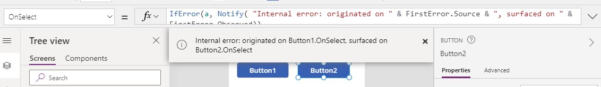

# IfError, IsError, IsBlankOrError functions in Power Apps

[This article is pre-release documentation and is subject to change.]

Detects errors and provides an alternative value or takes action.

> [!NOTE]
> - IfError, IsError, and IsBlankOrError functions are part of an experimental feature and are subject to change. More information: [Understand experimental, preview, and deprecated features in Power Apps](../working-with-experimental-preview.md).
> - The behavior that this article describes is available only when the *Formula-level error management* experimental feature in [advanced settings](../working-with-experimental-preview.md#controlling-which-features-are-enabled) is turned on (off by default).
> - Your feedback is very valuable to us - please let us know what you think in the [Power Apps community forums](https://powerusers.microsoft.com/t5/Expressions-and-Formulas/bd-p/How-To).

## IfError

The **IfError** function tests values until it finds an error. If the function discovers an error, the function evaluates and returns a corresponding replacement value and stops further evaluation.  A default value can also be supplied for when no errors are found.  The structure of **IfError** resembles that of the **If** function: **IfError** tests for errors, while **If** tests for **true**.

Use **IfError** to replace an error with a valid value so that downstream calculations can continue. For example, use this function if user input might result in a division by zero:

```powerapps-dot
IfError( 1/x, 0 )
```

This formula returns `0` if the value of `x` is zero, as `1/x` will produce an error.  If `x` isn't zero, then `1/x` is returned.  

### Stopping further processing

When [chaining](operators.md) formulas together in [behavior formulas](../working-with-formulas-in-depth.md), such as:

```powerapps-dot
Patch( DS1, ... );
Patch( DS2, ... )
```

The second [**Patch**](function-patch.md) function to `DS2` will be attempted even if the **Patch** to `DS1` fails.  The scope of an error is limited to each formula that is chained.

Use **IfError** to do an action and only continue processing if the action was successful. Applying **IfError** to this example:

```powerapps-dot
IfError(
    Patch( DS1, ... ), Notify( "problem in the first action" ),
    Patch( DS2, ... ), Notify( "problem in the second action" )
)
```

If the **Patch** of `DS1` has a problem, the first **Notify** is executed. No further processing occurs including the second **Patch** of `DS2`. If the first **Patch** succeeds, the second **Patch** will execute.  

If supplied, the optional *DefaultResult* argument is returned if no errors are discovered.  Without this argument, the last *Value* argument is returned. 

Building on the last example, the return value from **IfError** can be checked to determine if there were any problems:

```powerapps-dot
IfError(
    Patch( DS1, ... ), Notify( "problem in the first action" );  false,
    Patch( DS2, ... ), Notify( "problem in the second action" ); false,
    true
)
```

### Type compatibility

**IfError** will return the value of one of its arguments.  The types of all values that might be returned by **IfError** must be compatible.  

In the last example, **Patch** will return a record that isn't compatible with the Booleans used for the *Replacement* formulas or the *DefaultResult*. Which is fine, since there's no situation in which the return value from these **Patch** calls would be returned by **IfError**.

> [!NOTE]
> While the behavior in process for a change, the types of all arguments to **IfError** must be compatible currently.

In the simple example described earlier:

```powerapps-dot
IfError( 1/x, 0 )
```

The types of `1/x` and `0` were compatible as both were numbers.  If they're not, the second argument will be coerced to match the type of the first argument.

Excel will display **#DIV/0!** when a division by zero occurs.

Consider **IfError** with the following instead:

```powerapps-dot
IfError( 1/x, "#DIV/0!" )
```

The above formula won't work. The text string `"#DIV/0!"` will be coerced to the type of the first argument to **IfError**, which is a number.  The result of **IfError** will be yet another error since the text string can't be coerced.  As a fix, convert the first argument to a text string so that **IfError** always returns a text string:  

```powerapps-dot
IfError( Text( 1/x ), "#DIV/0!" )
```  

As seen above, **IfError** can return an error if the *Replacement* or *DefaultResult* is an error.

### FirstError / AllErrors

Within in the replacement formulas, the **FirstError** record and **AllErrors** table provide information about any errors that were found. The records include:

| **FirstError** field | Type | Description |
|---------------------|------|-------------|
| **Kind** | **ErrorKind** enum (number) | Categorized the error. |
| **Message** | Text string | Message about the error, suitable to be displayed to the end user. |
| **Source** | Text string | Location in the format *ControlName*.*PropertyName* where the error originated, used for reporting. |
| **Observed** | Text string | Location in the format *ControlName*.*PropertyName* where the error is surfaced to the user, used for reporting. |

For example, consider the following formula as a [**Button**](../controls/control-button.md) control's **OnSelect** property:

```powerapps-dot
Set( a, 1/0 )
```

And this formula on the **OnSelect** property of a second [**Button**](../controls/control-button.md) control:

```powerapps-dot
IfError( a, Notify( "Internal error: originated on " & FirstError.Source & ", surfaced on " & FirstError.Observed ) )
```

The example formula above would display the following banner when the two buttons are activated in sequence:



Typically, if an expression results in an error it will be a single one. But there are scenarios where multiple errors may be returned, for example, if the [formula chaining operator](./operators.md) or the [Concurrent function](./function-concurrent.md) are used. In those cases, the app can use the **AllErrors** table, whose records have the same fields as the **FirstError** record, to react to the errors.

## IsError

The **IsError** function tests for an error value.  

The return value is a Boolean *true* or *false*.

Using **IsError** will prevent any further processing of the error.

## IsBlankOrError

The **IsBlankOrError** function tests for either a blank value or an error value and is the equivalent of `Or( IsBlank( X ), IsError( X ) )`. 

When enabling error handling for existing apps, consider replacing **IsBlank** with **IsBlankOrError** to preserve existing app behavior.  Prior to the addition of error handling, a *blank* value was used to represent both null values from databases and error values.  Error handling separates these two interpretations of *blank* which could change the behavior of existing apps that continue to use **IsBlank**.

The return value is a boolean *true* or *false*.

Using **IsBlankOrError** will prevent any further processing of the error.

## Syntax

**IfError**( *Value1*, *Replacement1* [, *Value2*, *Replacement2*, ... [, *DefaultResult* ] ] )

* *Value(s)* – Required. Formula(s) to test for an error value.
* *Replacement(s)* – Required. The formulas to evaluate and values to return if matching *Value* arguments returned an error.
* *DefaultResult* – Optional.  The formulas to evaluate if the formula doesn't find any errors.

**IsError**( *Value* )<br>**IsBlankOrError**( *Value* )

* *Value* – Required. Formula to test.

## Examples

### Simple IfError

| Formula | Description | Result |
| --- | --- | --- |
| **IfError( 1, 2 )** |The first argument isn't an error. The function has no other errors to check and no default return value. The function returns the last *value* argument evaluated.   | 1 |
| **IfError( 1/0, 2 )** | The first argument returns an error value (because of division by zero). The function evaluates the second argument and returns it as the result. | 2 |
| **IfError( 10, 20, 30 )** | The first argument isn't an error. The function has no other errors to check but does have a default return value. The function returns the *DefaultResult* argument. | 30 |
| **IfError( 10, 11, 20, 21, 300 )** | The first argument **10** isn't an error, so the function doesn't evaluate that argument's corresponding replacement **11**. The third argument **20** isn't an error either, so the function doesn't evaluate that argument's corresponding replacement **21**. The fifth argument **300** has no corresponding replacement and is the default result. The function returns that result because the formula contains no errors. | 300 |
| **IfError( 1/0, Notify( "There was an internal problem" ) )** | The first argument returns an error value (due to division by zero). The function evaluates the second argument and displays a message to the user. The return value of **IfError** is the return value of **Notify**, coerced to the same type as the first argument to **IfError** (a number). | 1 |

### Simple IsError

| Formula | Description | Result |
| --- | --- | --- | 
| **IsError( 1 )** | The argument isn't an error.  | *false* | 
| **IsError( Blank() )** | The argument is a blank, but not an error. | *false* |
| **IsError( 1/0 )** | The argument is an error.  | *true* | 
| **If( IsError( 1/0 ), Notify( "There was an internal problem" ) )** | The argument to **IsError** returns an error value (because of division by zero). This function returns *true*, which causes the **If** to display a message to the user with the **Notify** function. The return value of **If** is the return value of **Notify**, coerced to the same type as the first argument to **If** (a boolean). | *true* |

### Simple IsBlankOrError

| Formula | Description | Result |
| --- | --- | --- | 
| **IsBlankOrError( 1 )** | The argument isn't an error or a blank.  | *false* | 
| **IsBlankOrErrro( Blank() )** | The argument is a blank.  | *true* |
| **IsBlankOrError( 1/0 )** | The argument is an error.  | *true* | 

### Step by step

1. Add a **[Text input](../controls/control-text-input.md)** control, and name it **TextInput1** if it doesn't have that name by default.

1. Add a **[Label](../controls/control-text-box.md)** control, and name it **Label1** if it doesn't have that name by default.

1. Set the formula for **Label1**'s **Text** property to:

	```powerapps-dot
    IfError( Value( TextInput1.Text ), -1 )
    ```

1. In **TextInput1**, enter **1234**.  

	Label1 will show the value **1234** as this is a valid input to the Value function.

1. In **TextInput1**, enter **ToInfinity**.

	Label1 will show the value **-1** as this isn't a valid input to the Value function.  Without wrapping the Value function with IfError, the label would show no value as the error value is treated as a *blank*. 

### See also

[Formula reference for Power Apps](../formula-reference.md)


[!INCLUDE[footer-include](../../../includes/footer-banner.md)]
