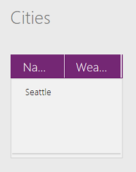

# Blank, Coalesce, IsBlank, and IsEmpty functions in PowerApps
Tests whether a value is blank or a [table](../working-with-tables.md) contains no [records](../working-with-tables.md#records), and provides a way to create *blank* values.

## Overview
*Blank* is a placeholder for "no value" or "unknown value." A **[Text input](../controls/control-text-input.md)** control is *blank* if the user hasn't typed any characters in it. The same control is no longer *blank* as soon as the user types a character in it.  Some data sources can store and return NULL values, which are represented in PowerApps as *blank*.

> [!NOTE]
> At this time, storing *blank* values is supported only for local collections. We know that many data sources support *blank* (NULL) values, and we're working to lift this limitation.

Any property or calculated value can be *blank*.  For example, a Boolean value normally has one of two values: **true** or **false**.  But in addition to these two, it can also be *blank*.  This is similar to Microsoft Excel, where a worksheet cell starts out as blank but can hold the values **TRUE** or **FALSE**, among others. At any time, the contents of the cell can be removed, and it would return to a *blank* state.

*Empty* is specific to tables that contain no records. The table structure may be intact, complete with [column](../working-with-tables.md#columns) names, but no data is in the table. A table may start as empty, take on records and no longer be empty, and then have the records removed and again be empty.

## Description
The **Blank** function returns a *blank* value. Use this to store a NULL value in a data source that supports these values, effectively removing any value from the field.

The **IsBlank** function tests for a *blank* value. *Blank* values are found in situations such as these:

* The return value from the **Blank** function.
* A control property has no formula set for it.
* No value is typed into a text-input control, or no selection is made in a listbox. You can use **IsBlank** to provide feedback that a field is required.
* A string that contains no characters has a **[Len](function-len.md)** of 0.
* An error occurred in a function. Often, one of the arguments to the function wasn't valid. Many functions return *blank* if the value of an argument is *blank*.
* Connected [data sources](../working-with-data-sources.md), such as SQL Server, may use "null" values. These values appear as *blank* in PowerApps.
* The *else* portion of an **[If](function-if.md)** function wasn't specified, and all conditions were **false**.
* You used the **[Update](function-update-updateif.md)** function but didn't specify a value for all columns. As a result, no values were placed in the columns that you didn't specify.

The **Coalesce** function evaluates its arguments in order and returns the first value that isn't *blank*.  Use this function to replace a *blank* value with a different value but leave non-*blank* values unchanged.  If all of the arguments are *blank*, then the function returns *blank*.  All arguments to **Coalesce** must be of the same type; for example, you can't mix numbers with text strings.  **Coalesce( value1, value2 )** is the more concise equivalent of **If( Not( IsBlank( value1 ) ), value1, value2 )** and doesn't require **value1** to be evaluated twice.  

The **IsEmpty** function tests whether a table contains any records. It's equivalent to using the **[CountRows](function-table-counts.md)** function and checking for zero. You can check for data-source errors by combining **IsEmpty** with the **[Errors](function-errors.md)** function.

The return value for both **IsBlank** and **IsEmpty** is a Boolean **true** or **false**.

## Syntax
**Blank**()

**Coalesce**( *Value1* [, *Value2*, ... ] )

* *Value(s)* – Required. Values to test.  Each value is evaluated in order until a non-*blank* value is found.  Values after the first non-*blank* value aren't evaluated.  

**IsBlank**( *Value* )

* *Value* – Required. Value to test.

**IsEmpty**( *Table* )

* *Table* - Required. Table to test for records.

## Examples
### Blank
> [!NOTE]
> At this time, the following example only works for local collections.  We know that many data sources support *blank* (NULL) values and We are working to lift this limitation.

1. Create an app from scratch, and add a **Button** control.
2. Set the button's **[OnSelect](../controls/properties-core.md)** property to this formula:

    **ClearCollect( Cities, { Name: "Seattle", Weather: "Rainy" } )**
3. Preview your app, click or tap the button that you added, and then close Preview.  
4. On the **File** menu, click or tap **Collections**.

     The **Cities** collection appears, showing one record with "Seattle" and "Rainy":

    
5. Click or tap the back arrow to return to the default workspace.
6. Add a **Label** control, and set its **Text** property to this formula:

    **IsBlank( First( Cities ).Weather )**

    The label shows **false** because the **Weather** field contains a value ("Rainy").
7. Add a second button, and set its **OnSelect** property to this formula:

    **Patch( Cities, First( Cities ), { Weather: Blank() } )**
8. Preview your app, click or tap the button that you added, and then close Preview.  

    The **Weather** field of the first record in **Cities** is replaced with a *blank*, removing the "Rainy" that was there previously.

    

    The label shows **true** because the **Weather** field no longer contains a value.

### Coalesce

| Formula | Description | Result |
| --- | --- | --- |
| **Coalesce( Blank(), 1 )** |Tests the return value from the **Blank** function, which always returns a *blank* value. Because the first argument is *blank*, evaluation continues with the next argument until a non-*blank* value is found. |**1** |
| **Coalesce( Blank(), Blank(), Blank(), Blank(), 2, 3 )** |**Coalesce** starts at the beginning of the argument list and evaluates each argument in turn until a non-*blank* value is found.  In this case, the first four arguments all return *blank*, so evaluation continues to the fifth argument. The fifth argument is non-*blank*, so evaluation stops here. The value of the fifth argument is returned, and the sixth argument isn't evaluated. |**2** |

### IsBlank
1. Create an app from scratch, add a text-input control, and name it **FirstName**.
2. Add a label, and set its **[Text](../controls/properties-core.md)** property to this formula:

    **If( IsBlank( FirstName.Text ), "First Name is a required field." )**

    By default, the **[Text](../controls/properties-core.md)** property of a text-input control is set to **"Text input"**. Because the property contains a value, it isn't blank, and the label doesn't display any message.
3. Remove all the characters from the text-input control, including any spaces.

    Because the **[Text](../controls/properties-core.md)** property no longer contains any characters, it's *blank*, and **IsBlank( FirstName.Text )** will be **true**. The required field message is displayed.

For information about how to perform validation by using other tools, see the **[Validate](function-validate.md)** function and [working with data sources](../working-with-data-sources.md).  

Other examples:

| Formula | Description | Result |
| --- | --- | --- |
| **IsBlank( Blank() )** |Tests the return value from the **Blank** function, which always returns a *blank* value. |**true** |
| **IsBlank( "" )** |A string that contains no characters. |**true** |
| **IsBlank( "Hello" )** |A string that contains one or more characters. |**false** |
| **IsBlank( *AnyCollection* )** |Because the [collection](../working-with-data-sources.md#collections) exists, it isn't blank, even if it doesn't contain any records. To check for an empty collection, use **IsEmpty** instead. |**false** |
| **IsBlank( Mid( "Hello", 17, 2 ) )** |The starting character for **[Mid](function-left-mid-right.md)** is beyond the end of the string.  The result is an empty string. |**true** |
| **IsBlank( If( false, false ) )** |An **[If](function-if.md)** function with no *ElseResult*.  Because the condition is always **false**, this **[If](function-if.md)** always returns *blank*. |**true** |

### IsEmpty
1. Create an app from scratch, and add a **Button** control.
2. Set the button's **[OnSelect](../controls/properties-core.md)** property to this formula:

    **Collect( IceCream, { Flavor: "Strawberry", Quantity: 300 }, { Flavor: "Chocolate", Quantity: 100 } )**
3. Preview your app, click or tap the button that you added, and then close Preview.  

    A collection named **IceCream** is created and contains this data:

    

    This collection has two records and isn't empty. **IsEmpty( IceCream )** returns **false**, and **CountRows( IceCream )** returns **2**.
4. Add a second button, and set its **[OnSelect](../controls/properties-core.md)** property to this formula:

    **Clear( IceCream )**
5. Preview your app, click or tap the second button, and then close Preview.  

    The collection is now empty:

    

    The **[Clear](function-clear-collect-clearcollect.md)** function removes all the records from a collection, resulting in an empty collection. **IsEmpty( IceCream )** returns **true**, and **CountRows( IceCream )** returns **0**.

You can also use **IsEmpty** to test whether a calculated table is empty, as these examples show:

| Formula | Description | Result |
| --- | --- | --- |
| **IsEmpty( [&nbsp;1,&nbsp;2,&nbsp;3 ] )** |The single-column table contains three records and, therefore, isn't empty. |**false** |
| **IsEmpty( [&nbsp;] )** |The single-column table contains no records and is empty. |**true** |
| **IsEmpty( Filter( [&nbsp;1,&nbsp;2,&nbsp;3&nbsp;], Value > 5 ) )** |The single-column table contains no values that are greater than 5.  The result from the filter doesn't contain any records and is empty. |**true** |

