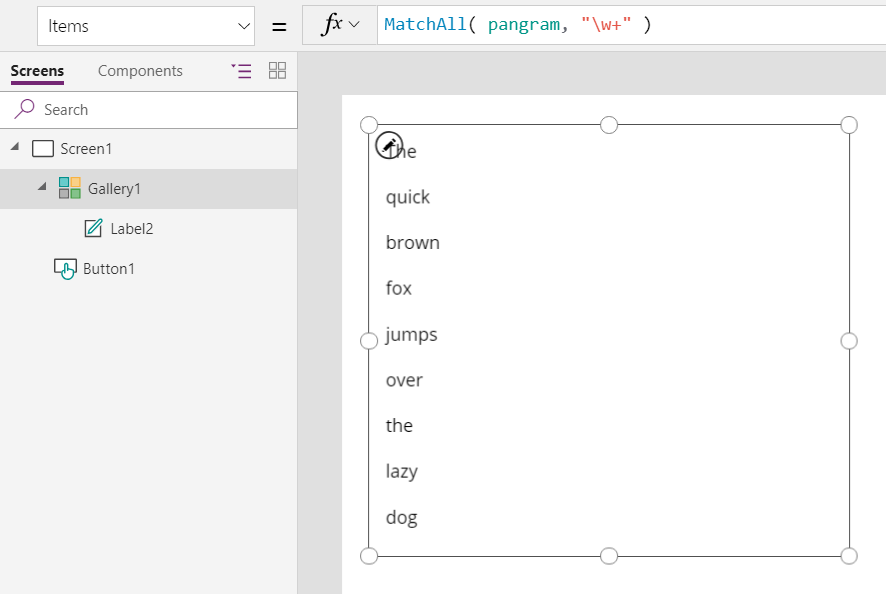
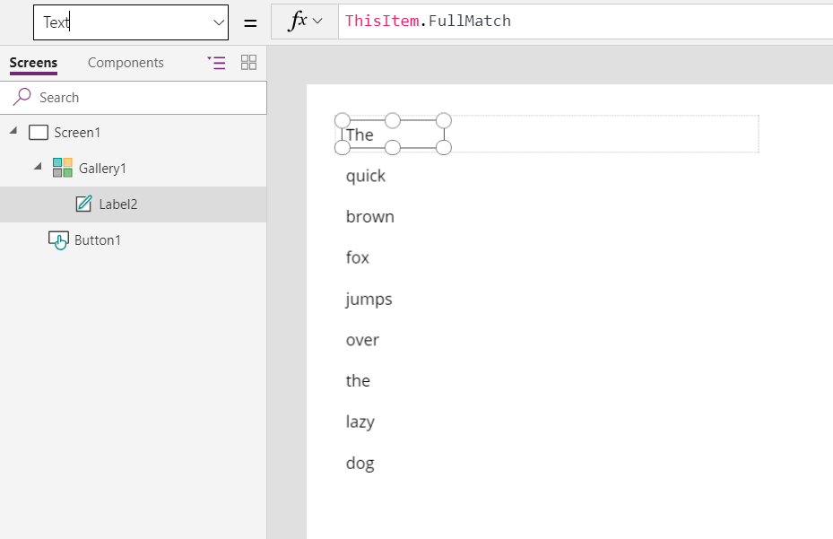

# IsMatch, Match, and MatchAll functions in Power Apps
Tests for a match or extracts portions of a text string based on a pattern.

## Description
The **IsMatch** function tests whether a text string matches a pattern that can comprise ordinary characters, predefined patterns, or a [regular expression](#regular-expressions).  The **Match** and **MatchAll** functions return what was matched, including sub-matches.  

Use **IsMatch** to validate what a user has typed in a **[Text input](../controls/control-text-input.md)** control. For example, you can confirm whether the user has entered a valid email address before the result is saved to your data source. If the entry doesn't match your criteria, add other controls that prompt the user to correct the entry.

Use **Match** to extract the first text string that matches a pattern and **MatchAll** to extract all text strings that match. You can also extract sub-matches to parse complex strings.   

**Match** returns a record of information for the first match found, and **MatchAll** returns a table of records for every match found. The record or records contain:

| Column | Type | Description |
|----|----|----|
| *named sub&#8209;match or sub&#8209;matches* | Text | Each named sub-match will have its own column. Create a named sub-match by using **(?&lt;*name*&gt;**...**)** in the regular expression. If a named sub-match has the same name as one of the predefined columns (below), the sub-match takes precedence, and a warning is generated. To avoid this warning, rename the sub-match. |
| **FullMatch** | Text | All of the text string that was matched. |
| **StartMatch** | Number | The starting position of the match within the input text string. The first character of the string returns 1. | 
| **SubMatches** | Single-column table of Text (column **Value**) | The table of named and unnamed sub-matches in the order in which they appear in the regular expression. Generally, named sub-matches are easier to work with and are encouraged. Use the [**ForAll**](function-forall.md) function or [**Last**](function-first-last.md)( [**FirstN**](function-first-last.md)( **...** ) ) functions to work with an individual sub-match. If no sub-matches are defined in the regular expression, this table will be present but empty. |

These functions support [**MatchOptions**](#match-options). By default: 
- These functions perform a case-sensitive match. Use **IgnoreCase** to perform case-insensitive matches.    
- **IsMatch** matches the entire text string (**Complete** MatchOption), while **Match** and **MatchAll** search for a match anywhere in the text string (**Contains** MatchOption). Use **Complete**, **Contains**, **BeginsWith**, or **EndsWith** as appropriate for your scenario.

**IsMatch** returns *true* if the text string matches the pattern or *false* if it doesn't. **Match** returns *blank* if no match is found that can be tested with the [**IsBlank**](function-isblank-isempty.md) function. **MatchAll** returns an empty table if no match is found that can be tested with the [**IsEmpty**](function-isblank-isempty.md) function.

If you're using **MatchAll** to split a text string, consider using the **[Split](function-split.md)** function, which is simpler to use and faster.

## Patterns
The key to using these functions is in describing the pattern to match. You describe the pattern in a text string as a combination of:

* Ordinary characters, such as  **"abc"** or **"123"**.
* Predefined patterns, such as **Letter**, **MultipleDigits**, or **Email**. (The **Match** enum defines these patterns.)
* Regular-expression codes, such as **"\d+\s+\d+"** or **"[a-z]+"**.

Combine these elements by using the [string-concatenation operator **&**](operators.md). For example, **"abc" & Digit & "\s+"** is a valid pattern that matches the characters "a", "b", and "c", followed by a digit from 0 to 9, followed by at least one whitespace character.

### Ordinary characters
The simplest pattern is a sequence of ordinary characters to be matched exactly.

For example, when used with the **IsMatch** function, the string "Hello" matches the pattern **"Hello"** exactly. No more and no less. The string "hello!" doesn't match the pattern because of the exclamation point on the end and because the case is wrong for the letter "h". (See [MatchOptions](#match-options) for ways to modify this behavior.)

In the pattern language, certain characters are reserved for special purposes. To use these characters, either prefix the character with a **\\** (backslash) to indicate that the character should be taken literally, or use one of the predefined patterns described later in this topic. This table lists the special characters:

| Special character | Description |
| --- | --- |
| **.** |dot or period |
| **?** |question mark |
| **&#42;** |asterisk |
| **\+** |plus |
| **( )** |parentheses |
| **[ ]** |square brackets |
| **{ }** |curly braces |
| **^** |caret |
| **$** |dollar sign |
| **\|** |vertical bar or pipe |
| **\\** |backslash |

For example, you can match "Hello?" by using the pattern **"Hello\\?"** with a backslash before the question mark.

### Predefined patterns
Predefined patterns provide a simple way to match either one of a set of characters or a sequence of multiple characters. Use the [string-concatenation operator **&**](operators.md) to combine your own text strings with members of the **Match** enum:

| Match enum | Description | Regular expression |
| --- | --- | --- |
| **Any** |Matches any character. |`.` |
| **Comma** |Matches a comma. |`,` |
| **Digit** |Matches a single digit ("0" through "9"). |`\d` |
| **Email** |Matches an email address that contains an "at" symbol ("\@") and a domain name that contains a dot (".") |`.+\@.+\\.[^\\.]{2,}` |
| **Hyphen** |Matches a hyphen. |`\-` |
| **LeftParen** |Matches a left parenthesis "(". |`\(` |
| **Letter** |Matches a letter. |`\p{L}` |
| **MultipleDigits** |Matches one or more digits. |`\d+` |
| **MultipleLetters** |Matches one or more letters. |`\p{L}+` |
| **MultipleNonSpaces** |Matches one or more characters that don't add whitespace (not space, tab, or newline). |`\S+` |
| **MultipleSpaces** |Matches one or more characters that add whitespace (space, tab, or newline). |`\s+` |
| **NonSpace** |Matches a single character that doesn't add whitespace. |`\S` |
| **OptionalDigits** |Matches zero, one, or more digits. |`\d*` |
| **OptionalLetters** |Matches zero, one, or more letters. |`\p{L}*` |
| **OptionalNonSpaces** |Matches zero, one, or more characters that don't add whitespace. |`\S*` |
| **OptionalSpaces** |Matches zero, one, or more characters that add whitespace. |`\s*` |
| **Period** |Matches a period or dot ("."). |`\.` |
| **RightParen** |Matches a right parenthesis ")". |`\)` |
| **Space** |Matches a character that adds whitespace. |`\s` |
|**Tab**|Matches a tab character.|`\t`|

For example, the pattern **"A" & MultipleDigits** will match the letter "A" followed by one or more digits.  

### Regular expressions
The pattern that these functions use is a [regular expression](https://en.wikipedia.org/wiki/Regular_expression). The ordinary characters and predefined patterns that are described earlier in this topic help build regular expressions.  

Regular expressions are very powerful, available in many programming languages, and used for a wide variety of purposes. They can also often look like a random sequence of punctuation marks. This article doesn't describe all aspects of regular expressions, but a wealth of information, tutorials, and tools are available on the web.  

Regular expressions come in different dialects, and Power Apps uses a variant of the JavaScript dialect. See [regular-expression syntax](/previous-versions/1400241x(v=vs.100)) for an introduction to the syntax. Named sub-matches (sometimes called named capture groups) are supported:

- Named sub-matches: **(?&lt;*name*&gt; ...)**
- Named backreferences: **\\k&lt;*name*&gt;**

In the **Match** enum table earlier in this topic, each enum appears in the same row as its corresponding regular expression.

## Match options
You can modify the behavior of these functions by specifying one or more options, which you can combine by using the string- concatenation operator (**&amp;**).  

| MatchOptions enum | Description | Impact on a regular expression |
| --- | --- | --- |
| **BeginsWith** |The pattern must match from the beginning of the text. |Adds a **^** to the start of the regular expression. |
| **Complete** |Default for **IsMatch**. The pattern must match the entire string of text, from beginning to end. |Adds a **^** to the start and a **$** to the end of the regular expression. |
| **Contains** |Default for **Match** and **MatchAll**. The pattern must appear somewhere in the text but doesn't need to begin or end it. |Doesn't modify the regular expression. |
| **EndsWith** |The pattern must match the end of the string of text. |Adds a **$** to the end of the regular expression. |
| **IgnoreCase** |Treats uppercase and lowercase letters as identical. By default, matching is case sensitive. |Doesn't modify the regular expression. This option is the equivalent of the standard "i" modifier for regular expressions.  |
| **Multiline** |Matches across multiple lines. |Doesn't modify the regular expression. This option is the equivalent of the standard "m" modifier for regular expressions. |

Using **MatchAll** is equivalent to using the standard "g" modifier for regular expressions.

## Syntax
**IsMatch**( *Text*, *Pattern* [, *Options* ] )

* *Text* – Required. The text string to test.
* *Pattern* – Required. The pattern to test as a text string. Concatenate predefined patterns that the **Match** enum defines, or provide a regular expression. *Pattern* must be a constant formula without any variables, data sources, or other dynamic references that change as the app runs.
* *Options* – Optional. A text-string combination of **MatchOptions** enum values. By default, **MatchOptions.Complete** is used.

**Match**( *Text*, *Pattern* [, *Options* ] )

* *Text* – Required. The text string to match.
* *Pattern* – Required. The pattern to match as a text string. Concatenate predefined patterns that the **Match** enum defines, or provide a regular expression. *Pattern* must be a constant formula without any variables, data sources, or other dynamic references that change as the app runs.
* *Options* – Optional. A text-string combination of **MatchOptions** enum values. By default, **MatchOptions.Contains** is used.

**MatchAll**( *Text*, *Pattern* [, *Options* ] )

* *Text* – Required. The text string to match.
* *Pattern* – Required. The pattern to match as a text string. Concatenate predefined patterns that the **Match** enum defines, or provide a regular expression. *Pattern* must be a constant formula without any variables, data sources, or other dynamic references that change as the app runs.
* *Options* – Optional. A text-string combination of **MatchOptions** enum values. By default, **MatchOptions.Contains** is used.

## IsMatch examples
### Ordinary characters
Imagine that your app contains a **Text input** control named **TextInput1**. The user enters values into this control to be stored in a database.   

The user types **Hello world** into **TextInput1**.

| Formula | Description | Result |
| --- | --- | --- |
| `IsMatch( TextInput1.Text, "Hello world" )` |Tests whether the user's input matches, exactly, the string "Hello world". |**true** |
| `IsMatch( TextInput1.Text, "Good bye" )` |Tests whether the user's input matches, exactly, the string "Good bye". |**false** |
| `IsMatch( TextInput1.Text, "hello", Contains )` |Tests whether the user's input contains the word "hello" (case sensitive). |**false** |
| `IsMatch( TextInput1.Text, "hello", Contains & IgnoreCase )` |Tests whether the user's input contains the word "hello" (case insensitive). |**true** |

### Predefined patterns

|                                                            Formula                                                            |                                                                Description                                                                |  Result   |
|-------------------------------------------------------------------------------------------------------------------------------|-------------------------------------------------------------------------------------------------------------------------------------------|-----------|
| `IsMatch( "123-45-7890", Digit & Digit & Digit & Hyphen & Digit & Digit & Hyphen & Digit & Digit & Digit & Digit )` |                                              Matches a United States Social Security Number                                               | **true**  |
|                                           `IsMatch( "joan@contoso.com", Email )`                                            |                                                         Matches an email address                                                          | **true**  |
|                              `IsMatch( "123.456", MultipleDigits & Period & OptionalDigits )`                               |                                   Matches a sequence of digits, a period, and then zero or more digits.                                   | **true**  |
|                                `IsMatch( "123", MultipleDigits & Period & OptionalDigits )`                                 | Matches a sequence of digits, a period, and then zero or more digits. A period doesn't appear in the text to match, so this pattern isn't matched. | **false** |

### Regular expressions

|                                                                              Formula                                                                              |                                                                                                                                  Description                                                                                                                                   |  Result   |
|-------------------------------------------------------------------------------------------------------------------------------------------------------------------|--------------------------------------------------------------------------------------------------------------------------------------------------------------------------------------------------------------------------------------------------------------------------------|-----------|
|                                                                    `IsMatch( "986", "\d+" )`                                                                   |                                                                                                                    Matches an integer greater than zero.                                                                                                                     | **true**  |
|                                                               `IsMatch( "1.02", "\d+(\.\d\d)?" )`                                                              |                                        Matches a positive currency amount. If the input contains a decimal point, the input must also contain two numeric characters after the decimal point. For example, 3.00 is valid, but 3.1 isn't.                                         | **true**  |
|                                                            `IsMatch( "-4.95", "(-)?\d+(\.\d\d)?" )`                                                             |                                                        Matches a positive or negative currency amount. If the input contains a decimal point, the input must also contain two numeric characters after the decimal point.                                                        | **true**  |
|                                                         `IsMatch( "111-11-1111", "\d{3}-\d{2}-\d{4}" )`                                                        | Matches a United States Social Security number. Validates the format, type, and length of the supplied input field. The string to match must consist of three numeric characters followed by a dash, then two numeric characters followed by a dash, and then four numeric characters. | **true**  |
|                                                         `IsMatch( "111-111-111", "\d{3}-\d{2}-\d{4}" )`                                                         |                                                                                               Same as the previous example, but one of the hyphens is out of place in the input.                                                                                               | **false** |
|                                         `IsMatch( "AStrongPasswordNot", "(?!^[0-9]\*$)(?!^[a-zA-Z]\*$)([a-zA-Z0-9]{8,10})" )`                                        |                                        Validates a strong password, which must contain eight, nine, or 10 characters, in addition to at least one digit and at least one alphabetic character. The string must not contain special characters.                                        | **false** |

## Match and MatchAll examples

| Formula | Description | Result |
|--------|------------|-----------|
| `Match( "Bob Jones <bob.jones@contoso.com>", "<(?<email>" & Match.Email & ")>"` | Extracts only the email portion of the contact information.  | {<br>email:&nbsp;"bob.jones@contoso.com",<br>FullMatch:&nbsp;"&lt;bob.jones@contoso.com>",<br>SubMatches:&nbsp;[&nbsp;"bob.jones@contoso.com"&nbsp;],<br>StartMatch: 11<br>}  
| `Match( "Bob Jones <InvalidEmailAddress>", "<(?<email>" & Match.Email & ")>"` | Extracts only the email portion of the contact information. No legal address is found (there is no @ sign), so the function returns *blank*. | *blank* |  
| `Match( Language(), "(<language>\w{2})(?:-(?<script>\w{4}))?(?:-(?<region>\w{2}))?" )` | Extracts the language, script, and region portions of the language tag that the **[Language](function-language.md)** function returns. These results reflect the United States; see the [**Language** function documentation](function-language.md) for more examples.  The **(?:** operator groups characters without creating another sub-match. | {<br>language: "en",<br>script: *blank*, <br>region: "US",<br>FullMatch: "en-US", <br>SubMatches: [ "en", "", "US" ], <br>StartMatch: 1<br>} 
| `Match( "PT2H1M39S", "PT(?:<hours>\d+)H)?(?:(?<minutes>\d+)M)?(?:(?<seconds>\d+)S)?" )` | Extracts the hours, minutes, and seconds from an ISO 8601 duration value. The extracted numbers are still in a text string; use the [**Value**](function-value.md) function to convert it to a number before mathematical operations are performed on it.  | {<br> hours: "2",<br>minutes: "1",<br>seconds: "39",<br>FullMatch: "PT2H1M39S",<br>SubMatches:&nbsp;[&nbsp;"2",&nbsp;"1",&nbsp;"39"&nbsp;],<br>StartMatch: 1<br>} |

Let's drill into that last example. If you wanted to convert this string to a date/time value using the **[Time](function-date-time.md)** function, you must pass in the named sub-matches individually. To do this, you can use the **[With](function-with.md)** function operating on the record that **Match** returns:

``` powerapps-dot
With( 
    Match( "PT2H1M39S", "PT(?:(?<hours>\d+)H)?(?:(?<minutes>\d+)M)?(?:(?<seconds>\d+)S)?" ), 
	Time( Value( hours ), Value( minutes ), Value( seconds ) )
)
```

For these examples, add a [Button](../controls/control-button.md) control, set its **OnSelect** property to this formula, and then select the button:

``` powerapps-dot
Set( pangram, "The quick brown fox jumps over the lazy dog." )
```
 
| Formula | Description | Result |
|---------|-------------|--------|
| `Match( pangram, "THE", IgnoreCase )` | Find all matches of "THE" in the text string that the **pangram** variable contains. The string contains two matches, but only the first is returned because you're using **Match** and not **MatchAll**. The SubMatches column is empty because no sub-matches were defined.  | {<br>FullMatch: "The",<br>SubMatches: [&nbsp;],<br>StartMatch: 32<br>} |
| `MatchAll( pangram, "the" )` | Find all matches of "the" in the text string that the **pangram** variable contains. The test is case sensitive, so only the second instance of "the" is found. The SubMatches column is empty because no sub-matches were defined.  |   |
| `MatchAll( pangram, "the", IgnoreCase )` | Find all matches of "the" in the text string that the **pangram** variable contains. In this case, the test is case insensitive, so both instances of the word are found. The SubMatches column is empty because no sub-matches were defined.  |   |
| `MatchAll( pangram, "\b\wo\w\b" )` | Finds all three-letter words with an "o" in the middle. Note that "brown" is excluded because it's not a three-letter word and, therefore, fails to match "\b" (word boundary).  |   |
| `Match( pangram, "\b\wo\w\b\s\*(?<between>\w.+\w)\s\*\b\wo\w\b" )` | Matches all the characters between "fox" and "dog". | {<br>between:&nbsp;"jumps&nbsp;over&nbsp;the&nbsp;lazy",<br>FullMatch:&nbsp;"fox&nbsp;jumps&nbsp;over&nbsp;the&nbsp;lazy&nbsp;dog",<br>SubMatches: [ "jumps over the lazy" ],<br>StartMatch: 17<br> } |

To see the results of **MatchAll** in a gallery:

1. In an empty screen, insert a blank vertical **[Gallery](../controls/control-gallery.md)** control.

2. Set the gallery's **Items** property to **MatchAll( pangram, "\w+" )** or **MatchAll( pangram, MultipleLetters )**.

	

3. Select "Add an item from the Insert tab" in the middle of the gallery control to select the template of the gallery. 

5. Add a **[Label](../controls/control-text-box.md)** control to the gallery's template.  

4. Set the label's **Text** property to **ThisItem.FullMatch**.  
 
    The gallery is filled with each word in our example text.  Resize the gallery's template and the label control in order to see all the words on one screen.

	


[!INCLUDE[footer-include](../../../includes/footer-banner.md)]