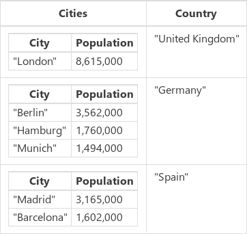
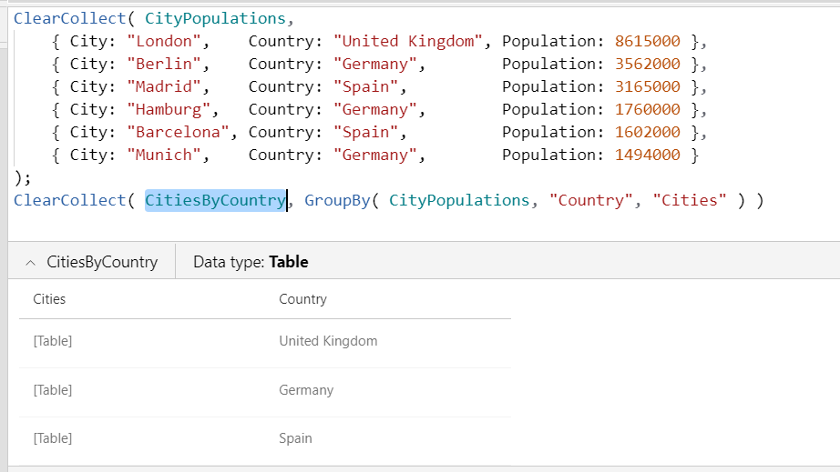

# JSON function in Power Apps

Generates a JSON text string for a table, a record, or a value.

## Description

The **JSON** function returns the JavaScript Object Notation (JSON) representation of a data structure as text so that it's suitable for storing or transmitting across a network. [ECMA-404](https://www.ecma-international.org/publications/files/ECMA-ST/ECMA-404.pdf) and [IETF RFC 8259](https://tools.ietf.org/html/rfc8259) describe the format, which is widely used by JavaScript and other programming languages.

Canvas apps support the [data types](data-types.md) that this table lists with details about their text representation:

| Data type | Description | Result example |
|-----------|-------------|---------|
| **Boolean** | *true* or *false*. | `true` |
| **Color** | String that contains the 8-digit hexadecimal representation for the color. This representation takes the format #*rrggbbaa*, where *rr* is the red component, *gg* is green, *bb* is blue, and *aa* is the alpha channel. For the alpha channel, **00** is fully transparent, and **ff** is fully opaque. You can pass the string to the [**ColorValue**](function-colors.md) function.  | `"#102030ff"` |
| **Currency** | Number that uses the appropriate decimal separator for the user's language. Scientific notation is used if needed. | `1.345` |
| **Date** | String that contains the date in ISO 8601 **yyyy-mm-dd** format. | `"2019-03-31"` |
| **DateTime** | String that contains an ISO 8601 date/time. Date/time values are in UTC, as the ending "Z" indicates.  | `"2019-03-31T22:32:06.822Z"`  |
| **GUID** | String that contains the GUID value. Letters are lowercase. | `"751b58ac-380e-4a04-a925-9f375995cc40"`
| **Image, Media** | If **IncludeBinaryData** is specified, media files are encoded in a string. Web references that use the http: or https: URL scheme aren't modified. References to in-memory binary data are encoded with the ["data:*mimetype*;base64,..."](https://en.wikipedia.org/wiki/Data_URI_scheme) format. In-memory data includes images that users capture by using the [**Camera**](../controls/control-camera.md) control and any other references with the appres: and blob: URL schemes.| `"data:image/jpeg;base64,/9j/4AA..."` |
| **Number** | Number that uses the appropriate decimal separator for the user's language. Scientific notation is used if needed. | `1.345` |
| **Option&nbsp;set** | Numeric value of the choice, not the label that's used for display. The numeric value is used because it's language independent.  | `1001` |
| **Time** | String that contains an ISO 8601 *hh:mm:ss.fff* format.  | `"23:12:49.000"` |
| **Record** | Comma-delimited list, between **{** and **}**, of fields and their values. This notation resembles that for records in canvas apps, but the name is always between double quotation marks. This format doesn't support records that are based on many-to-one relationships.  | `{ "First Name": "Fred", "Age": 21 }` |
| **Table** | Comma-delimited list, between **[** and **]**, of records. This format doesn't support tables that are based on one-to-many relationships.  | `[ { "First Name": "Fred", "Age": 21 }, { "First Name": "Jean", "Age": 20 } ]` |
| **Two&nbsp;option** | Boolean value of the two option, *true* or *false*, not the label that's used for display. The Boolean value is used because it's language independent. | `false` |
| **Hyperlink, Text** | String between double quotation marks. The function escapes embedded double-quotation marks with a backslash, replaces newlines with "\n", and makes other standard JavaScript replacements. | `"This is a string."` |

Specify the optional *Format* argument to control how readable the result is and how unsupported and binary data types are handled. By default, the output is as compact as possible with no unnecessary spaces or newlines, and unsupported data types and binary data aren't allowed. You can combine multiple formats if you specify the **&** operator.

| JSONFormat enum | Description |
|-----------------|-------------|
| **Compact** | Default.  The output is as compact as possible with no added spaces or newlines. |
| **IndentFour** | To improve readability, the output contains a newline for each column and nesting level and uses four spaces for each indentation level. |
| **IncludeBinaryData** | The result includes image, video, and audio-clip columns. This format can dramatically increase the result's size and degrade your app's performance. |
| **IgnoreBinaryData** | The result doesn't include image, video, or audio-clip columns. If you specify neither **IncludeBinaryData** nor **IgnoreBinaryData**, the function produces an error if it encounters binary data. |
| **IgnoreUnsupportedTypes** | Unsupported data types are allowed, but the result won't include them. By default, unsupported data types produce an error. |

Use the [**ShowColumns** and **DropColumns**](function-table-shaping.md) functions to control which data the result includes and to remove unsupported data types.

Because **JSON** can be both memory and compute intensive, you can use this function only in [behavior functions](../working-with-formulas-in-depth.md). You can capture the result from **JSON** into a [variable](../working-with-variables.md), which you can then use in data flow.

If a column has both a display name and a logical name, the result contains the logical name. Display names reflect the language of the app user and are, therefore, inappropriate for data transfer to a common service.

## Syntax

**JSON**( *DataStructure* [, *Format* ] )

* *DataStructure* – Required. The data structure to convert to JSON.  Tables, records, and primitive values are supported, arbitrarily nested.
* *Format* - Optional.  **JSONFormat** enum value. The default value is **Compact**, which doesn't add newlines or spaces and blocks binary data and unsupported columns.

## Examples

### Hierarchical data

1. Insert a [**Button**](../controls/control-button.md) control, and set its **OnSelect** property to this formula.

    ```powerapps-dot
    ClearCollect( CityPopulations,
        { City: "London",    Country: "United Kingdom", Population: 8615000 },
        { City: "Berlin",    Country: "Germany",        Population: 3562000 },
        { City: "Madrid",    Country: "Spain",          Population: 3165000 },
        { City: "Hamburg",   Country: "Germany",        Population: 1760000 },
        { City: "Barcelona", Country: "Spain",          Population: 1602000 },
        { City: "Munich",    Country: "Germany",        Population: 1494000 }
    );
    ClearCollect( CitiesByCountry, GroupBy( CityPopulations, "Country", "Cities" ) )
    ```

1. Select the button while holding down the Alt key.

    The **CitiesByCountry** collection is created with this data structure, which you can show by selecting **Collections** on the **File** menu and then selecting the name of the collection.

    > [!div class="mx-imgBorder"]
    > 

    You can also show this collection by selecting **File** > **Settings** > **Upcoming features** > **Enable formula bar result view**, selecting the name of the collection in the formula bar, and then selecting the down arrow next to the name of the collection under the formula bar.

    > [!div class="mx-imgBorder"]
    > 

1. Insert another button, and set its **OnSelect** property to this formula:

    ```powerapps-dot
    Set( CitiesByCountryJSON, JSON( CitiesByCountry ) )
    ```

    This formula sets the global variable **CitiesByCountryJSON** to the JSON representation for **CitiesByCountry**.

1. Select the button while holding down the Alt key.

1. Insert a [**Label**](../controls/control-text-box.md) control, and set its **Text** property to this variable.

    ```powerapps-dot
    CitiesByCountryJSON
    ```

    The label shows this result, all on a single line with no spaces, suitable for transmission across a network:

    ```json
    [{"Cities":[{"City":"London","Population":8615000}],"Country":"United Kingdom"},{"Cities":[{"City":"Berlin","Population":3562000},{"City":"Hamburg","Population":1760000},{"City":"Munich","Population":1494000}],"Country":"Germany"},{"Cities":[{"City":"Madrid","Population":3165000},{"City":"Barcelona","Population":1602000}],"Country":"Spain"}]
    ```

1. Change the second button's formula to make the output more readable.

    ```powerapps-dot
    Set( CitiesByCountryJSON, JSON(CitiesByCountry, JSONFormat.IndentFour ))
    ```

1. Select the second button while holding down the Alt key.

    The label shows the more readable result.

    ```json
    [
        {
            "Cities": [
                {
                    "City": "London",
                    "Population": 8615000
                }
            ],
            "Country": "United Kingdom"
        },
        {
            "Cities": [
                {
                    "City": "Berlin",
                    "Population": 3562000
                },
                {
                    "City": "Hamburg",
                    "Population": 1760000
                },
                {
                    "City": "Munich",
                    "Population": 1494000
                }
            ],
            "Country": "Germany"
        },
        {
            "Cities": [
                {
                    "City": "Madrid",
                    "Population": 3165000
                },
                {
                    "City": "Barcelona",
                    "Population": 1602000
                }
            ],
            "Country": "Spain"
        }
    ]
    ```

### Images and media in base64

1. Add an [**Image**](../controls/control-image.md) control.

    This control brings **SampleImage** with it.

1. Add a [**Button**](../controls/control-button.md) control, and set its **OnSelect** property to this formula.

    ```powerapps-dot
    Set( ImageJSON, JSON( SampleImage, JSONFormat.IncludeBinaryData ) )
    ```

1. Select the button while holding down the Alt key.

1. Add a label, and set its **Text** property to this variable.

    ```powerapps-dot
    ImageJSON
    ```

1. Resize the control and reduce the font size as needed to show most of the result.

    The label shows the text string that the **JSON** function captured.

    ```json
    "data:image/svg+xml;base64,PD94bWwgdmVyc2lvbj0iMS4wIiBlbmNvZGluZz0idXRmLTgiPz4NCjxzdmcgdmVyc2lvbj0iMS4xIg0KCSB4bWxucz0iaHR0cDovL3d3dy53My5vcmcvMjAwMC9zdmciIHhtbG5zOnhsaW5rPSJodHRwOi8vd3d3LnczLm9yZy8xOTk5L3hsaW5rIiB4bWxuczphPSJodHRwOi8vbnMuYWRvYmUuY29tL0Fkb2JlU1ZHVmlld2VyRXh0ZW5zaW9ucy8zLjAvIg0KCSB4PSIwcHgiIHk9IjBweCIgd2lkdGg9IjI3MHB4IiBoZWlnaHQ9IjI3MHB4IiBlbmFibGUtYmFja2dyb3VuZD0ibmV3IDAgMCAyNzAgMjcwIiB4bWw6c3BhY2U9InByZXNlcnZlIj4NCgk8ZyBjbGFzcz0ic3QwIj4NCgkJPHJlY3QgeT0iMC43IiBmaWxsPSIjRTlFOUU5IiB3aWR0aD0iMjY5IiBoZWlnaHQ9IjI2OS4zIi8+DQoJCTxwb2x5Z29uIGZpbGw9IiNDQkNCQ0EiIHBvaW50cz0iMjc3LjksMTg3LjEgMjQ1LDE0My40IDE4OC42LDIwMi44IDc1LDgwLjUgLTQuMSwxNjUuMyAtNC4xLDI3MiAyNzcuOSwyNzIiLz4NCgkJPGVsbGlwc2UgZmlsbD0iI0NCQ0JDQSIgY3g9IjIwMi40IiBjeT0iODQuMSIgcng9IjI0LjQiIHJ5PSIyNC4zIi8+DQoJPC9nPg0KPC9zdmc+"
    ```


[!INCLUDE[footer-include](../../../includes/footer-banner.md)]