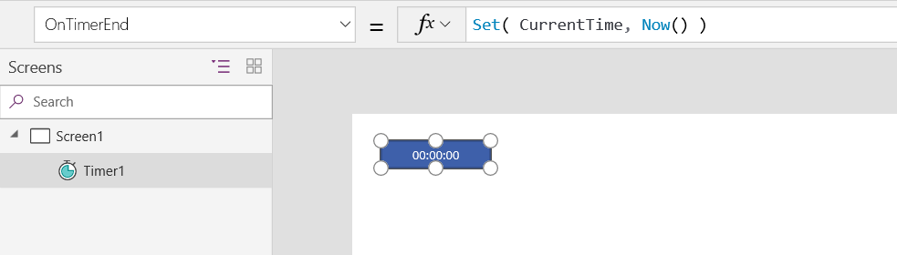
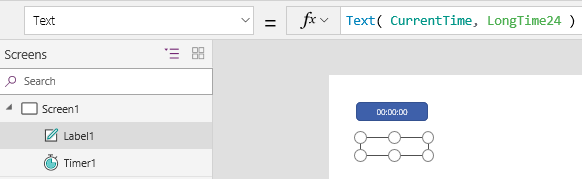
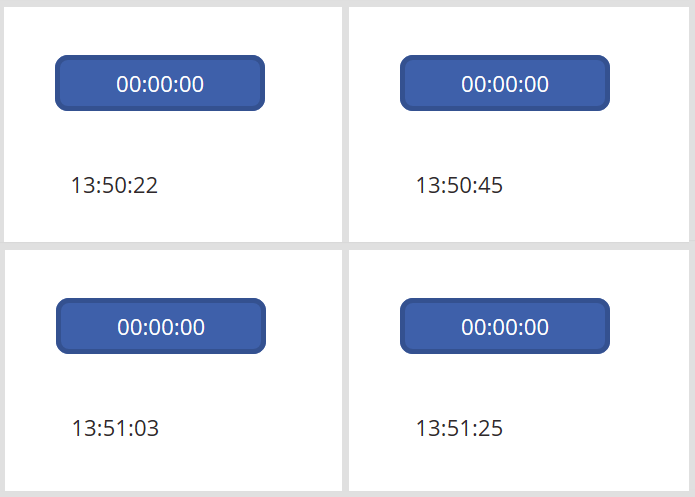

# Now, Today, and IsToday functions in Power Apps
Returns the current date and time, and tests whether a date/time value is today.

## Description
The **Now** function returns the current date and time as a date/time value.

The **Today** function returns the current date as a date/time value. The time portion is midnight. **Today** has the same value throughout a day, from midnight today to midnight tomorrow.

The **IsToday** function tests whether a date/time value is between midnight today and midnight tomorrow. This function returns a Boolean (**true** or **false**) value.

All these functions work with the local time of the current user.

See [working with dates and times](../show-text-dates-times.md) for more information.

## Volatile Functions
**Now** and **Today** are volatile functions.  Each time one of these functions is evaluated it returns a different value.  

When used in a data flow formula, a volatile function will only return a different value if the formula in which it appears is reevaluated.  If nothing else changes in the formula then it will have the same value throughout the execution of your app.

For example, a label control with **Label1.Text = Now()** will not change while your app is active.  Only closing and reopening the app will result in a new value.

The function will be reevaluated if it is part of a formula in which something else has changed.  For example, if we change our example to involve a slider control with **Label1.Text = DateAdd( Now(), Slider1.Value, Minutes )** then the current time is retrieved each time the Slider control's value changes and the label's text property is reevaluated.

When used in a [behavior formula](../working-with-formulas-in-depth.md), volatile functions will be evaluated each time the behavior formula is evaluated.  See below for an example.

## Syntax
**Now**()

**Today**()

**IsToday**( *DateTime* )

* *DateTime* - Required.  The date/time value to test.

## Examples
For the examples in this section, the current time is **3:59 AM** on **February 12, 2015**, and the language is **en-us**.

| Formula | Description | Result |
| --- | --- | --- |
| **Text( Now(), "mm/dd/yyyy hh:mm:ss" )** |Retrieves the current date and time, and displays it as a string. |"02/12/2015 03:59:00" |
| **Text( Today(), "mm/dd/yyyy hh:mm:ss" )** |Retrieves the current date only, leaving the time portion as midnight, and displays it as a string. |"02/12/2015 00:00:00" |
| **IsToday( Now() )** |Tests whether the current date and time is between midnight today and midnight tomorrow. |**true** |
| **IsToday( Today() )** |Tests whether the current date is between midnight today and midnight tomorrow. |**true** |
| **Text( DateAdd( Now(), 12 ), "mm/dd/yyyy hh:mm:ss" )** |Retrieves the current date and time, adds 12 days to the result, and displays it as a string. |"02/24/2015 03:59:00" |
| **Text( DateAdd( Today(), 12 ), "mm/dd/yyyy hh:mm:ss" )** |Retrieves the current date, adds 12 days to the result, and displays it as a string. |"02/24/2015 00:00:00" |
| **IsToday( DateAdd( Now(), 12 ) )** |Tests whether the current date and time, plus 12 days, is between midnight today and midnight tomorrow. |**false** |
| **IsToday( DateAdd( Today(), 12 ) )** |Tests whether the current date, plus 12 days, is between midnight today and midnight tomorrow. |**false** |

#### Display a clock that updates in real time

1. Add a **[Timer](../controls/control-timer.md)** control, set its **Duration** property to **1000**, and set its **Repeat** property to **true**.

    The timer will run for one second, automatically start over, and continue that pattern. 

1. Set the control's **OnTimerEnd** property to this formula:

    **Set( CurrentTime, Now() )**

    Whenever the timer starts over (after each second), this formula sets the **CurrentTime** global variable to the current value of the **Now** function.

	

1. Add a **[Label](../controls/control-text-box.md)** control, and set its **Text** property to this formula:

    **Text( CurrentTime, LongTime24 )**

    Use the **[Text](function-text.md)** function to format the date and time however you want, or set this property to just **CurrentTime** to show hours and minutes but not seconds.

	

1. Preview the app by pressing F5, and then start the timer by clicking or tapping it.

    The label continually shows the current time, down to the second.

	

1. Set the timer's **AutoStart** property to **true** and its **Visible** property to **false**.

    The timer is invisible and starts automatically.

1. Set the screen's **[OnStart](../controls/control-screen.md)** property so that the **CurrentTime** variable has a valid value, as in this example:

    **Set(CurrentTime, Now())**

    The label appears as soon as the app starts (before the timer runs for a full second).

[!INCLUDE[footer-include](../../../includes/footer-banner.md)]