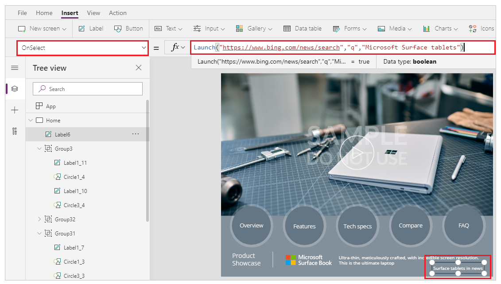
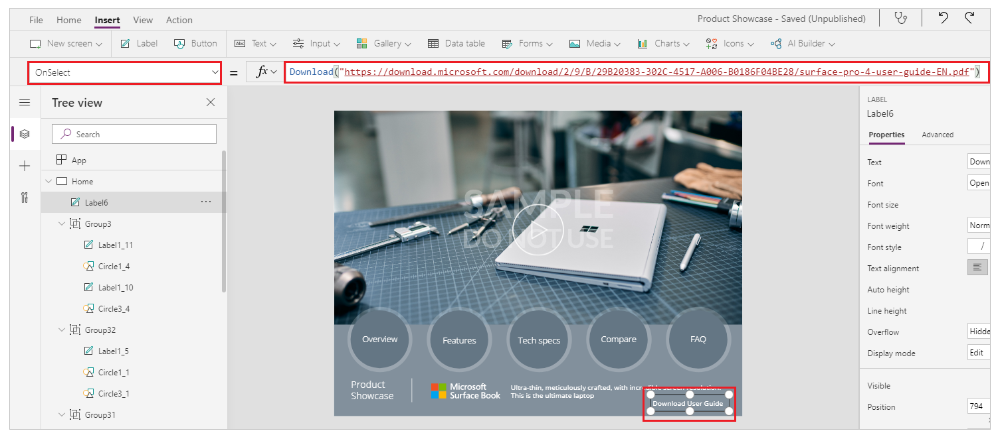
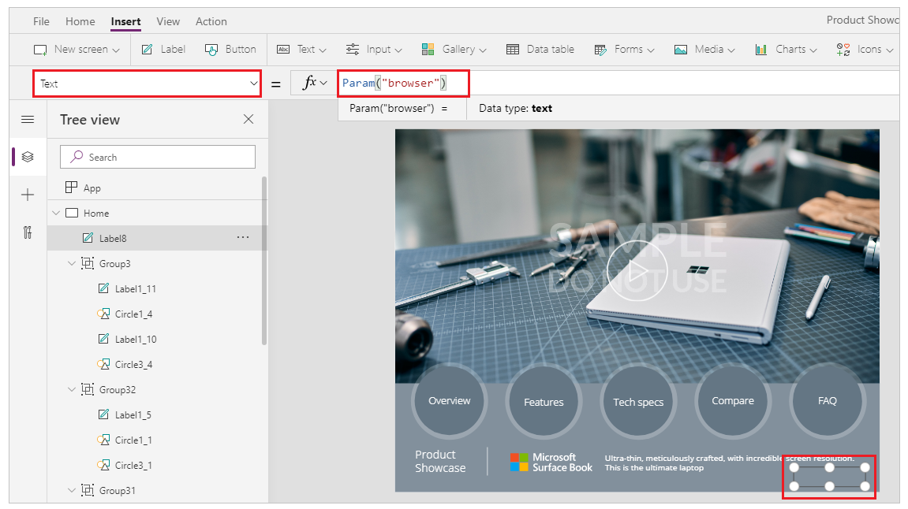
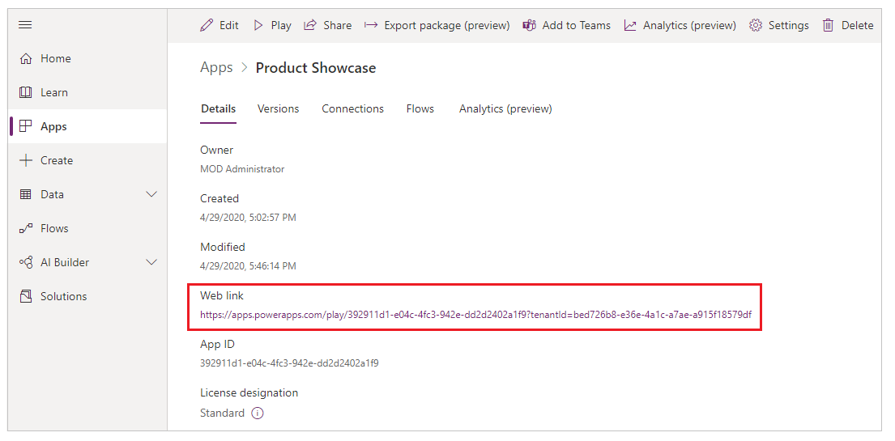
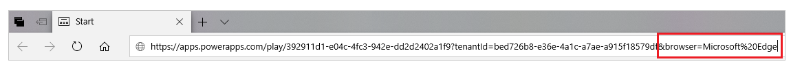
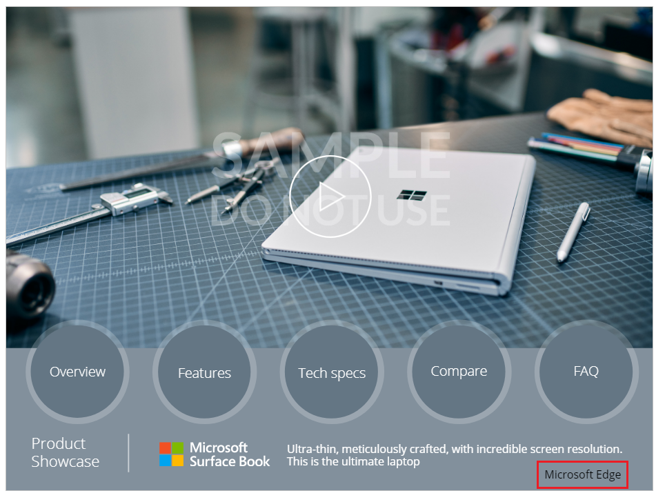
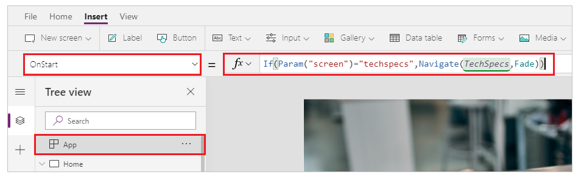

# Download, Launch, and Param functions in canvas apps
Downloads or launches a webpage or an app with parameters.  

## Description
The **Download** function downloads a file from the web to the local device. The user is prompted for a location to save the file.  **Download** returns the location where the file was stored locally as a string.  

The **Launch** function launches a webpage or an app.  Optionally, this function can pass parameters to the app.

In Internet Explorer and Microsoft Edge, the **Launch** function opens a website or app only if its security settings are the same or higher than those of the app that contains the function. If, for example, you add the **Launch** function to an app that will run in the **Trusted sites** security zone, ensure that the website or app that you want the function to open is in the **Trusted sites** or **Local intranet** zone (not in **Restricted sites**). More information: [Change security and privacy settings for Internet Explorer 11](https://support.microsoft.com/help/17479/windows-internet-explorer-11-change-security-privacy-settings).  

The **Param** function retrieves a parameter passed to the app when it was launched. If the named parameter wasn't passed, **Param** returns *blank*.

## Syntax
**Download**( *Address* )

* *Address* - Required.  The address of a web resource to download.

**Launch**( *Address* [, *ParameterName1*, *ParameterValue1*, ... ] )

* *Address* - Required.  The address of a webpage or the ID of an app to launch.
* *ParameterName(s)* - Optional.  Parameter name.
* *ParameterValue(s)* - Optional.  Corresponding parameter values to pass to the app or the webpage.

**Param**( *ParameterName* )

* *ParameterName* - Required.  The name of the parameter passed to the app.

## Examples

In these examples, we used the **Product Showcase** tablet layout template. To create an app with this template, follow the steps from [create an app](../get-started-test-drive.md) article and select the **Product Showcase** template. You can also use your own app.

### Launch

1. Go to [Power Apps](https://make.powerapps.com).
1. Select **Apps** from left navigation pane.
1. Select your app and then select **Edit**.
1. Select **Insert** from the menu and then select **Label**.
1. Move the label to the bottom right of the screen.
1. From the properties pane on the right-side, select **Color** as *white* and set **Border thickness** at *1*.
1. Select the **Text** property from right-side and enter text as *Surface tablets in news*.
1. From property list on top left, select **OnSelect**.
1. Enter formula such as ```Launch("https://www.bing.com/news/search","q","Microsoft Surface tablets")```.

    

1. Save and publish the app.
1. Play the app.
1. Select label **Surface tablets in news** to launch news search with keywords *Microsoft Surface tablets*.

> [!TIP]
> For scalability, you can replace the manually entered keywords in Launch function with [variables](../working-with-variables.md).

### Download

1. Go to [Power Apps](https://make.powerapps.com).
1. Select **Apps** from left navigation pane.
1. Select your app and then select **Edit**.
1. Select **Insert** from the menu and then select **Label**.
1. Move the label to the bottom right of the screen.
1. From the properties pane on the right-side, select **Color** as *white* and set **Border thickness** at *1*.
1. Select the **Text** property from right-side and enter text as *Download User Guide*.
1. From property list on top left, select **OnSelect**.
1. Enter formula such as ```Download("https://download.microsoft.com/download/2/9/B/29B20383-302C-4517-A006-B0186F04BE28/surface-pro-4-user-guide-EN.pdf")```. 

    

1. Save and publish the app.
1. Play the app.
1. Select the **Download User Guide** button to download the guide.

> [!NOTE]
> If the host server processing the download request supports *Range* header, the file opens in a new browser with multiple [HTTP 206 Partial Content](https://www.w3.org/Protocols/rfc2616/rfc2616-sec10.html) responses. Check host server capabilities if Download function causes the file to open in new tab instead of prompt to download.

### Param

1. Go to [Power Apps](https://make.powerapps.com).
1. Select **Apps** from left navigation pane.
1. Select your app and then select **Edit**.
1. Select **Insert** from the menu and then select **Label**.
1. Move the label to the bottom right of the screen.
1. From the properties pane on the right-side, select **Color** as *white* and set **Border thickness** at *1*.
1. Select **Text** property for the label from top left.
1. Enter formula such as ```Param("browser")```.

    

1. Go to [Power Apps](https://make.powerapps.com).
1. Select **Apps** from left navigation pane.
1. Select your app and then select **Details**. 
1. Copy the **Web link** for your app.

    

1. Save and publish the app.
1. Open a new browser.
1. Paste the app web link in the browser and append ```&browser=Microsoft%20Edge``` at the end.

    

1. When your app launches, the label shows the parameter value passed.

    

1. Close the app player and edit the app.
1. Select **App** from the Tree view on left navigation.
1. Select **OnStart** property on top left.
1. Enter the formula such as ```If(Param("screen")="techspecs",Navigate(TechSpecs,Fade))```.

    

    [If function](function-if.md) in [OnStart](object-app.md#onstart-property) property checks if parameter equals a certain value, in this case the value *techspecs*. And if it matches, the app navigates to *TechSpecs* screen.

    > [!NOTE]
    > Replace **TechSpecs** screen name in the Navigate function with name of a screen in your own app if you're not using the **Product Showcase** app template.

1. Save and publish the app.
1. Open a new browser.
1. Paste the app web link in the browser and append ```&screen=techspecs``` at the end.

    

1. The app directly launches with **TechSpecs** or a screen you entered in Navigate function.

### See also

[Canvas app formula reference](formula-reference.md)