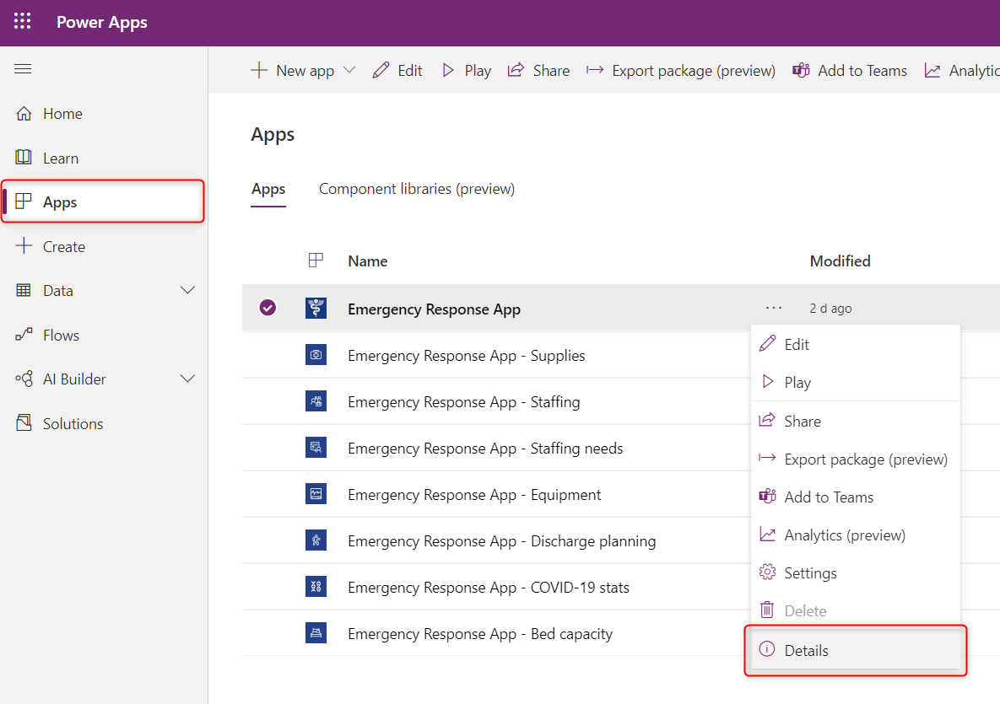
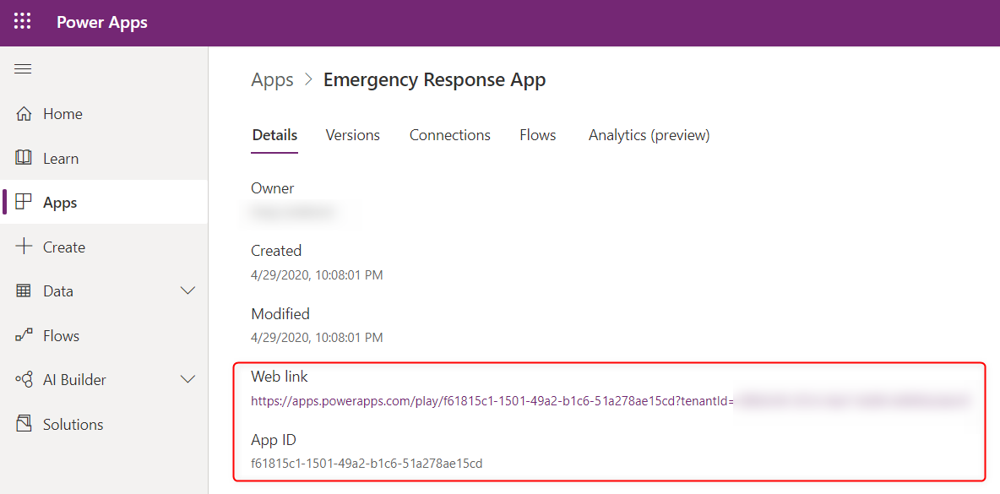

# Launch and Param functions in Power Apps
Launches a webpage or a canvas app and provides access to launch parameters.

## Launch

### Adddress
Webpages are launched via a URL address.  For example:

```powerapps-dot
Launch( "https://bing.com" )
```  

Canvas apps are launched with either their **Web link** or **App ID**.  To find these values for an app, open the [Power Apps](https://make.powerapps.com) portal and follow these steps.

1. Select Apps and then Details from the **...** menu for an app:
    
1. Copy and paste either the **Web link** or **App ID**:
    

The **Web link** can be linked from any web page and will launch the canvas app.  It can also be used with the **Launch** function.

The **App ID** can be used with the **Launch** function, but must be prefixed with `/providers/Microsoft.PowerApps/apps/`.  For example:

```powerapps-dot
Launch( "/providers/Microsoft.PowerApps/apps/b26f2340-5b65-9271-2be4-365b295861ef" )
```

Native apps on a device cannot be directly launched.  There may be indirect options available on some platforms, such as a native app installing a custom URL scheme or registering with the web browser to offer an option for specific web sites.

### LaunchTarget
[!NOTE]
The LaunchTarget argument is currently in Preview and will be released in all regions soon.

Use the *LaunchTarget* argument to specify the target browser window in which to open the webpage or app.  Use one of the following **LaunchTarget** enum values or provide a custom window *name*.

| LaunchTarget&nbsp;enum | Description | 
| --- | --- | 
| **Blank** | The webpage or app is opened in a new window or tab. |
| **Self** | The webpage or app replaces the current window or tab. |
| *name* | Instead of an enum value, use your own text string to *name* the window or tab.  This is an internal only name that is only used by the **Launch** function; it has no impact on nor will it match the title of the window that your users see.  If a window or tab with the given *name* already exists, its contents will be replaced, otherwise a new window or tab will be created.  *name* cannot begin with the underscore character "_". |

**Blank** is the default when running in a web browser with **Self** and *name* as available options.  In a mobile player, **Blank** is the default for webpages with *name* as as available option, while **Self** will always be used for apps.

> [!NOTE]
> *LaunchTarget* enum names are in transition.  You can use **Blank** and **Self** today but these names will be changing in the weeks ahead.  Your app will automatically be updated when this occurs, your formulas will not require an update.

### Parameters
**Launch** can pass parameters to the webpage or canvas app.  Parameters can be provided in two equivalent ways:
- An argument list of name value pairs.  For example 
    ```
    Launch( "http://bing.com/search", "q", "Power%20Apps", "count", 1 )
    ```

- A record of field values.  For example:
    ```
    Launch( "http://bing.com/search", { q: "Power%20Apps", count: 1 } )
    ```
    This form can be easier to work with as it makes the association between name and value clearer.  It is the only form that supports the optional *LaunchTarget* argument.

[!NOTE]
The record option for parameters is currently in Preview and will be released in all regions soon.

The address and parameters are URL encoded before being passed to replace certain non-alphanumeric characters with `%` and a hexadecimal number as if the [**EncodeUrl**](function-encode-decode.md) function has been used on each.

### Security zones
In Internet Explorer and classic Microsoft Edge, the **Launch** function opens a website or app only if its security settings are the same or higher than those of the app that contains the function. If, for example, you add the **Launch** function to an app that will run in the **Trusted sites** security zone, ensure that the website or app that you want the function to open is in the **Trusted sites** or **Local intranet** zone (not in **Restricted sites**). More information: [Change security and privacy settings for Internet Explorer 11](https://support.microsoft.com/help/17479/windows-internet-explorer-11-change-security-privacy-settings).  

## Param
The **Param** function retrieves a parameter passed to the app when it was launched. If the named parameter wasn't passed, **Param** returns *blank*.

Parameters can be passed to a canvas app in one of two ways:
- If launching a canvas app from another canvas app, use the *Parameter* arguments to the **Launch** function.  Parameter names and values will be automatically URL encoded.
- If launching a canvas app from a web page, add a [query string](https://en.wikipedia.org/wiki/Query_string) to the [canvas app address](#address).  For example, adding `?First%20Name=Fred&category=3` would pass two parameters: `First Name` with a value of `"Fred"` and `category` with a value of `"3"` (note it is a text string).  Only the first item after the canvas app address should have a `?`; after that use the `&` as illustrated here.  The parameter name and value must be URL encoded if they contains spaces or special characters, similar to using the [**EncodeURL**](function-encode-decode.md) function. 

Param names are case sensitive.  

Param names and values will be automatically URL decoded.

Even if the parameter contains a number, the type returned by **Param** will always be a text string.  Conversion to other types will automatically occur or use explicit conversions such as the [**Value**](function-value.md) function to convert to a number.

## Syntax
**Launch**( *Address* [, *ParameterName1*, *ParameterValue1*, ... ] )

* *Address* – Required.  The address of a webpage or the ID of an app to launch.
* *ParameterName(s)* – Optional.  Parameter name.
* *ParameterValue(s)* – Optional.  Corresponding parameter values to pass to the app or the webpage.

**Launch**( *Address*, { [ *ParameterName1*: *ParameterValue1*, ... ] } [, *LaunchTarget* ] )

* *Address* – Required.  The address of a webpage or the ID of an app to launch.
* *ParameterName(s)* – Optional.  Parameter name.
* *ParameterValue(s)* – Optional.  Corresponding parameter values to pass to the app or the webpage.
* *LaunchTarget* – Optional.  A **LaunchTarget** enum value or a custom *name*.  

**Param**( *ParameterName* )

* *ParameterName* - Required.  The name of the parameter passed to the app.

## Examples

### Simple Launch

From a canvas app to a web page:

| Formula | Description |
| ------- | ----------- |
| **Launch(&nbsp;"http://bing.com/search",&nbsp;<br>"q",&nbsp;"Power&nbsp;Apps",&nbsp;"count",&nbsp;1&nbsp;)** | Opens the webpage **http://bing.com/search?q=Power%20Apps&count=1**.  A new window or tab is opened. |  
| **Launch(&nbsp;"http://bing.com/search",&nbsp;<br>{&nbsp;q:&nbsp;"Power&nbsp;Apps",&nbsp;count:&nbsp;1&nbsp;}&nbsp;)** | The same as the previous examples using the equivalent record notation.  A new window or tab is opened. | 
| **Launch(&nbsp;"http://bing.com/search",&nbsp;<br>{&nbsp;q:&nbsp;"Power&nbsp;Apps",&nbsp;count:&nbsp;1&nbsp;},&nbsp;<br>LaunchTarget.Self&nbsp;)** | The same as the previous examples, replacing the current window or tab with the result if running in a web browser. | 
| **Launch(&nbsp;"http://bing.com/search",&nbsp;<br>{&nbsp;q:&nbsp;"Power&nbsp;Apps",&nbsp;count:&nbsp;1&nbsp;},&nbsp;<br>"Search&nbsp;Results"&nbsp;)** | The same as the previous example, creating or replacing the contents of the window or tab named **Search Results**. |

From a canvas app to a canvas app:

```powerapps-dot
Launch( "/providers/Microsoft.PowerApps/apps/b26f2340-5b65-9271-2be4-365b295861ef",
        { Navigate: "Second Screen", Record: 34 }
)
```

From a web page to a canvas app:

```html
<a href="/providers/Microsoft.PowerApps/apps/b26f2340-5b65-9271-2be4-365b295861ef?Navigate=Second%20Screen&Record=34">
```

### Simple Param

For these examples, the canvas app was launched as shown at the end of the Simple Launch above.

| Formula | Description | Result |
| ------- | ----------- |-------|
| **Param(&nbsp;"Navigate"&nbsp;)** | The **Navigate** parameter was provide when the app was launched and is returned. | "Second Screen" |
| **Param(&nbsp;"Record"&nbsp;)** | The **Record** parameter was provided when the app was launched.  Even though it was passed in as a number to the **Launch** function, the result from **Param** will be a text string that can be implicitly or explicitly converted to other tyeps.  | "34" |
| **Param(&nbsp;"User"&nbsp;)**  | The **User** parameter was not provided.  A *blank* value is returned that can be tested with the [**IsBlank**](function-isblank-isempty.md) function. | *blank* |

### Step by Step Launch

The **Product Showcase** tablet layout template was used for the following example. To create an app with this template, follow the steps from [create an app](../get-started-test-drive.md) article and select the **Product Showcase** template. You can also use your own app.

1. Go to [Power Apps](https://make.powerapps.com).
1. Select **Apps** from left navigation pane.
1. Select your app and then select **Edit**.
1. Select **Insert** from the menu and then select **Label**.
1. Move the label to the bottom right of the screen.
1. From the properties pane on the right-side, select **Color** as *white* and set **Border thickness** at *1*.
1. Select the **Text** property from right-side and enter text as *Surface tablets in news*.
1. From property list on top left, select **OnSelect**.
1. Enter formula as ```Launch("https://www.bing.com/news/search","q","Microsoft Surface tablets")```. You can also use any other URL, parameter and keywords of your choice.

    

1. Save and publish the app.
1. Play the app.
1. Select label **Surface tablets in news** to launch news search with keywords *Microsoft Surface tablets*.

> [!TIP]
> For scalability, you can replace the manually entered keywords in Launch function with [variables](../working-with-variables.md).

### Step by Step Param

1. Go to [Power Apps](https://make.powerapps.com).
1. Select **Apps** from left navigation pane.
1. Select your app and then select **Edit**.
1. Select **Insert** from the menu and then select **Label**.
1. Move the label to the bottom right of the screen.
1. Select **Text** property for the label from top left.
1. Enter formula as ```Param("browser")```. You can also use a different parameter of your choice.

    

1. Save and publish the app.
1. Go to [Power Apps](https://make.powerapps.com).
1. Select **Apps** from left navigation pane.
1. Select your app and then select **Details**. 
1. Copy the **Web link** for your app.

    

1. Open a new browser.
1. Paste the app web link in the browser and append ```&browser=Microsoft%20Edge``` at the end.

    

1. When your app launches, the label shows the parameter value passed.

    

1. Close the app player and edit the app.
1. Select **App** from the Tree view on left navigation.
1. Select **OnStart** property on top left.
1. Enter the formula as ```If(Param("screen")="techspecs",Navigate(TechSpecs,Fade))```.  

    

    [If function](function-if.md) in [OnStart](object-app.md#onstart-property) property checks if parameter equals a certain value, in this case the value *techspecs*. And if it matches, the app navigates to *TechSpecs* screen.

    > [!NOTE]
    > Replace **TechSpecs** screen name in the Navigate function with name of a screen in your own app if you're not using the **Product Showcase** app template.

1. Save and publish the app.
1. Open a new browser.
1. Paste the app web link in the browser and append ```&screen=techspecs``` at the end.

    

1. The app directly launches with **TechSpecs** or a screen you entered in Navigate function.

### See also

[Canvas app formula reference](../formula-reference.md)
