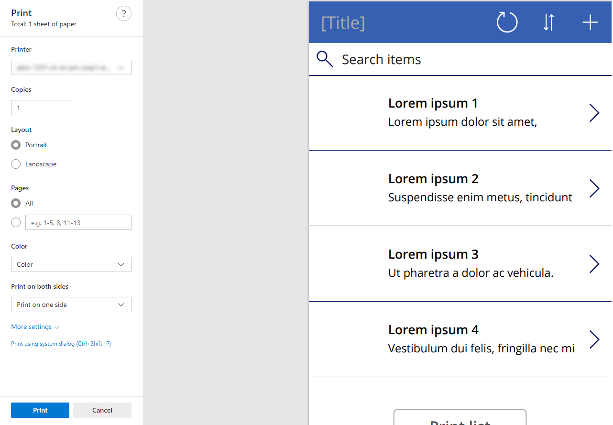
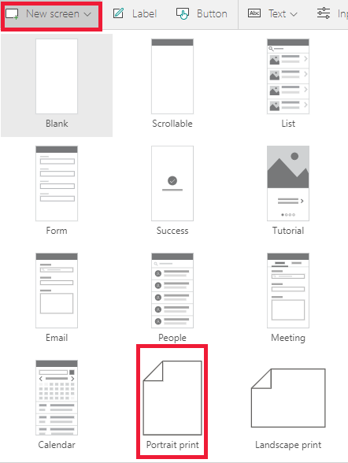
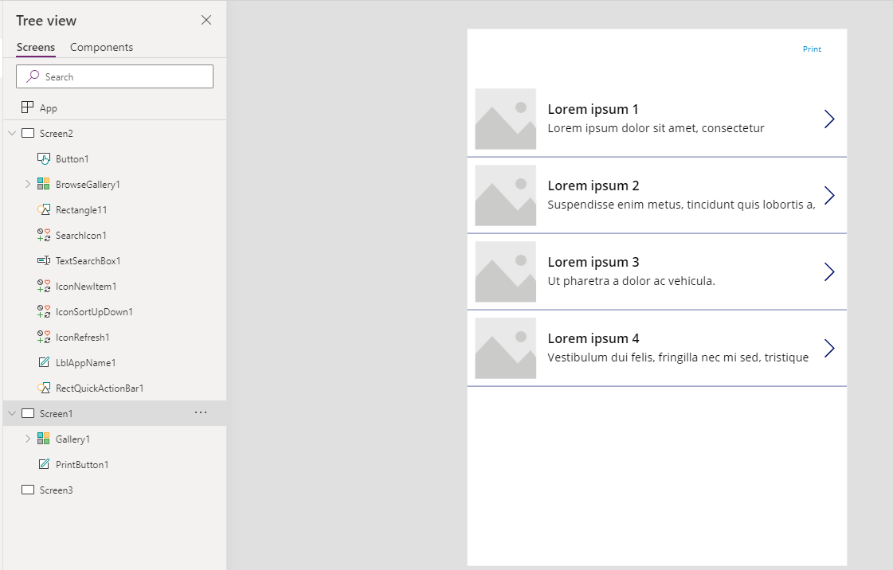

# Print function in Power Apps 

Opens the current screen in the default browser print dialog.

## Description 

The print function allows you to select any screen and fit it to a page in order to send it to a printer for printing or allows you to save it as a PDF file.  

The different configurations of the screen enable different printing outcomes. For fixed screens, they fit the size of the page, for use of the screen templates/special sized screens, we will fit the content to the size of the print.  

> [!NOTE]
> You can only print the screen you have added a button and defined **Print** function on `OnSelect` property of the button. For example, if you have added a button on `screen 2` and when you select the button, only the content in the `screen 2` gets printed. 

## Syntax

**Print()**

### Examples

1. Go to [Power Apps](https://make.powerapps.com).
1. Select **Apps** from the left navigation pane.
1. Select your app or create an app from scratch. 
1. Select **Insert** from the menu and then select **Button**.
1. From the property list on the top left, select **OnSelect**.
1. Enter the formula `Print()`. 
1. Save and publish the app.
1. Play the app. 
1. Select the button that you added. When you select the button, a default print browser pops up and allows you to choose from the available options to print or save it as a PDF file.

   

### Hide controls while printing 

To enable more customizable content, you can access the screen when the screen is printing to the change properties of the canvas app. For example, hiding buttons, or changing a form to view mode.  

From the above example, where you insert a button on the screen and when you print the screen, you notice that the button is also gets printed. To remove the button from the screen while printing, on the button’s **Visible** property add the formula `Not Screen1.Printing`. Preview the app and select the button. Observe that the button does not show in the content in the browser preview print dialog.  

### Use a screen template 

An easy way to get started is to use a screen template to size your print to the letter size.  

- Open or create a new canvas app.
- Select **New Screen** and select **Portrait print** option.

  

- Observe that the screen is sized differently from other screens with the print button on the top-right corner.  

   

- Add content to this screen.
- Observe that the content is sized to the print. This enables more custom control over the experience.  

### Screen sizes for common prints 

To build out a print for a specific size, you can build a [responsive app](../build-responsive-apps.md), or create a special screen to manage your print.

|Print size|Screen height|Screen width|
|----------|----------------|---------|
|A4 portrait|1123|794|
|A4 landscape|794|1123|
|Letter portrait|1056|816|
|Letter landscape|816|1056|
||||

## Known limitations

- The **Print** function currently doesn't work on mobile devices and on SharePoint custom forms.  
- In Internet Explorer and classic Edge browsers, there may be undesirable behavior with how the screen scales.  
- The default browser printers are the ones that will be available to print to.  
- In some browser print dialogs, a setting called **Background graphics** should be enabled to see all the images and colors in the print.  

### See also

[Canvas app formula reference](../formula-reference.md)
