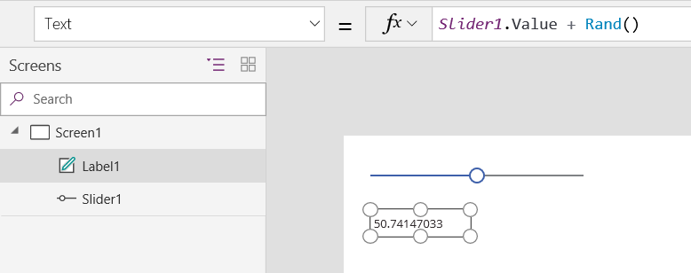
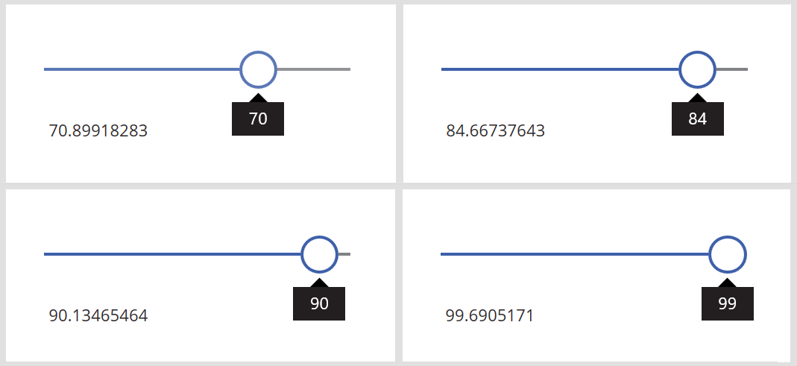
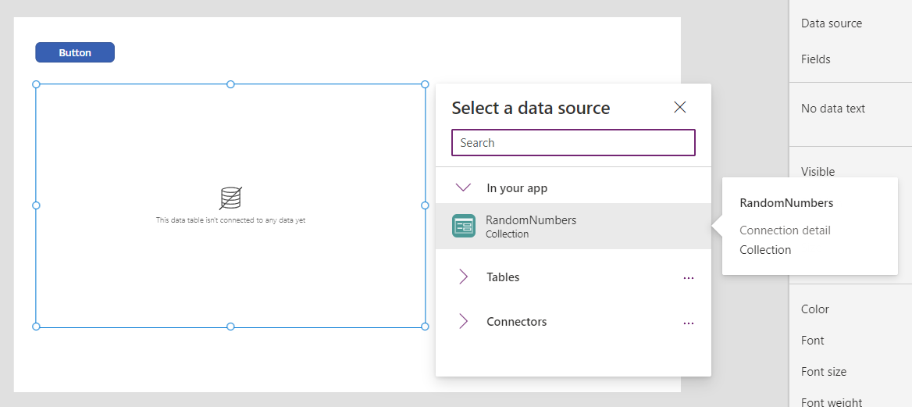
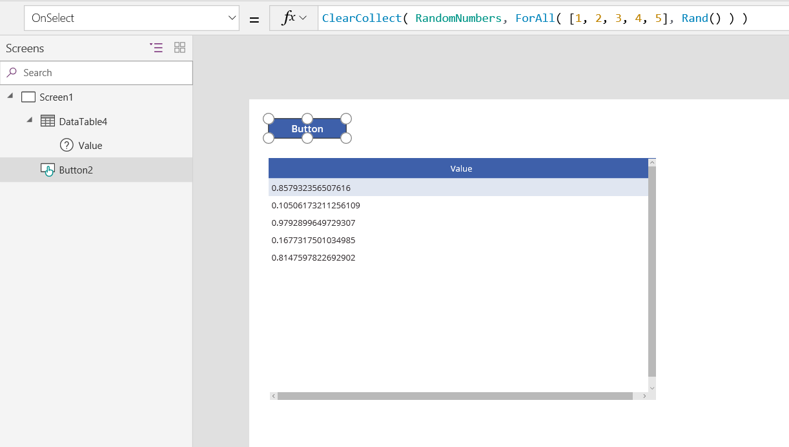
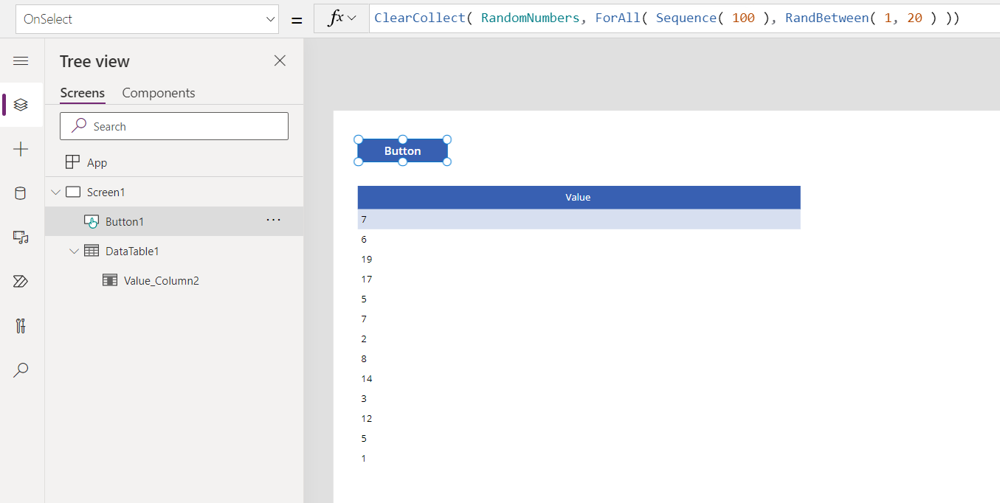

# Rand function in Power Apps
Returns a pseudo-random number.

## Description
The **Rand** function returns a pseudo-random number that's greater than or equal to 0 and less than 1.

## Volatile Functions
**Rand** is a volatile function.  Each time the function is evaluated it returns a different value.  

When used in a data flow formula, a volatile function will only return a different value if the formula in which it appears is reevaluated.  If nothing else changes in the formula then it will have the same value throughout the execution of your app.

For example, a label control with **Label1.Text = Rand()** will not change while your app is active.  Only closing and reopening the app will result in a new value.

The function will be reevaluated if it is part of a formula in which something else has changed.  For example, if we change our example to involve a slider control with **Label1.Text = Slider1.Value + Rand()** then a new random number is generated each time the Slider control's value changes and the label's text property is reevaluated.  See below for this example.

When used in a [behavior formula](../working-with-formulas-in-depth.md), **Rand** will be evaluated each time the behavior formula is evaluated.  See below for an example.

## Syntax
**Rand**()

## Examples

#### Display a different random number as user input changes
1. Add a **[Slider](../controls/control-slider.md)** control, and rename it **Slider1** if it has a different name.

1. Add a **[Label](../controls/control-text-box.md)** control, and set its **Text** property to this formula:

    **Slider1.Value + Rand()**

    The label shows **50** (the default value for the slider) plus a random decimal:

    

1. While holding down the Alt key, change the value of the slider.

    Every time you change the value of the slider, the decimal portion of the label shows a different random number:

    

#### Create a table of random numbers
1. Add a **[Button](../controls/control-button.md)** control, and set its **[OnSelect](../controls/properties-core.md)** property to this formula:

    **ClearCollect( RandomNumbers, ForAll( [ 1, 2, 3, 4, 5 ], Rand() ))**

    This formula creates a single-column table that's used to iterate five times, resulting in five random numbers.

1. Add a **[Data table](../controls/control-data-table.md)**, set its **Items** property to **RandomNumbers**, and show the **Value** field.

    

1. While holding down the Alt key, select the button by clicking or tapping it.

    The data table shows five random decimal numbers:

    

1. Select the button again to show a different list of random numbers:

    

To generate a single random number instead of a table, use **Set( RandomNumber, Rand() )**.

[!INCLUDE[footer-include](../../../includes/footer-banner.md)]