# Relate and Unrelate functions in Power Apps

Relate and unrelate records of two tables through a one-to-many or many-to-many relationship.

## Description

The **Relate** function links two records through a one-to-many or many-to-many relationship in Microsoft Dataverse. The **Unrelate** function reverses the process and removes the link.

For one-to-many relationships, the Many table has a foreign-key field that points to a record of the One table. **Relate** sets this field to point to a specific record of the One table, while **Unrelate** sets this field to *blank*. If the field is already set when **Relate** is called, the existing link is lost in favor of the new link. You can also set this field by using the [**Patch**](function-patch.md) function or an **[Edit form](../controls/control-form-detail.md)** control; you need not use the **Relate** function.

For many-to-many relationships, the system that links the records maintains a hidden join table. You can't access this join table directly; it can be read only through a one-to-many projection and set through the **Relate** and **Unrelate** functions. Neither related table has a foreign key.

The data for the table that you specify in the first argument will be refreshed to reflect the change, but the data for the table that you specify in the second argument won't. That data must be manually refreshed with the **[Refresh](function-refresh.md)** function to show the result of the operation.

These functions never create or delete a record. They only relate or unrelate two records that already exist.

You can use these functions only in [behavior formulas](../working-with-formulas-in-depth.md).

> [!NOTE]
> These functions are part of a preview feature, and their behavior is available only when the **Relational data, option sets, and other new features for CDS** feature is enabled. This is an app-level setting that's enabled by default for new apps. To find this feature switch, open the **File** menu, select **Settings**, and then select **Upcoming features**. Your feedback is very valuable to us - please let us know what you think in the [Power Apps community forums](https://powerusers.microsoft.com/t5/Expressions-and-Formulas/bd-p/How-To).

## Syntax

**Relate**( *Table1RelatedTable*, *Table2Record* )

* *Table1RelatedTable* - Required. For a record of *Table1*, the table of *Table2* records related through a one-to-many or many-to-many relationship.
* *Table2Record* - Required. The *Table2* record to add to the relationship.

**Unrelate**( *Table1RelatedTable*, *Table2Record* )

* *Table1RelatedTable* - Required. For a record of *Table1*, the table of *Table2* records related through a one-to-many or many-to-many relationship.
* *Table2Record* - Required. The *Table2* record to remove from the relationship.

## Examples

Consider a **Products** table with the following relationships as seen in the [Power Apps portal's table viewer](../../data-platform/create-edit-entities-portal.md):

| Relationship display name | Related table | Relationship type |
| --- | --- |
| Product Reservation | Reservation | One-to-many |
| Product &harr; Contact | Contact | Many-to-many |

**Products** and **Reservations** are related through a One-to-Many relationship.  To relate the first record of the **Reservations** table with the first record of the **Products** table:

`Relate( First( Products ).Reservations, First( Reservations ) )`

To remove the relationship between these records:

`Unrelate( First( Products ).Reservations, First( Reservations ) )`

At no time did we create or remove or a record, only the relationship between records was modified.

**Products** and **Contacts** are related through a Many-to-Many relationship.  To relate the first record of the **Contacts** table with the first record of the **Products** table:

`Relate( First( Products ).Contacts, First( Contacts ) )`

As Many-to-Many relationships are symmetric, we could also have done this in the opposite direction:

`Relate( First( Contacts ).Products, First( Products ) )`

To remove the relationship between these records:

`Unrelate( First( Products ).Contacts, First( Contacts ) )`

or:

`Unrelate( First( Contacts ).Products, First( Products ) )`

The walk through that follows does exactly these operations on these tables using an app with **Gallery** and **Combo box** controls for selecting the records involved.

These examples depend on the sample data being installed in your environment. Either [create a trial environment including sample data](../../model-driven-apps/overview-model-driven-samples.md#get-sample-apps) or [add sample data to an existing environment](../../model-driven-apps/overview-model-driven-samples.md#install-or-uninstall-sample-data).

### One-to-many

#### **Relate** function

You'll first create a simple app to view and reassign the reservations that are associated with a product.

1. Create a [tablet app from blank](../data-platform-create-app-scratch.md).

1. On the **View** tab, select **Data sources**.

1. In the **Data** pane, select **Add data** > select **Products**. <br>
    The Products table is part of the sample data loaded above.

1. On the **Insert** tab, add a blank vertical **[Gallery](../controls/control-gallery.md)** control.

1. Ensure that the control that you just added is named **Gallery1**, and then move and resize it to fill the left-hand side of the screen.

1. On the **Properties** tab, set **Gallery1**'s **Items** property to **Products** and its **Layout** to **Image and title**.

    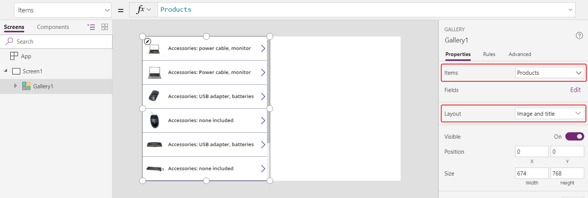

1. In **Gallery1**, ensure that the **Label** control is named **Title1**, and then set its **Text** property to **ThisItem.Name**.

    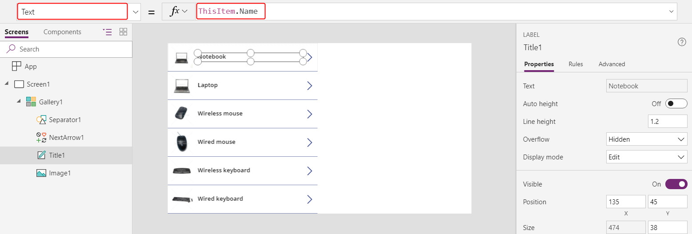

1. Select the screen to avoid inserting the next item into **Gallery1**.  Add a second blank vertical **Gallery** control, and ensure that it's named **Gallery2**.

    **Gallery2** will show the reservations for whatever product the user selects in **Gallery1**.

1. Move and resize **Gallery2** to fill the upper-right quadrant of the screen.

1. (optional) Add the blue **Label** control above **Gallery2**, as the next graphic shows.

1. In the formula bar, set the **Items** property of **Gallery2** to **Gallery1.Selected.Reservations**.

    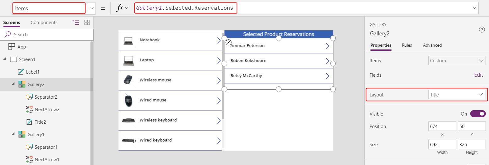

1. In the properties pane, set **Gallery2**'s **Layout** to **Title**.

    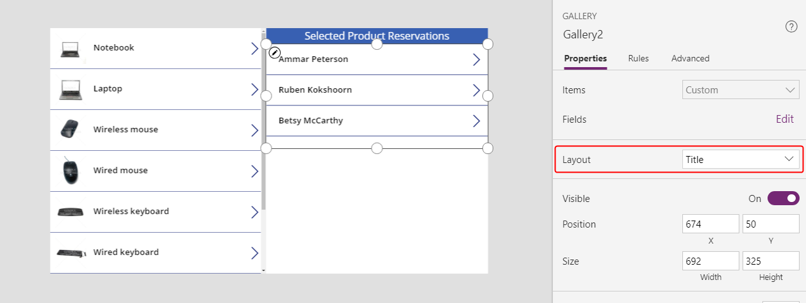

1. In **Gallery2**, add a **[Combo box](../controls/control-combo-box.md)** control, ensure that it's named **ComboBox1**, and then move and resize it to avoid blocking the other controls in **Gallery2**.

1. On the **Properties** tab, set **ComboBox1**'s **Items** property to **Products**.

    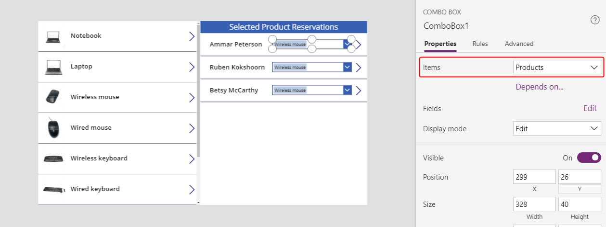

1. Scroll down in the **Properties** tab and set **ComboBox1**'s **Allow multiple selection** property to **Off**.

    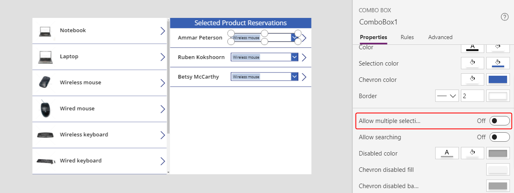

1. In the formula bar, set **ComboBox1**'s **DefaultSelectedItems** property to **ThisItem.'Product Reservation'**.

    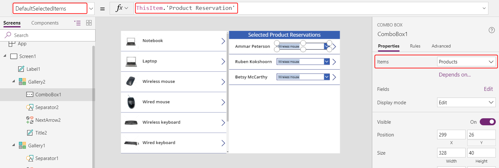

1. In **Gallery2**, set **NextArrow2**'s **OnSelect** property to this formula:

    ```powerapps-dot
    Relate( ComboBox1.Selected.Reservations, ThisItem )
    ```

    When the user selects this icon, the current reservation changes to the product that the user selected in **ComboBox1**.

    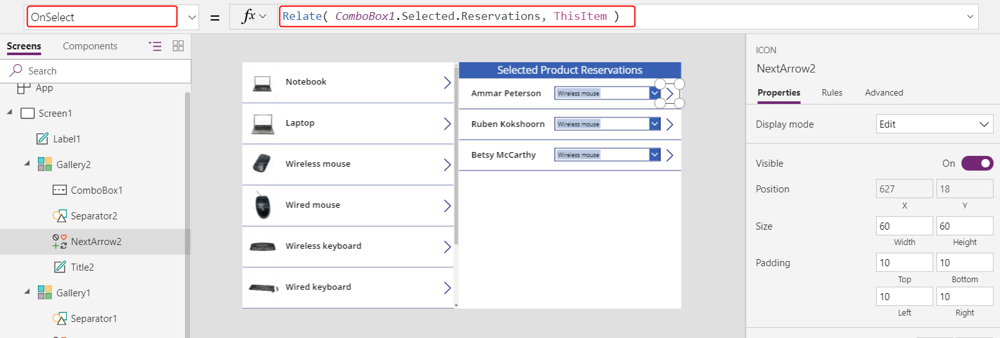

1. Press F5 to test the app in Preview mode.

With this app, the user can move a reservation from one product to another. For a reservation on one product, the user can select a different product in **ComboBox1** and then select **NextArrow2** to change that reservation.

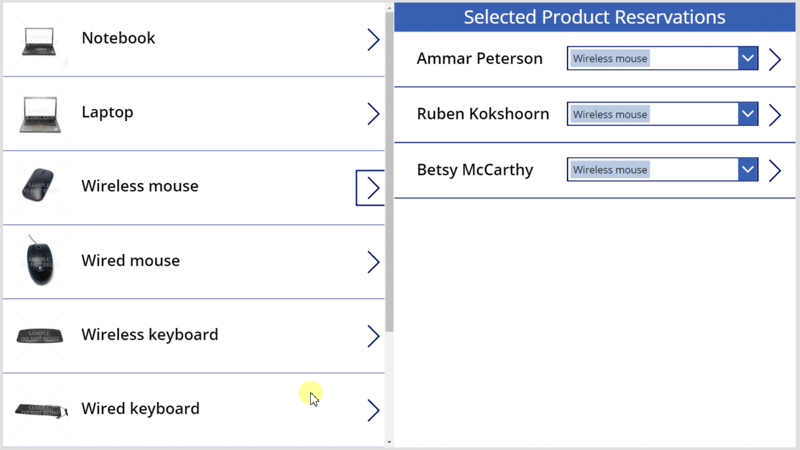

#### **Unrelate** function

At this point, you can move the relationship from one record to another, but you can't remove the relationship altogether. You can use the **Unrelate** function to disconnect a reservation record from any product.

1. On the **View** tab, select **Data sources**.

1. In the **Data** pane, select **Add data source** > **Microsoft Dataverse** > **Reservations** > **Connect**.

1. In **Gallery2**, set the **OnSelect** formula for **NextArrow2** to this formula:

    ```powerapps-dot
    If( IsBlank( ComboBox1.Selected ),
        Unrelate( Gallery1.Selected.Reservations, ThisItem ),
        Relate( ComboBox1.Selected.Reservations, ThisItem )
    );
    Refresh( Reservations )
    ```
    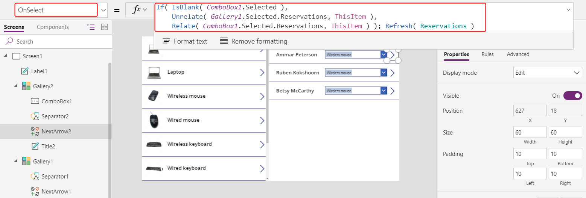

1. Copy **Gallery2** to the Clipboard by selecting it and then pressing Ctrl-C.

1. Paste a duplicate of **Gallery2** to the same screen by pressing Ctrl-V, and then move it to the lower-right quadrant of the screen.

1. (optional) If you added a label above **Gallery2**, repeat the previous two steps for that label.

1. Ensure that the duplicate of **Gallery2** is named **Gallery2_1**, and then set its **Items** property to this formula:

    ```powerapps-dot
    Filter( Reservations, IsBlank( 'Product Reservation' ) )
    ```

    A delegation warning appears, but it won't matter with the small amount of data in this example.

    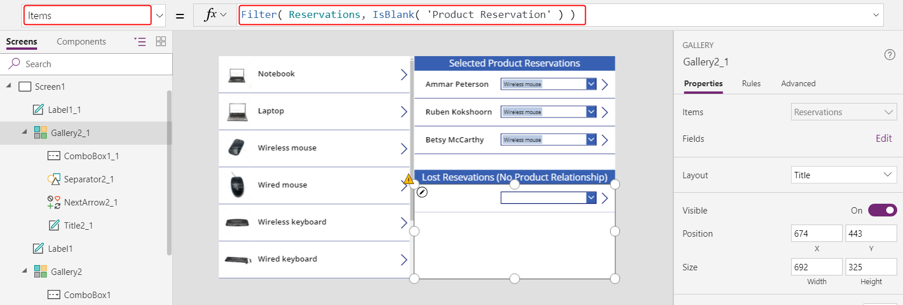

With these changes, users can clear the selection in **ComboBox1** for a contact if that person hasn't reserved a product. Contacts who haven't reserved a product appear in **Gallery2_1** where users can assign each contact to a product.

   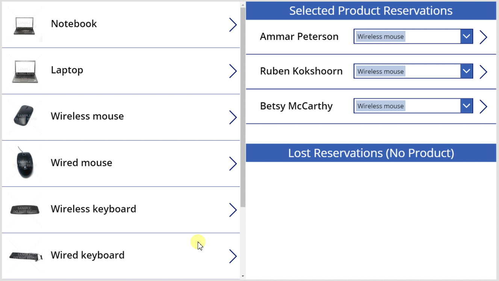

### Many-to-many

#### Create a many-to-many relationship

The sample data doesn't include a many-to-many relationship, but you'll create one between the Products table and the Contacts table. Users can relate each product to more than one contact and each contact to more than one product.

1. From [this page](https://make.powerapps.com?utm_source=padocs&utm_medium=linkinadoc&utm_campaign=referralsfromdoc), select **Data** in the left navigation bar, and then select **Tables**.

    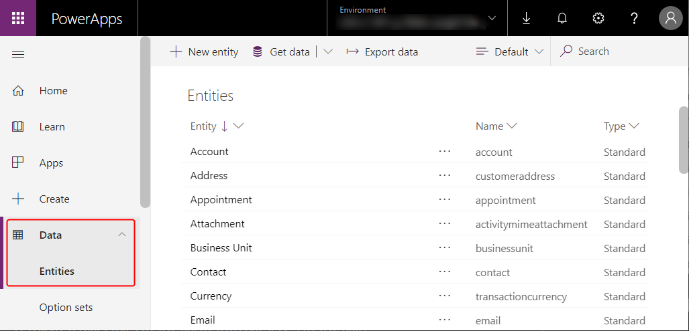

1. Change the table filter to include all tables.

    By default, sample tables don't appear.

    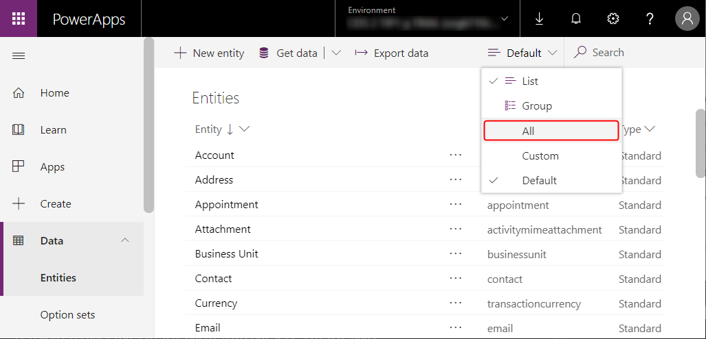

1. Scroll down, open the **Product** table, and select **Relationships**.

1. Select **Add relationship** > **Many-to-many**.

1. Select the **Contact** table for the relationship.

1. Select **Done** > **Save table**.

#### Relate and unrelate contacts with one or more products

You'll create another app that resembles the one you created earlier in this topic, but the new app will offer a many-to-many relationship. Each contact will be able to reserve multiple products instead of only one.

1. In a blank app for tablets, create **Gallery1** as the [first procedure](#one-to-many) in this topic describes.

1. Add another blank vertical **Gallery** control, ensure that it's named **Gallery2**, and then move it into the upper-right corner of the screen.

    Later in this topic, you'll add a **Combo box** control under **Gallery2**.

1. In the formula bar, set **Gallery2**'s **Items** property to **Gallery1.Selected.Contacts**.

    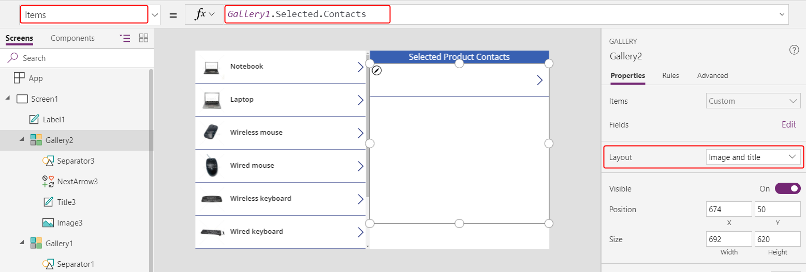

1. On the **Properties** tab, set **Layout** to **Image and title**.

    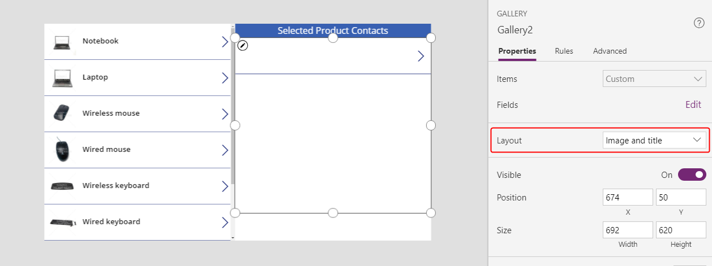

1. In **Gallery2**, ensure that the **Label** control is named **Title2**, and then set its **Text** property to **ThisItem.'Full Name'**.

    No text will appear in that control until you finish this procedure and assign a contact to a product.

    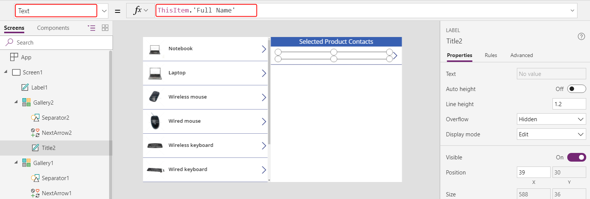

1. Delete **NextArrow2**, insert a **Cancel** icon, and ensure that it's named **icon1**.

1. Set the **Cancel** icon's **OnSelect** property to this formula: 

    ```powerapps-dot
    Unrelate( Gallery1.Selected.Contacts, ThisItem )
    ```

    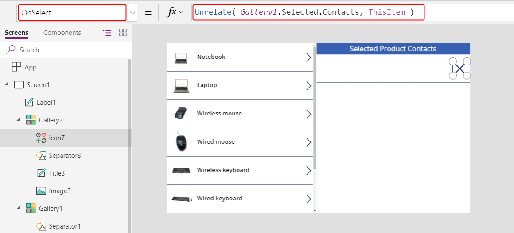

1. On the **View** tab, select **Data sources**.

1. In the **Data** pane, select **Add data source** > **Microsoft Dataverse** > **Contacts** > **Connect**.

1. Under **Gallery2**, add a **Combo box** control, ensure that it's named **ComboBox1**, and then set its **Items** property to **Contacts**.

    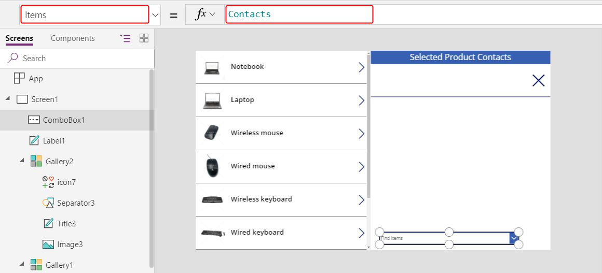

1. On the **Properties** tab, set **Allow multiple selection** to **Off**.

    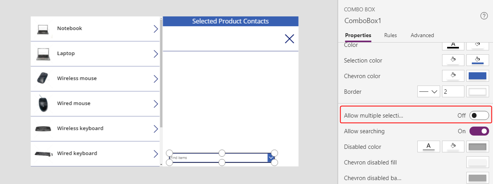

1. Insert an **Add** icon, and set its **OnSelect** property to this formula: 

    ```powerapps-dot
    Relate( Gallery1.Selected.Contacts, ComboBox1.Selected )
    ```

    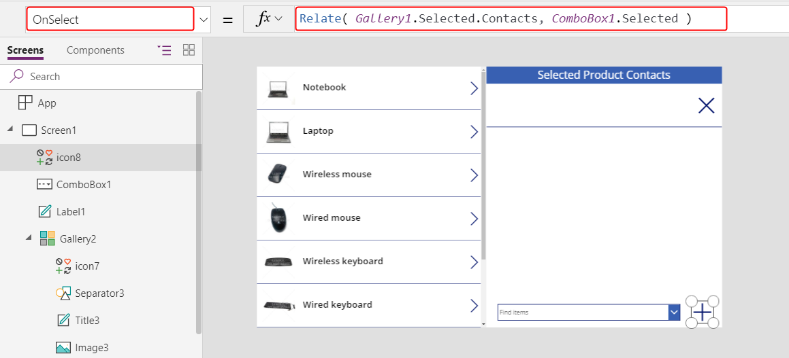

With this app, users can now freely relate and unrelate a set of contacts to each product.

- To add a contact to a product, select the contact in the combo box at the bottom of the screen, and then select the **Add** icon.
- To remove a contact from a product, select the **Cancel** icon for that contact.

    Unlike one-to-many, a many-to-many relationship allows users to associate the same contact with multiple products.


#### In reverse: relate and unrelate products with multiple contacts

Many-to-many relationships are symmetric. You can extend the example to add products to a contact and then flip between the two screens to show how the relationship appears from either direction.

1. Set the **OnVisible** property of **Screen1** to **Refresh( Products )**.

    When you update a one-to-many or many-to-many relationship, only the data of the first argument table of the **Relate** or **Unrelate** call is refreshed. The second must be refreshed manually if you want to flip between the screens of this app.

    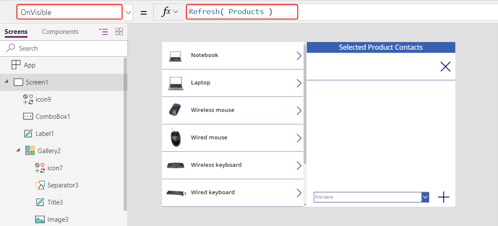

1. Duplicate **Screen1**.

    The duplicate will be named **Screen1_1** and form the basis for looking at the relationships from the contacts side.

    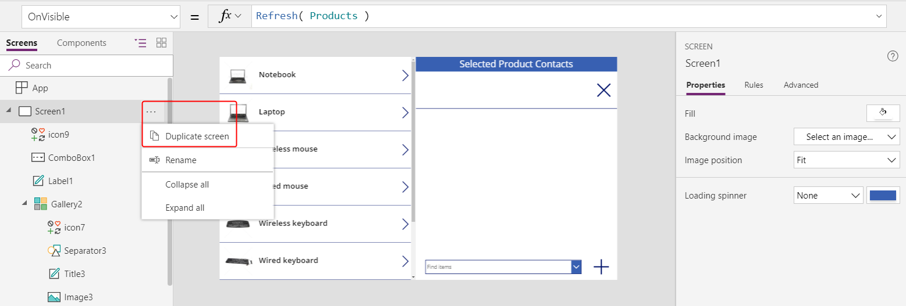

1. To create the reverse view, change these formulas on the controls of **Screen1_1**:

    - Screen1_1.OnVisible = `Refresh( Contacts )`
    - Gallery1_1.Items = `Contacts`
    - Title1_1.Text = `ThisItem.'Full Name'`
    - Label1_1.Text = `"Selected Contact Products"`
    - Gallery2_1.Items = `Gallery1_1.Selected.Products`
    - Title2_1.Text = `ThisItem.Name`
    - Icon1_1.OnSelect = `Unrelate( Gallery1_1.Selected.Products, ThisItem )`
    - ComboBox1_1.Items = `Products`
    - Icon2_1.OnSelect = `Relate( Gallery1_1.Selected.Products, ComboBox1_1.Selected )`

    The result will look very similar to the previous screen but comes at the relationship from the **Contacts** side.

    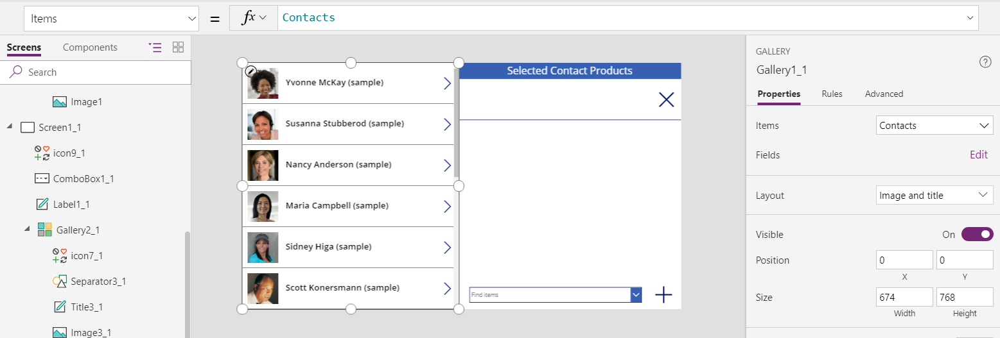

1. Insert an **Arrows up down** icon and set its **OnSelect** property to **Navigate( Screen1, None )**.  Do the same thing on **Screen1** with the formula **Navigate( Screen1_1, None )**.

    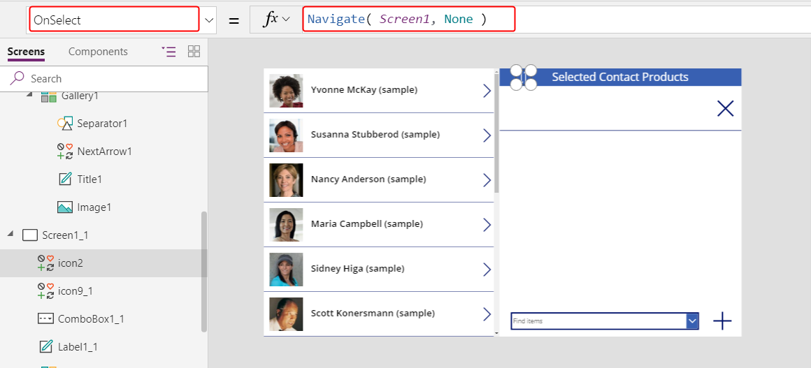

With this new screen, users can add a contact to a product and then flip to a view of contacts and see the associated product. The relationships are symmetric and shared between the two screens.

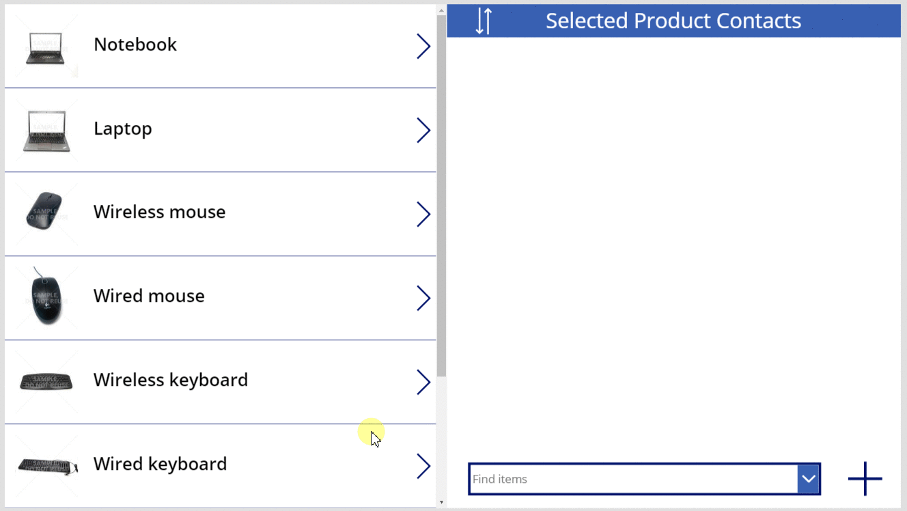


[!INCLUDE[footer-include](../../../includes/footer-banner.md)]