# Remove and RemoveIf functions in Power Apps
Removes [records](../working-with-tables.md#records) from a [data source](../working-with-data-sources.md).

## Description
### Remove function
Use the **Remove** function to remove a specific record or records from a data source.  

For [collections](../working-with-data-sources.md#collections), the entire record must match. You can use the **All** argument to remove all copies of a record; otherwise, only one copy of the record is removed.

### RemoveIf function
Use the **RemoveIf** function to remove a record or records based on a condition or a set of conditions. Each condition can be any formula that results in a **true** or **false** and can reference [columns](../working-with-tables.md#columns) of the data source by name. Each condition is evaluated individually for each record, and the record is removed if all conditions evaluate to **true**.

**Remove** and **RemoveIf** return the modified data source as a [table](../working-with-tables.md). You can use both functions only in [behavior formulas](../working-with-formulas-in-depth.md).

You can also use the **[Clear](function-clear-collect-clearcollect.md)** function to remove all of the records in a collection.

### Delegation
[!INCLUDE [delegation-no](../../../includes/delegation-no.md)]

## Syntax
**Remove**( *DataSource*, *Record1* [, *Record2*, ... ] [, **All** ] )

* *DataSource* – Required. The data source that contains the record or records that you want to remove.
* *Record(s)* – Required. The record or records to remove.
* **All** – Optional. In a collection, the same record may appear more than once.  You can add the **All** argument to remove all copies of the record.

**Remove**( *DataSource*, *Table* [, **All** ] )

* *DataSource* – Required. The data source that contains the records that you want to remove.
* *Table* – Required. A table of records to remove.
* **All** – Optional. In a collection, the same record may appear more than once.  You can add the **All** argument to remove all copies of the record.

**RemoveIf**( *DataSource*, *Condition* [, ... ] )

* *DataSource* – Required. The data source that contains the record or records that you want to remove.
* *Condition(s)* – Required. A formula that evaluates to **true** for the record or records to remove.  You can use column names from the *DataSource* in the formula.  If you specify multiple *Conditions*, all must evaluate to **true** for the record or records to be removed.

## Examples - single formulas

In these examples, you'll remove a record or records in a data source that's named **IceCream** and that starts with the data in this table:


#### Create a collection with sample records

To create a collection with this data:

1. Insert a [**Button**](../controls/control-button.md) control.
1. Set button control's **OnSelect** property to the below formula:

    ```powerapps-dot
    ClearCollect( IceCream,
                  { ID: 1, Flavor: "Chocolate",  Quantity: 100 },
                  { ID: 2, Flavor: "Vanilla",    Quantity: 200 },
                  { ID: 3, Flavor: "Strawberry", Quantity: 300 }
    )
    ```
1. Select the button [while holding down the Alt key](../keyboard-shortcuts.md#alternate-behavior):


#### Remove sample records from collection using a formula

| Formula | Description | Result |
| --- | --- | --- |
| **Remove(&nbsp;IceCream,<br>First(&nbsp;Filter(&nbsp;IceCream,&nbsp;Flavor="Chocolate"&nbsp;)&nbsp;) )** |Removes the **Chocolate** record from the data source. | <br><br>The **IceCream** data source has been modified. |
| **Remove(&nbsp;IceCream,<br>First(&nbsp;Filter(&nbsp;IceCream,&nbsp;Flavor="Chocolate"&nbsp;)&nbsp;) First(&nbsp;Filter(&nbsp;IceCream,&nbsp;Flavor="Strawberry"&nbsp;)&nbsp;) )** |Removes two records from the data source. |<br><br>The **IceCream** data source has been modified. |
| **RemoveIf(&nbsp;IceCream, Quantity&nbsp;>&nbsp;150 )** |Removes records that have a **Quantity** that's greater than **150**. |<br><br>The **IceCream** data source has been modified. |
| **RemoveIf(&nbsp;IceCream, Quantity&nbsp;>&nbsp;150, Left(&nbsp;Flavor,&nbsp;1&nbsp;) = "S" )** |Removes records that have a **Quantity** that's greater than 150 and **Flavor** starts with an **S**. |<br><br><br>The **IceCream** data source has been modified. |
| **RemoveIf(&nbsp;IceCream, true )** |Removes all records from the data source. |<br><br>The **IceCream** data source has been modified. |

## Examples - remove button outside a gallery

In this example, you'll use a [**Gallery** control](../controls/control-gallery.md) to list the records in a table. And then use the **Remove** function to selectively remove an item.  

### Prepare for sample data

This example uses the **Contacts** table in Microsoft Dataverse available with the *sample apps and data*. You can deploy *sample apps and data* when you [create an environment](/power-platform/admin/create-environment#create-an-environment-with-a-database). You can also use any other data source instead.

### Remove button outside a gallery

In this example, you'll remove an item by using a *button* that is outside the gallery.

1. Create a [new blank canvas app](../data-platform-create-app-scratch.md) using a Phone layout.

    

1. Select the **Insert** from the left pane.

1. Select **Vertical gallery**. <br>
    A **Gallery** control is be added to your screen.

    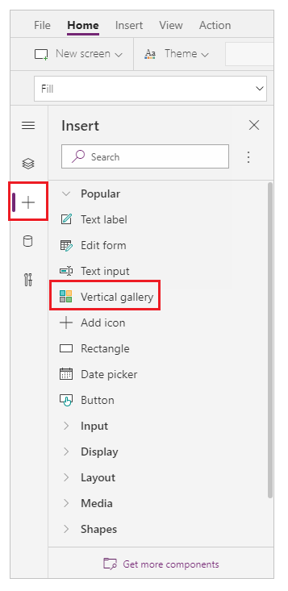

1. You're prompted to select a data source where you can select a data source from the available data sources. <br>
    For example, select the **Contacts** table to use *sample data*:  

    

    The gallery shows items from this table: 

    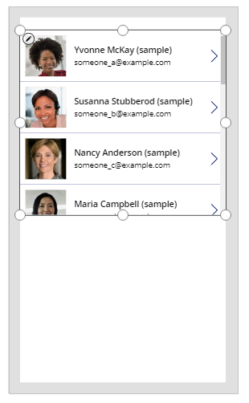

1. Insert a [**Button**](../controls/control-button.md) control from left pane:
    
    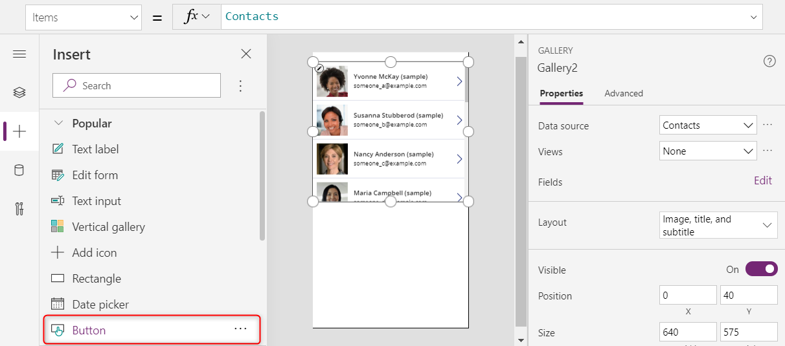

1. Move the added button below the gallery items:

    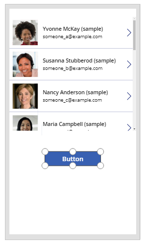

1. Update button text property to *Remove record*. You can also use text of your choice:

    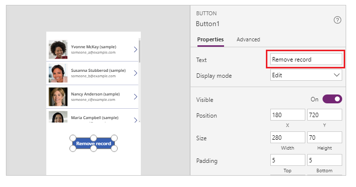

1. Set the **OnSelect** property for this button control to the following formula:

    ```powerapps-dot
    Remove( Contacts, Gallery1.Selected )
    ```

    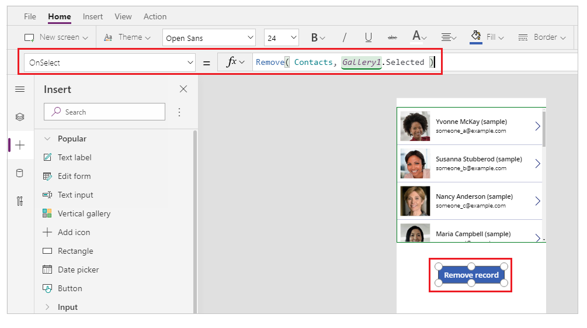

    The gallery control makes the currently selected record available using **Selected** property. **Remove** function refers to this selected record to remove it.

1. Preview the app using the *Play* button on the top right, or press *F5* on keyboard:

    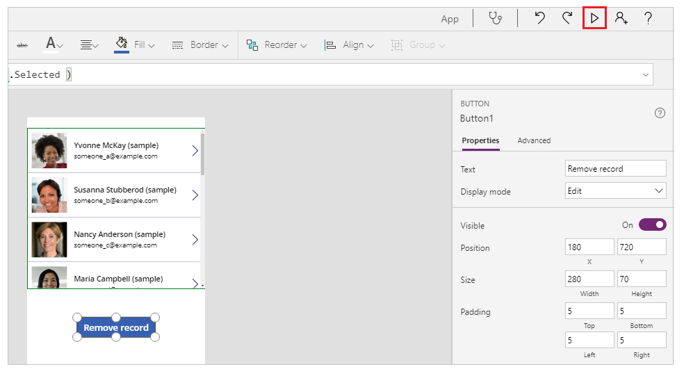

1. Select a record to remove, such as *Nancy*'s record in this example:

    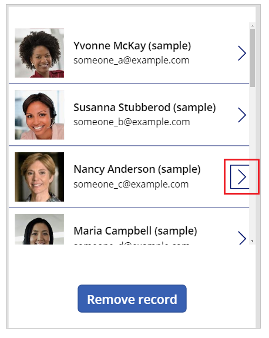

1. Select **Remove record**:

    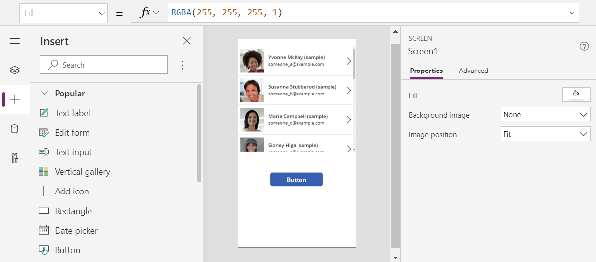

    Selecting the button removes the selected record (in this example, Nancy's record).

1. Close the app preview.

    > [!TIP]
    > You can also use alternate behavior with [*Alt key*](../keyboard-shortcuts.md#alternate-behavior) instead of using the app preview with *Play* button or *F5*.

## Examples - trash can icon inside a gallery

In this example, you'll remove an item by using an *icon* placed inside the gallery.

### Create a collection with sample data

If you already have [prepared sample data](#prepare-for-sample-data), skip this step and move to [Trash can icon inside a gallery](#trash-can-icon-inside-a-gallery).

1. Add a [**Button**](../controls/control-button.md) control to your screen.
1. Set the **OnSelect** property to the following formula:

    ```powerapps-dot
    ClearCollect( SampleContacts, 
          { 'Full Name': "Yvonne McKay (sample)",      'Primary Email': "someone_a@example.com" },
          { 'Full Name': "Susanna Stubberod (sample)", 'Primary Email': "someone_b@example.com" },
          { 'Full Name': "Nancy Anderson (sample)",    'Primary Email': "someone_c@example.com" },
          { 'Full Name': "Maria Campbell (sample)",    'Primary Email': "someone_d@example.com" },
          { 'Full Name': "Robert Lyon (sample)",       'Primary Email': "someone_e@example.com" },
          { 'Full Name': "Paul Cannon (sample)",       'Primary Email': "someone_f@example.com" },
          { 'Full Name': "Rene Valdes (sample)",       'Primary Email': "someone_g@example.com" } 
    )
    ```
1. Select the button [while holding down the Alt key](../keyboard-shortcuts.md#alternate-behavior).

Sample collection is created that you can use in the following example.

### Trash can icon inside a gallery

1. Create a [new blank canvas app](../data-platform-create-app-scratch.md) using a Phone layout.

    

1. Select the **Insert** from the left pane.

1. Select **Vertical gallery**. <br>
    A **Gallery** control is be added to your screen.

    

1. You're prompted to select a data source where you can select a data source from the available data sources. <br>
    For example, select the **Contacts** table to use *sample data*:  

    

    If you created a [collection](#create-a-collection-with-sample-data), select your collection instead:

    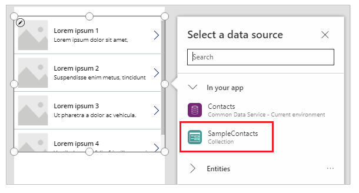

1. Select a control within the top item in the gallery. <br>
    
    To ensure next step inserts item into gallery's template and not outside the gallery, ensure you follow this step before moving to the next step.
    
    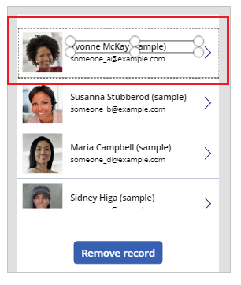

1. Select **Add icon** from left pane. <br>
    
    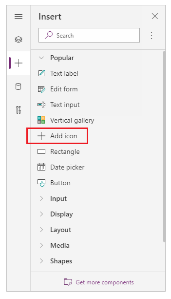

    > [!NOTE]
    > **Add icon** inserts a **+** icon on the left side of the gallery, replicated for each item in the gallery. 

1. In the top item, move the icon to the right side of the screen.

    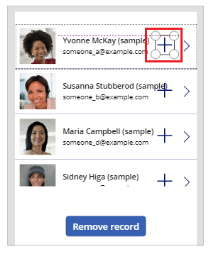

1. Select the **Icon** property for icon and set it to the following formula to update the icon image as trash icon:

    ```powerapps-dot 
    Icon.Trash
    ```
    
    > [!NOTE]
    > The **Icon.** prefix is only shown when you're actively editing the formula.

    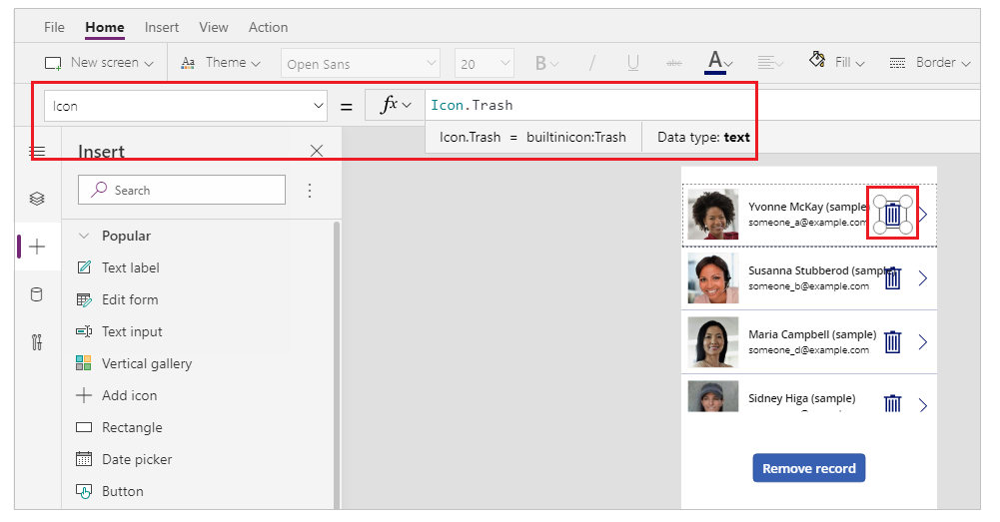

1. Set the **OnSelect** property to the following formula:

    ```powerapps-dot
    Remove( [@Contacts], ThisItem )
    ```

    > [!NOTE]
    > You must use [global disambiguation operator](operators.md#disambiguation-operator) **[@**...**]** in this example with sample data that uses the *Contacts* table to avoid conflict with a *One-to-Many* relationship. If you use data sources such as a SharePoint list or a SQL Server table, using *global disambgulation operator* is not required.

    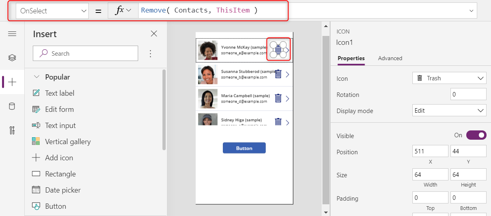

1. Preview the app using the *Play* button on the top right, or press *F5* on keyboard.

1. Select the trash icon next to a record, for example *Maria*'s:

    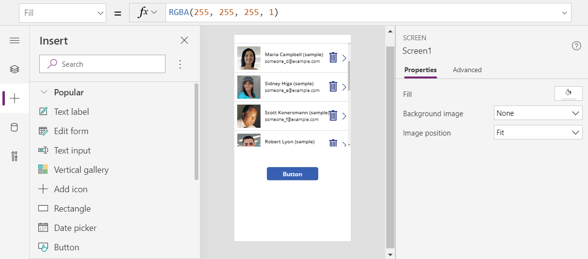

    The record is deleted:

    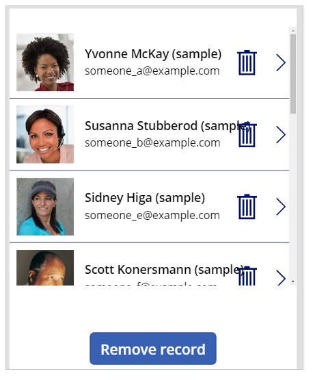

1. Close the app preview.


[!INCLUDE[footer-include](../../../includes/footer-banner.md)]