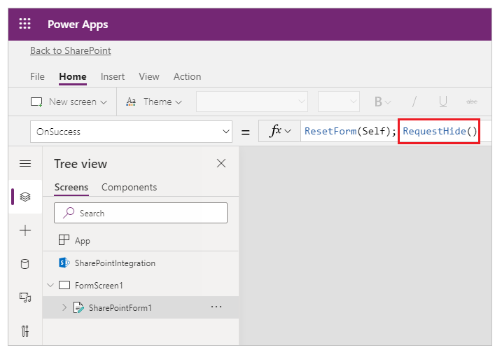

# RequestHide function in Power Apps

Hides the [SharePoint form](../sharepoint-form-integration.md#understand-the-sharepointintegration-control).

>[!NOTE]
> Only works with [SharePoint forms](../sharepoint-form-integration.md).

## Description

Use the **RequestHide** function to hide the SharePoint form. By default, RequestHide() is used for the *OnSuccess* property of a SharePoint form being customized.

This function is not required for the **SharePointIntegration** control's **OnCancel** event as SharePoint by default hides the form when a user selects **Cancel**, and the function only reacts to a SharePoint form.

## Syntax

**RequestHide** ( )

* No parameters.

## Examples

| Formula | Description |
| --- | --- |
| **RequestHide()** | Hides the form. |

[!INCLUDE[footer-include](../../../includes/footer-banner.md)]