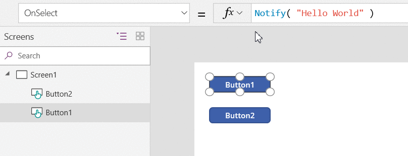
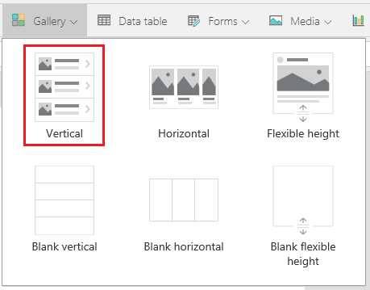
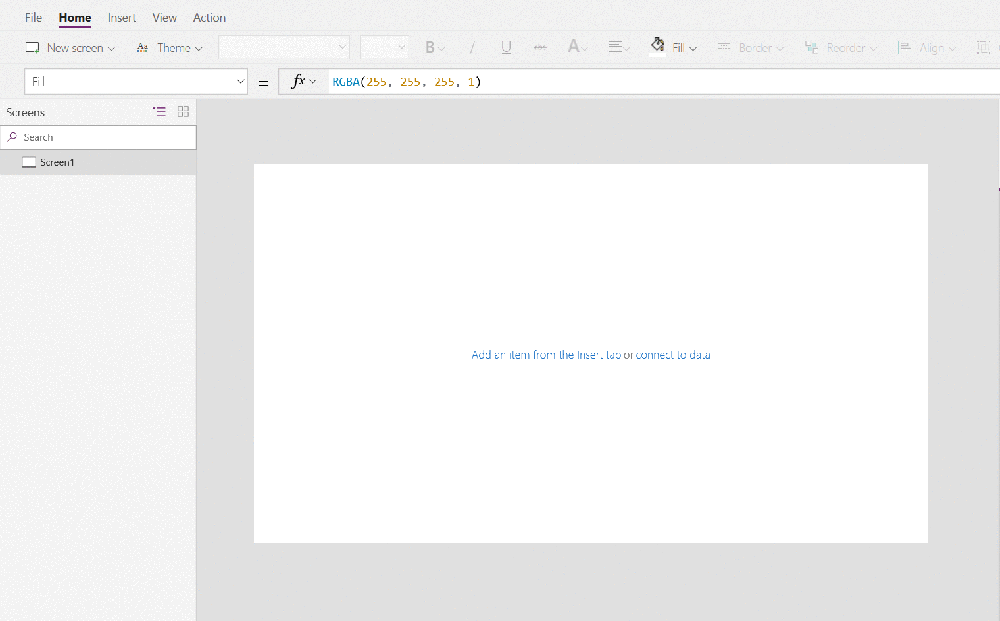

# Select function in Power Apps
Simulates a select action on a control, causing the **OnSelect** formula to be evaluated.

## Description
The **Select** function simulates a select action on a control as if the user had clicked or tapped the control. As a result, the **OnSelect** formula on the target control is evaluated.

Use **Select** to propagate a select action to a parent control. This type of propagation is the default behavior in, for example, galleries. By default, the **OnSelect** property of any control in a **[Gallery](../controls/control-gallery.md)** control is set to **Select( Parent )**. That way, you can set the value of the **OnSelect** property of the gallery control itself, and that formula will be evaluated regardless of where in the gallery a user might click or tap.

If you want one or more controls in the gallery to perform different actions from the gallery itself, set the **OnSelect** property for those controls to something other than the default value. You can leave the default values for the **OnSelect** properties of most controls in the gallery if you want them to perform the same action as the gallery itself.

**Select** queues the target **OnSelect** for later processing, which may happen after the current formula has finished being evaluated. **Select** doesn't cause the target **OnSelect** to evaluate immediately, nor does **Select** wait for **OnSelect** to finish being evaluated.

You can't use **Select** across screens.

You can use **Select** only with controls that have an **OnSelect** property.

You can use **Select** only in [behavior formulas](../working-with-formulas-in-depth.md).

A control can't **Select** itself directly or indirectly through other controls.

The select function can also be used with a gallery. For example, it can be used to specify the row or column to select in a gallery and the control to select within that row or column of the gallery. When you select a row or column, the gallery selection changes and the **OnSelect** formula on the gallery control is evaluated. If a control within the row or column is provided, the **OnSelect** formula for the child control will be evaluated. 

## Syntax
**Select**( *Control* )

* *Control* – Required.  The control to select on behalf of the user.

**Select**( *Control, Row or column, Child Control* )

- *Control* – Required. The control to select on behalf of the user.
- *Row or column* – Not required. The number of row or column (starting with 1) in a gallery control to select on behalf of the user.
- *Child Control* - Not required. The child control of the control identified in the 'control' parameter to select. 

## Examples

- *Button*

    ```Select(button1)```

- *Gallery*	

    ```Select(Gallery1, 1)```

    Simulates a user selecting row 1 or column 1 in Gallery1. 

- *Gallery*	

    ```Select(Gallery1, 1, ChildControl1)```

    Simulates a user selecting ChildConttrol1 in row 1 or column 1 of Gallery1.

#### Basic usage

1. Add a **[Button](../controls/control-button.md)** control, and rename it **Button1** if it has a different name.

1. Set the **OnSelect** property of **Button1** to this formula:

	**Notify( "Hello World" )**

1. On the same screen, add a second **Button** control, and set its **OnSelect** property to this formula:

	**Select( Button1 )**

1. While holding down the Alt key, select the second button.

    A notification appears across the top of your app. The **OnSelect** property of **Button1** generated this notification.

	

#### Gallery control

1. Add a vertical **[Gallery](../controls/control-gallery.md)** control that contains other controls.

    

2. Set the **OnSelect** property of the gallery to this formula:
 
	**Notify( "Gallery Selected" )**

3. While holding down the Alt key, click or tap the background of the gallery or any control in the gallery.

    All actions will show the **Gallery Selected** notification at the top of the app.

	Use the gallery's **OnSelect** property to specify the default action to take when the user clicks or taps an item in the gallery.

5. Set the **OnSelect** property of the image control to this formula:

	**Notify( "Image Selected", Success )**

6. While holding down the Alt key, click or tap the various elements of the gallery.

    When you click or tap any control in the gallery except the image, **Gallery Selected** appears as before. When you click or tap the image, **Image Selected** appears.
 
	Use individual controls in the gallery to take actions that differ from the gallery's default action.

	

7. On the same screen, add a **Button** control, and set its **OnSelect** property to this formula:

	**Select( Gallery1,2,Image1 )**

8. While holding down the Alt key, select the button.
   
     A **Image Selected** notification appears across the top of your app. The button click simulated selecting the image in row 2 of the gallery.  


[!INCLUDE[footer-include](../../../includes/footer-banner.md)]