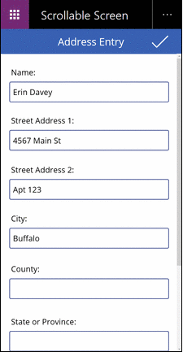
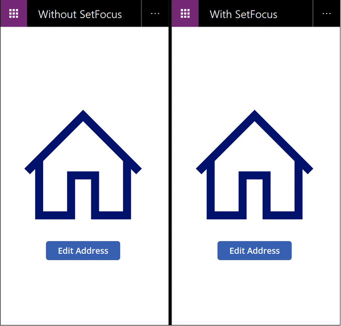

# SetFocus function in Power Apps
Moves input focus to a specific control. 

## Description
The **SetFocus** function gives a control the input focus.  The user's keystrokes are then received by that control, allowing them to type into a text input control or use the *Enter* key to select a button.  The user can also use the *Tab* key, touch, mouse, or other gesture to move the input focus themselves. *Tab* key behavior is governed by the [**TabIndex** property](../controls/properties-accessibility.md).

Use the **SetFocus** function to set the focus when (each with an example below):
- a newly exposed or enabled input control, to guide the user in what comes next and for faster data entry.
- a form is validated, to focus and display the offending input control for quick resolution.
- a screen is displayed, to focus the first input control with the **OnVisible** property of the [**Screen**](../controls/control-screen.md).

The control with focus may be visually different based on the [**FocusedBorderColor**](../controls/properties-color-border.md) and [**FocusedBorderThickness**](../controls/properties-color-border.md) properties.

## Limitations

**SetFocus** can only be used with:
- [**Button**](../controls/control-button.md) control
- [**Icon**](../controls/control-shapes-icons.md) control
- [**Image**](../controls/control-image.md) control
- [**Label**](../controls/control-text-box.md) control
- [**TextInput**](../controls/control-text-input.md) control

You cannot set the focus to controls that are within a [**Gallery**](../controls/control-gallery.md) control, [**Edit form**](../controls/control-form-detail.md) control, or [Component](../create-component.md).  **SetFocus** can be used with a control in a scrollbale screen.

You cannot set the focus to controls that are within a [**Container**](../controls/control-container.md) control.

You can only set the focus to controls on the same screen as the formula containing the **SetFocus** call.

Attempting to set the focus to a control that has its [**DisplayMode**](../controls/properties-core.md) property set to **Disabled** has no effect.  Focus will remain where it was previously.

On Apple iOS, the soft keyboard will only be displayed automatically if **SetFocus** was initiated by a direct user action.  For example, invoking from a button's **OnSelect** property will display the soft keyboard while invoking from a screen's **OnVisible** will not. 

You can use **SetFocus** only in [behavior formulas](../working-with-formulas-in-depth.md).

## Syntax
**SetFocus**( *Control* )

* *Control* – Required.  The control to give the input focus.

## Examples

### Focus on a newly exposed or enabled input control

Many shopping carts allow the customer to use the shipping address as the billing address, alleviating the need to enter the same information twice.  If a different billing address is desired, the billing address text input boxes are enabled, and it is helpful to guide the customer to the these newly enabled controls for faster data entry.  


There are many formulas in play here, but the one that moves the focus is on the **OnUncheck** property of the **Check box** control:

```powerappa-dot
SetFocus( BillingName ) 
```

The *Tab* key can also be used to move focus quickly from one field to another.  To better illustrate, the *Tab* key was not used in the animation.

To create this example:
1. Create a new app.
1. Add [**Label** controls](../controls/control-text-box.md) with the text "Shipping address", "Name:", "Address:", "Billing Address", "Name:", and "Address:" and position them as shown in the animation.
1. Add a [**Text Input** control](../controls/control-text-input.md) and rename it **ShippingName**.
1. Add a [**Text Input** control](../controls/control-text-input.md) and rename it **ShippingAddress**.
1. Add a [**Check box** control](../controls/control-check-box.md) and rename it **SyncAddresses**.
1. Set the **Text** property of this control to the formula `"Use Shipping address as Billing address"`.
1. Add a [**Text Input** control](../controls/control-text-input.md) and rename it **BillingName**.
1. Set the **Default** property on this control to the formula `ShippingName`.
1. Set the **DisplayMode** property on this control to the formula `If( SyncAddresses.Value, DisplayMode.View, DisplayMode.Edit )`.  This will automatically enable or disable this control based on the state of the check box control.
1. Add a [**Text Input** control](../controls/control-text-input.md) and rename it **BillingAddress**.
1. Set the **Default** property on this control to the formula `ShippingAddress`.
1. Set the **DisplayMode** property on this control to the formula `If( SyncAddresses.Value, DisplayMode.View, DisplayMode.Edit )`.  This will automatically enable or disable this control based on the state of the check box control.
1. Set the **Default** property of the check box to the formula `true`.  This will default the Billing address to use the same value as the Shipping address.
1. Set the **OnCheck** property of the check box to the formula `Reset( BillingName ); Reset( BillingAddress )`.  If the user chooses to sync Shipping and Billing addresses, this will clear any user input in the Billing address fields allowing the **Default** properties on each to pull the values from the corresponding Shipping address fields.
1. Set the **OnUncheck** property of the check box to the formula `SetFocus( BillingName )`.  If the user chooses to have a different billing address, this will move the focus to the first control in the Billing address.  The controls will have already been enabled due to their **DisplayMode** properties.

### Focus on validation issues

> [!NOTE]
> Although this example appears to be an **Edit form** control, unfortunately **SetFocus** is not yet supported by  that control.  Instead, this example uses a scrollable screen to host the input controls.

When validating a form, it can be helpful to not only display a message if there is a problem but to also take the user to the field that is offending.  It can be particularly helpful if the field in question is scrolled off the screen and not visible.



In this animation, the validation button is repeatedly pressed until all the fields have been filled in properly.  Note that the mouse pointer doesn't move down from the top of the screen.   Instead the **SetFocus** function hsa moved the input focus to the control that requires attention with this formula:

```powerapps-dot
If( IsBlank( Name ), 
        Notify( "Name requires a value", Error ); SetFocus( Name ),
    IsBlank( Street1 ), 
        Notify( "Street Address 1 requires a value", Error ); SetFocus( Street1 ),
    IsBlank( Street2 ), 
        Notify( "Street Address 2 requires a value", Error ); SetFocus( Street2 ),
    IsBlank( City ), 
        Notify( "City requires a value", Error ); SetFocus( City ),
    IsBlank( County ), 
        Notify( "County requires a value", Error ); SetFocus( County ),
    IsBlank( StateProvince ), 
        Notify( "State or Province requires a value", Error ); SetFocus( StateProvince ),
    IsBlank( PostalCode ), 
        Notify( "Postal Code requires a value", Error ); SetFocus( PostalCode ),
    IsBlank( Phone ), 
        Notify( "Contact Phone requires a value", Error ); SetFocus( Phone ),
    Notify( "Form is Complete", Success )
)
```

To create this example:
1. Create a new, blank phone app.
1. From the **Insert** menu, select **New screen**, and then select **Scrollable**.
1. In the center section of the screen, add **Text input** controls and name them **Name**, **Street1**, **Street2**, **City**, **County**, **StateProvince**, **PostalCode**, and **Phone**. Add **Label** controls above each one to identify the fields.  You may need to resize the section if it is not long enough to fit all the controls.
1. Add a checkmark [**Icon** control](../controls/control-shapes-icons.md) at the top of the screen, above the scrollable section.  
1. Set the **OnSelect** property of the icon control to the formula `If( IsBlank( ...` given above.

### Focus when displaying a screen

> [!NOTE]
> Although this example appears to be an **Edit form** control, unforutnatley **SetFocus** is not yet supported by  that control.  Instead, this example uses a scrollable screen to host the input controls.

Similar to exposing an input control, when displaying a data entry screen it is helpful to focus the first input control for faster data entry.



In this animation, the data entry screen on the left is not using **SetFocus**.  Upon display no input control has focus, requiring the user to tab, touch, mouse, or use another means to focus the **Name** field before a value can be typed into it.

On the right we have exactly the same app with the **OnVisible** property of the data entry screen set to this formula:

```powerapps-dot
SetFocus( Name )
```

This sets the focus to the **Name** field automatically.  The user can begin typing and tabbing between fields immediately with no prior action required.

To create this example:
1. Create the "Focus on validation issues" app above.
1. On this screen, set the **OnVisible** property to the formula `SetFocus( Name )`.
1. Add a second screen.
1. Add a [**Button** control](../controls/control-button.md).
1. Set the **OnSelect** property of this control to the formula `Navigate( Screen1 )`.
1. Preview the app from this screen.  Press the button.  The **OnVisible** formula will be evaluated and the **Name** field will automatically be in focus.


[!INCLUDE[footer-include](../../../includes/footer-banner.md)]
