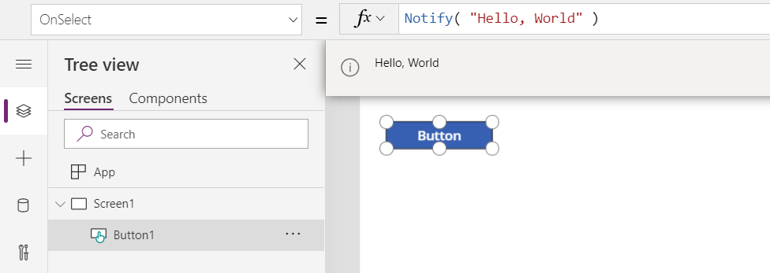
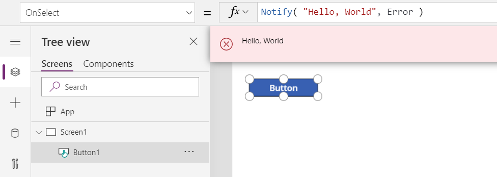
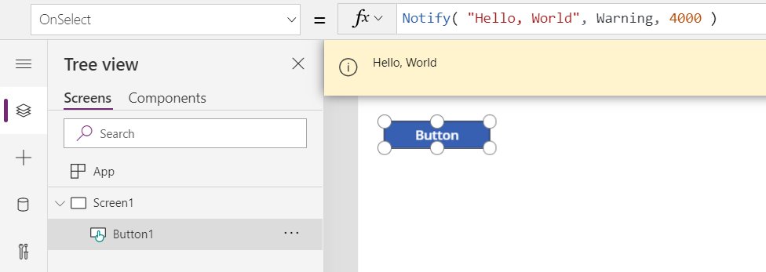
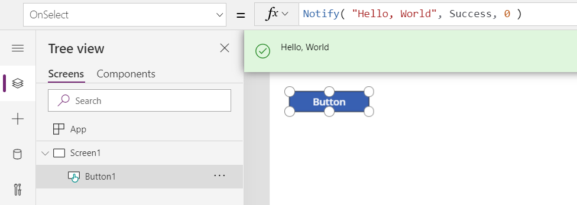

# Notify function in PowerApps
Displays a banner message to the user.

## Description
The **Notify** function displays a banner message to the user at the top of the screen, overlaying what is currently displayed.  

An appropriate color and icon are used depending on the type of the message.   The type is specified by the second argument to the function:

| NotificationType Argument | Description |
| --- | --- |
| **NotificationType.Error** | Displays the message as an error. |
| **NotificationType.Information** (Default) | Displays the message as informational.  |
| **NotificationType.Success** | Displays the message as success. |
| **NotificationType.Warning** | Displays the message as a warning. |

Messages are shown both when authoring your app and when end users are using your app.

**Notify** can only be used in [behavior formulas](../working-with-formulas-in-depth.md).

**Notify** can be paired with the [**IfError**](function-iferror.md) function to detect and report errors with a custom error message.

PowerApps can also send push notifications using an entirely different mechanism from **Notify**.  For more information see [Send a notification in PowerApps](../add-notifications.md).

**Notify** always returns *true*.

Note: This function was previously named **ShowError** when it could only display error messages.

## Syntax
**Notify**( *Message*, [ *NotificationType* ] )

* *Message* – Required.  Message to display to the user.
* *NotificationType* – Optional.  Type of the message to display from the table above.  The default is **NotificationType.Information**.  

## Examples

### Step by step

1. Add a **Button** control to your screen.

2. Set the **OnSelect** property of the **Button** to:

	**Notify( "Hello, World" )**

3. Click or press the button.  

	Each time the button is clicked, the message **Hello, World** is displayed to the user as informational.

	

4. Change the type of message to indicate an error.  Add a second argument to our formula:

	**Notify( "Hello, World", NotificationType.Error )**

5. Click or press the button.

	Now each time the button is clicked, the message **Hello, World** is displayed to the user as an error.

	

4. Change the type of message to indicate a warning.  Change the second argument in our formula:

	**Notify( "Hello, World", NotificationType.Warning )**

5. Click or press the button.

	Now each time the button is clicked, the message **Hello, World** is displayed to the user as a warning.

	

4. Change the type of message to indicate success.  Change the second argument in our formula:

	**Notify( "Hello, World", NotificationType.Success )**

5. Click or press the button.

	Now each time the button is clicked, the message **Hello, World** is displayed to the user as success.

	
