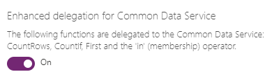

# Count, CountA, CountIf, and CountRows functions in Power Apps

Counts all [records](../working-with-tables.md#records) in a [table](../working-with-tables.md), or counts all records that satisfy a condition.

## Description
The **Count** function counts the number of records that contain a number in a single-column table.

The **CountA** function counts the number of records that aren't *blank* in a single-column table. This function includes [empty](function-isblank-isempty.md) text ("") in the count.

The **CountIf** function counts the number of records in a table that are **true** for a logical formula.  The formula can reference [columns](../working-with-tables.md#columns) of the table.

The **CountRows** function counts the number of records in a table.

Each of these functions returns a number.

You need to enable the **Enhanced delegation for Microsoft Dataverse** option in the advance settings to make **CountIf** and **CountRows** functions delegation to work. To enable the option:

1. Open the app where you want to use the functions. 
1. Select **File** > **Settings** > **Upcoming features** > **Preview**.
1. Turn on the **Enhanced delegation for Microsoft Dataverse** option.

    > [!div class="mx-imgBorder"]
    > 

<!--[!INCLUDE [delegation-no](../../../includes/delegation-no.md)]-->

> [!IMPORTANT]
> - There is a 50K delegation limit if you use `CountRows` and `CountIf` functions with filters. There is no hard limit on the `CountRows` function when extracted directly from the data source because of the cached count that Dataverse keeps. 
> - If the `CountRows(<Data Source>)` function is used without filtering, the count might not be 100% accurate, because the cached count updates periodically. If you need precise count and expect the result to be under the aggregate limit, you can bypass the cached count via `CountIf(<Data Source>, True)`.

## Syntax

**Count**( *SingleColumnTable* ) 
**CountA**( *SingleColumnTable* )

* *SingleColumnTable* - Required.  Column of records to count.  

**CountIf**( *Table*, *LogicalFormula* )

* *Table* - Required.  Table of records to count.
* *LogicalFormula* - Required.  Formula to evaluate for each record of the table.  Records that return **true** for this formula are counted.  The formula can reference columns of the table.

**CountRows**( *Table* )

* *Table* - Required.  Table of records to count.

## Example

1. Import or create a [collection](../working-with-data-sources.md#collections) named **Inventory**, as the first subprocedure in [Show images and text in a gallery](../show-images-text-gallery-sort-filter.md) describes.
2. Add a label, and set its **[Text](../controls/properties-core.md)** property to this formula:
   
    **CountIf(Inventory, UnitsInStock < 30)**
   
    The label shows **2** because two products (Ganymede and Callisto) have fewer than 30 units in stock.
3. Add another label, and set its **[Text](../controls/properties-core.md)** property to this formula:
   
    **CountA(Inventory.UnitsInStock)**
   
    The label shows **5**, the number of non-empty cells in the **UnitsInStock** column.
4. Add another label, and set its **[Text](../controls/properties-core.md)** property to this formula:
   
    **CountRows(Inventory)**
   
    The label shows **5** because the collection contains five rows.

[!INCLUDE[footer-include](../../../includes/footer-banner.md)]