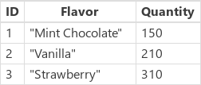

# Update and UpdateIf functions in Power Apps
Updates [records](../working-with-tables.md#records) in a [data source](../working-with-data-sources.md).

## Description
### Update function
Use the **Update** function to replace an entire record in a data source. In contrast, the **UpdateIf** and the **[Patch](function-patch.md)** functions modify one or more values in a record, leaving the other values alone.

For a [collection](../working-with-data-sources.md#collections), the entire record must match. Collections allow duplicate records, so multiple records might match. You can use the **All** argument to update all copies of a record; otherwise, only one copy of the record is updated.

If the data source generates a column's value automatically, the value of that [column](../working-with-tables.md#columns) must be reaffirmed.

### UpdateIf function
Use the **UpdateIf** function to modify one or more values in one or more records that match one or more conditions. The condition can be any formula that results in a **true** or **false** and can reference columns of the data source by name. The function evaluates the condition for each record and modifies any record for which the result is **true**.  

To specify a modification, use a change record that contains new property values. If you provide this change record inline with curly braces, property formulas can reference properties of the record that's being modified. You can use this behavior to modify records based on a formula.

Similar to **UpdateIf**, you can also use the **[Patch](function-patch.md)** function to change specific columns of a record without affecting other columns.

Both **Update** and **UpdateIf** return the modified data source as a [table](../working-with-tables.md). You must use either function in a [behavior formula](../working-with-formulas-in-depth.md).

### Delegation
[!INCLUDE [delegation-no](../../../includes/delegation-no.md)]

## Syntax
**Update**( *DataSource*, *OldRecord*, *NewRecord* [, **All** ] )

* *DataSource* – Required. The data source that contains the record that you want to replace.
* *OldRecord* – Required. The record to replace.
* *NewRecord* – Required. The replacement record. This isn't a change record. The entire record is replaced, and missing properties will contain *blank*.
* *All* – Optional. In a collection, the same record may appear more than once. Specify the **All** argument to update all copies of the record.

**UpdateIf**( *DataSource*, *Condition1*, *ChangeRecord1* [, *Condition2*, *ChangeRecord2*, ... ] )

* *DataSource* – Required. The data source that contains the record or records that you want to modify.
* *Condition(s)* – Required. A formula that evaluates to **true** for the record or records that you want to modify.  You can use column names of *DataSource* in the formula.  
* *ChangeRecord(s)* - Required.  For each corresponding condition, a change record of new property values to apply to records of *DataSource* that satisfy the condition. If you provide the record inline using curly braces, property values of the existing record can be used in the property formulas.

## Examples
In these examples, you'll replace or modify records in a data source that's named **IceCream** and that starts with the data in this table:

| Formula | Description | Result |
| --- | --- | --- |
| **Update(&nbsp;IceCream, First(&nbsp;Filter(&nbsp;IceCream,&nbsp;Flavor="Chocolate"&nbsp;)&nbsp;), {&nbsp;ID:&nbsp;1,&nbsp;Flavor:&nbsp;"Mint&nbsp;Chocolate",&nbsp;Quantity:150&nbsp;} )** |Replaces a record from the data source. |   The **IceCream** data source has been modified. |
| **UpdateIf(&nbsp;IceCream, Quantity > 175, {&nbsp;Quantity:&nbsp;Quantity&nbsp;+&nbsp;10&nbsp;} )** |Modifies records that have a **Quantity** that is greater than **175**.  The **Quantity** field is incremented by 10, and no other fields are modified. |  The **IceCream** data source has been modified. |
| **Update(&nbsp;IceCream, First(&nbsp;Filter(&nbsp;IceCream, Flavor="Strawberry"&nbsp;)&nbsp;), {&nbsp;ID:&nbsp;3, Flavor:&nbsp;"Strawberry Swirl"} )** |Replaces a record from the data source. The **Quantity** property hasn't been supplied in the replacement record, so that property will be *blank* in the result. |  The **IceCream** data source has been modified. |
| **UpdateIf(&nbsp;IceCream, true, {&nbsp;Quantity:&nbsp;0&nbsp;} )** |Sets the value of the **Quantity** property for all records in the data source to 0. |   The **IceCream** data source has been modified. |

### Step by step
1. Import or create a collection named **Inventory**, and show it in a gallery as [Show data in a gallery](../show-images-text-gallery-sort-filter.md) describes.
2. Name the gallery **ProductGallery**.
3. Add a slider named **UnitsSold**, and set its **Max** property to this expression: **ProductGallery.Selected.UnitsInStock**
4. Add a button, and set its **[OnSelect](../controls/properties-core.md)** property to this formula: **UpdateIf(Inventory, ProductName = ProductGallery.Selected.ProductName, {UnitsInStock:UnitsInStock-UnitsSold.Value})**
5. Press F5, select a product in the gallery, specify a value with the slider, and then select the button.
   
    The number of units in stock for the product you specified decreases by the amount that you specified.

[!INCLUDE[footer-include](../../../includes/footer-banner.md)]