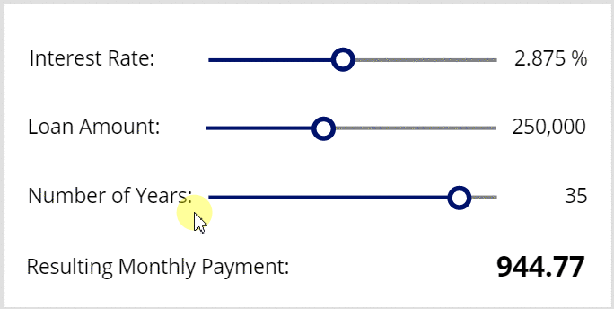

# With function in PowerApps
Calculates values and performs actions for a single [record](../working-with-tables.md#records).

## Description

The **With** function evaluates a formula for a single record.  The formula can calculate a value and/or perform actions, such as modifying data or working with a connection.

[!INCLUDE [record-scope](../../../includes/record-scope.md)]

Use the [**ForAll** function](function-with.md) to evaluate a formula for all the records in a table of records.

Use **With** to improve the readability of complex formulas by pulling values out of a formula and giving them names.  These named values act like simple local variables confined to the scope of the **With**.  The same inline record syntax that is used with the [**UpdateContext** function](function-updatecontext.md) can be used with **With**.  Using **With** is preferred over using context or global variables since **With** can be used outside of [behavior formulas](../working-with-formulas-in-depth.md).  

If the *Record* argument to **With** is an error, that error will be returned by the function and the *Formula* will not be evaluated.

## Syntax
**With**( *Record*, *Formula* )

* *Record* – Required. The record to be acted upon.  For names values, use the inline syntax `{ name1: value1, name2: value2, ... }`
* *Formula* – Required.  The formula to evaluate for *Record*.  The formula can reference any of the fields of *Record* directly.

## Examples

### Simple named values

```powerapps-dot
With( { radius: 10, 
        height: 15 },
    Pi() * (radius*radius) * height
)
// Result: 4712.38898038 (as shown in a label control)
```

This example uses a record of named values to calculate the volume of a cylinder.  These names values**With** can be used to create simple local variables, bringing to the top all of the inputs for a formula and  eliminating the need to repeat the value, for example **radius**.  This is similar to how context variables are defined with the [**UpdateContext function**](function-updatecontext.md).

### Nested With



```powerapps-dot
With( { AnnualRate: RateSlider/8/100,           // slider moves in 1/8th increments and convert to percentage
        Amount: AmountSlider*10000,             // slider moves by 10,000 increment
        Years: YearsSlider,                     // slider moves in single year increments, no adjustment required
        AnnualPayments: 12 },                   // number of payments per year
      With( { r: AnnualRate/AnnualPayments,     // interest rate
              P: Amount,                        // loan amount
              n: Years*AnnualPayments },        // number of payments
            r*P / (1 - (1+r)^-n)                // standard interest calculation
      )
)  
```
3. Add a **Label** control to the left of this slider control.  Set its **Text** property to **"Recurring Monthly Payment:"**. 

This example nests **With** functions to create a two-tier calculation for [monthly mortgage payments](https://en.wikipedia.org/wiki/Mortgage_calculator#Monthly_payment_formula).  As long as there is no conflict, all of the outer **With** named values are available within the inner **With**.

Since the slider controls can only move in increments of 1, the sliders are divided or multiplied to create the equivalent of a custom increment.  In the case of the interest rate, the **RateSlider** has its **Max** property set to **48**, divided by 8 for a 1/8 percentage point increment and divided by 100 to covert from a percentage to a decimal, covering the range 0.125% to 6%.  In the case of of the loan amount, the **AmountSlider** has its **Max** property set to **60** and multiplied by 10,000, covering the range 10,000 to 600,000.

The **With** is automatically recalculated as the sliders move and the new loan payment displayed.  No variables are used and so need to use the **OnChange** property of the slider controols.

Here are the detailed instructions for creating this app:
1. Create a new app.
2. Add a [**Slider**](../controls/control-slider) control and name it **RateSlider**.  Set its **Max** property to 48.
3. Add a [**Label**](../controls/control-text-box) control to the left of the slider control.  Set its **Text** property to **"Interest Rate:"**.
3. Add a **Label** control to the right of the slider control.  Set its **Text** property to the formula **RateSlider/8 & " %"**.
3. Add another **Slider** control and name it **AmountSlider**.  Set its **Max** property to 60.
3. Add a **Label** control to the left of this slider control.  Set its **Text** property to **"Loan Amount:"**. 
3. Add a **Label** control to the right of this slider control.  Set its **Text** property to the formula **AmountSlider/8 * 10000**
4. Add another **Slider** control and name it **YearsSlider**.  Set its **Max** property to 40.
3. Add a **Label** control to the left of this slider control.  Set its **Text** property to **"Number of Years:"**. 
3. Add a **Label** control to the right of this slider control.  Set its **Text** property to the formula **YearsSlider**.
5. Add a **Label** control and set its **Text** property to the formula shown above.

### Primary key returned from Patch

```powerapps-dot
With( Patch( Orders, Defaults( Orders ), { OrderStatus: "New" } ),
      ForAll( NewOrderDetails, 
              Patch( OrderDetails, Defaults( OrderDetails ), 
                     { Order: OrderID,          // from With's first argument, primary key of Patch result
                       Quantity: Quantity,      // from ForAll's NewOrderDetails table
                       ProductID: ProductID }   // from ForAll's NewOrderDetails table
              )
      )
)
```

This example adds a record to the **Order** table in SQL Server.  It then uses the returned primary key for the order, returned by the **Patch** function in the **OrderID** field, to create related records in the **OrderDetails** table.  

### Extracted values with a regular expression

```powerapps-dot
With( 
    Match( "PT2H1M39S", "PT(?:<hours>\d+)H)?(?:(?<minutes>\d+)M)?(?:(?<seconds>\d+)S)?" ),
    Time( Value( hours ), Value( minutes ), Value( seconds ) )
)
// Result: 2:01 AM (as shown in a label control, use the Text function to see the seconds)
```

This example extracts the hours, minutes, and seconds from an ISO 8601 duration value and then uses these sub-matches to create a Date/Time value. 

Note that although the sub-matches contain numbers they are still in a text string.  Use the [**Value**](function-value.md) function to convert to a number before performing mathematical operations.  

