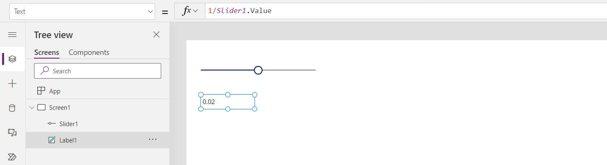
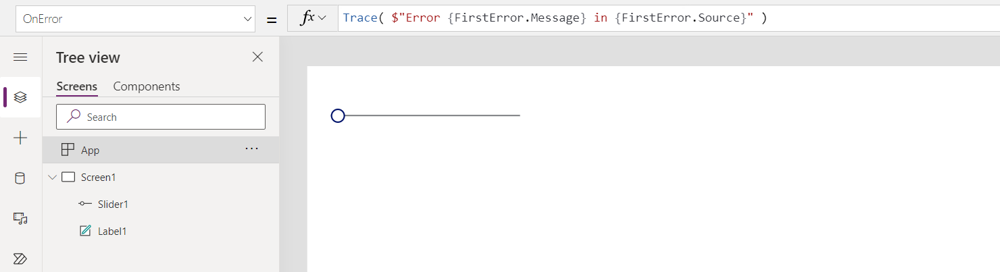
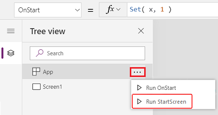

# App object in Power Apps

Provides information about the currently running app and control over the app's behavior.

## Description

Like a control, the **App** object provides properties that identify which screen is showing and that prompt the user to save changes so that they're not lost. Every app has an **App** object.

You can write formulas for some properties of the **App** object. At the top of the **Tree view** pane, select the **App** object as you would any other control or screen. View and edit one of the object's properties by selecting it in the drop-down list to the left of the formula bar.

> [!div class="mx-imgBorder"]
> 

## ActiveScreen property

The **ActiveScreen** property identifies the screen that's showing.

This property returns a screen object, which you can use to reference properties of the screen or compare to another screen to determine which screen is showing. You can also use the expression **App.ActiveScreen.Name** to retrieve the name of the screen that's showing.

Use the **[Back](function-navigate.md)** or **[Navigate](function-navigate.md)** function to change the screen that's showing.

## ConfirmExit properties

Nobody wants to lose unsaved changes. Use the **ConfirmExit** and **ConfirmExitMessage** properties to warn the user before they close your app.

> [!NOTE]
> - **ConfirmExit** doesn't work in apps that are embedded in, for example, Power BI and SharePoint.
> - At present, these properties can reference controls on only the first screen if the **Delayed load** preview feature is enabled (which it is by default for new apps). If references are made, Power Apps Studio doesn't show an error, but the resulting published app doesn't open in Power Apps Mobile or a browser. We're actively working to lift this limitation. In the meantime, you can turn off **Delayed load** in **Settings** > **Upcoming features** (under **Preview**).

### ConfirmExit

**ConfirmExit** is a Boolean property that, when *true*, opens a confirmation dialog box before the app is closed. By default, this property is *false*, and no dialog box appears.

Use this property to show a confirmation dialog box if the user has made changes but not saved them. Use a formula that can check variables and control properties (for example, the **Unsaved** property of the [**Edit form**](../controls/control-form-detail.md) control).

The confirmation dialog box appears in any situation where data could be lost, as in these examples:

- Running the [**Exit**](function-exit.md) function.
- If the app is running in a browser:
  - Closing the browser or the browser tab in which the app is running.
  - Selecting the browser's back button.
  - Running the [**Launch**](function-param.md) function with a *LaunchTarget* of **Self**.
- If the app is running in Power Apps Mobile (iOS or Android):
  - Swiping to switch to a different app in Power Apps Mobile.
  - Selecting the back button on an Android device.
  - Running the [**Launch**](function-param.md) function to launch another canvas app.

The exact look of the confirmation dialog box might vary across devices and versions of Power Apps.

The confirmation dialog box doesn't appear in Power Apps Studio.

### ConfirmExitMessage

By default, the confirmation dialog box shows a generic message, such as **"You may have unsaved changes."** in the user's language.

Use **ConfirmExitMessage** to provide a custom message in the confirmation dialog box. If this property is *blank*, the default value is used. Custom messages are truncated as necessary to fit within the confirmation dialog box, so keep the message to a few lines at most.

In a browser, the confirmation dialog box might appear with a generic message from the browser.

> [!NOTE]
> App object has two more additional properties `OnMessage` and `BackEnabled` which are experimental properties and will go away from the app object in future. We recommend not to use these properties in your production environment.

### Example

1. Create an app that contains two form controls, **AccountForm** and **ContactForm**.

1. Set the **App** object's **ConfirmExit** property to this expression:

    ```powerapps-dot
    AccountForm.Unsaved Or ContactForm.Unsaved
    ```

    This dialog box appears if the user changes data in either form and then tries to close the app without saving those changes.

    > [!div class="mx-imgBorder"]
    > 

1. Set the **App** object's **ConfirmExitMessage** property to this formula:

    ```powerapps-dot
    If( AccountsForm.Unsaved,
        "Accounts form has unsaved changes.",
        "Contacts form has unsaved changes."
    )
    ```

    This dialog box appears if the user changes data in the Account form and then tries to close the app without saving those changes.

    > [!div class="mx-imgBorder"]
    > 

## OnError property

> [!NOTE]
> - OnError is part of an experimental feature and is subject to change. More information: [Understand experimental, preview, and deprecated features in Power Apps](../working-with-experimental-preview.md).
> - The behavior that this article describes is available only when the *Formula-level error management* experimental feature in [advanced settings](../working-with-experimental-preview.md#controlling-which-features-are-enabled) is turned on (off by default).
> - Your feedback is very valuable to us - please let us know what you think in the [Power Apps community forums](https://powerusers.microsoft.com/t5/Expressions-and-Formulas/bd-p/How-To).

Use **OnError** to take action after an error has been detected.  It provides a global opportunity to intercept an error banner before it is displayed to the end user.  It can also be used to log an error with the [**Trace** function](function-trace.md) or write to a database or web service.

The result of every formula evaluation is checked for an error.  If it is an error, **OnError** will be evaluated with the same **FirstError** and **AllErrors** scope variables that would have been present if the entire formula was wrapped in an [**IfError** function](function-iferror.md).  

If **OnError** is empty, a default error banner is shown with the **FirstError.Message** of the error.  Defining an **OnError** formula overrides this behavior enabling the maker to handle the error reporting as they see fit.  The default behavior can be requested in the **OnError** by re-throwing the error with the [**Error** function](function-iferror.md).  This is useful if some errors are to be filtered out or handled in a different manner, while others are to be passed through.

One thing that **OnError** cannot do is replace an error in calculations the way that **IfError** can.  At the point that **OnError** is invoked, the error has already happened and it has already been processed through formula calculations.  **OnError** controls error reporting only.

**OnError** formulas are evaluated concurrently and it is possible that their evalution may overlap with the processing of other errors.  For example, if you set a global variable at the top of an **OnError** and read it later on in the same formula, the value may have changed.  Use the [**With** function](funciton-with.md) to create a named value that is local to the formula.

Although each error is processed individually by **OnError**, the default error banner may not appear for each error individually.  To avoid having too many error banners displayed at the same time, the same error will not trigger a new error banner if it has recently been shown.

### Example

Let's look at an example.  Consider a **Label** control and **Slider** control that are bound together through the formula:

```powerapps-dot
Label1.Text = 1/Slider1.Value
```

> [!div class="mx-imgBorder"]
> 

The slider defaults to 50.  If the slider is moved to 0, **Label1** will show no value and an error banner is shown:

> [!div class="mx-imgBorder"]
> 

Let's look at what happened in detail:
1. User moved the slide to the left and the **Slide1.Value** property changed to 0.
1. **Label1.Text** was automatically re-evaluated.  Division by zero occurred, generating an error.
1. There is no **IfError** in this formula.  The division by zero error is returned by the formula evaluation.  
1. **Label1.Text** can't show anything for this error, so it shows a *blank* state.
1. **OnError** is invoked.  Since there is no handler, the standard error banner is displayed wth error information.

If it made sence in our app, we could modify the formula to **Label1.Text = IfError( 1/Slider1.Value, 0 )**.  This would result in no error or error banner.  Note that we cannot change the value of an error from **OnError** since at that point the error has already happened, it is only a question of how it will be reported.

if we add an **OnError** handler, it will have no impact before step 5, but it can impact how the error is reported:

```powerapps-dot
Trace( $"Error {FirstError.Message} in {FirstError.Source}" )
```

> [!div class="mx-imgBorder"]
> 

With this in place, from the app user's perspective there will be no error.  But the error will be added to the Monitor's trace, complete with the source of the error informaiton from **FirstError**:

> [!div class="mx-imgBorder"]
> 

If we also wanted to have the same default error banner displayed in addition to the trace, we can re-throw the error with the **Error** function after the **Trace** call just as it did if the **Trace** was not there:

```powerapps-dot
Trace( $"Error {FirstError.Message} in {FirstError.Source}" );
Error( FirstError )
```

## OnStart property

> [!NOTE]
> The use of **OnStart** property can cause performance problems when loading an app. We're in the process of creating alternatives for the top two reasons for using property&mdash;caching data and setting up global variables.  We've already created an alternative for defining the first screen to be shown with [**Navigate**](function-navigate.md).  Depending on your context, this property may be disabled by default. If you don't see it, and you need to use it, check the app's Advanced settings for a switch to enable it. The **OnVisible** property of a screen can also be used.

The **OnStart** property runs when the user starts the app. This property is often used to perform the following tasks:

- Retrieve and cache data into collections by using the **[Collect](function-clear-collect-clearcollect.md)** function.
- Set up global variables by using the **[Set](function-set.md)** function.

This formula is evaluated before the first screen appears. No screen is loaded, so you can't set context variables with the **[UpdateContext](function-updatecontext.md)** function. However, you can pass context variables with the **Navigate** function.

After you change the **OnStart** property, test it by hovering over the **App** object in the **Tree view** pane,  selecting ellipsis (...), and then selecting **Run OnStart**. Unlike when the app is loaded for the first time, existing collections and variables will already be set. To start with empty collections, use the **[ClearCollect](function-clear-collect-clearcollect.md)** function instead of the **Collect** function.

> [!div class="mx-imgBorder"]
> 

> [!NOTE]
> - Using the [**Navigate**](function-navigate.md) function in the **OnStart** property has been retired. Existing apps will continue to work. For a limited time, you can still enable it in the app settings (available under **Retired**). However, using **Navigate** in this manner can lead to app load delays as it forces the system to complete evaluation of **OnStart** before displaying the first screen. Use the **StartScreen** property instead to calculate the first screen displayed.
> - **Retired** switch will be turned off for apps created before March 2021 where you added **Navigate** to **OnStart** between March 2021 and now. When you edit such apps in Power Apps Studio, you may see an error. Turn the above mentioned **Retired** switch to clear this error.

## StartScreen property

> [!NOTE]
> **StartScreen** property will not appear in the list of properties when the retired option **Enhanced formula bar** is turned on. To turn **Enhanced formula bar** off, go to **Settings** > **Upcoming features** > **Retired** > turn off the **Enhanced formula bar** switch when you want to use **StartScreen** property.

The **StartScreen** property determines which screen will be displayed first. It's evaluated once when the app is loaded and returns the screen object to be displayed. By default, this property will be empty, and the first screen in the Studio Tree view is shown first.

**StartScreen** is a data flow property that can't contain behavior functions.  All data flow functions are available, in particular use these functions and signals to determine which screen to show first:

- [**Param**](function-param.md) function to read parameters used to start the app.
- [**User**](function-user.md) function to read information about the current user.
- [**LookUp**](function-filter-lookup.md), [**Filter**](function-filter-lookup.md), [**CountRows**](function-table-counts.md), [**Max**](function-aggregates.md), and other functions that read from a data source.
- Any API calls through a connector, but be careful that it returns quickly.
- Signals such as [**Connection**](signals.md#connection), [**Compass**](signals.md#compass), and **App**.

> [!NOTE]
> Global variables and collections, including those created in **OnStart**, are not available in **StartScreen**.  There are declarative alternatives for doing this that are on the way. For your feedback on this restriction, go to [Power Apps community forum](https://powerusers.microsoft.com/t5/Power-Apps-Community/ct-p/PowerApps1).

If **StartScreen** returns an error, the first screen in the Studio Tree view will be shown as if **StartScreen** hadn't been set. Use the **IfError** function to catch any errors and redirect to an appropriate error screen.

After changing **StartScreen** in Studio, test it by hovering over the **App** object in the **Tree view** pane, selecting the ellipsis (...), and then selecting **Navigate to StartScreen**. The screen will change as if the app has been loaded.

> [!div class="mx-imgBorder"]
> 

### Examples

```powerapps-dot
Screen9
```
Indicates that `Screen9` should be shown first whenever the app starts.

```powerapps-dot
If( Param( "admin-mode" ) = 1, HomeScreen, AdminScreen )
```
Checks if the Param "admin-mode" has been set by the user and uses it to decide if the HomeScreen or AdminScreen should be displayed first.

```powerapps-dot
If( LookUp( Attendees, User = User().Email ).Staff, StaffPortal, HomeScreen )
```
Checks if an attendee to a conference is a staff member and directs them to the proper screen on startup.

```powerapps-dot
IfError( If( CustomConnector.APICall() = "Forest", 
             ForestScreen, 
             OceanScreen 
         ), 
         ErrorScreen 
)
```
Directs the app based on an API call to either `ForestScreen` or `OceanScreen`.  If the API fails for any reason, the `ErrorScreen` is used instead.

[!INCLUDE[footer-include](../../../includes/footer-banner.md)]
