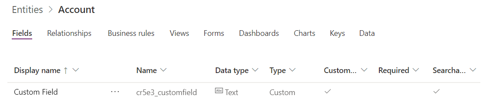
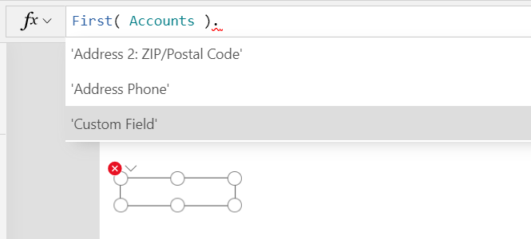
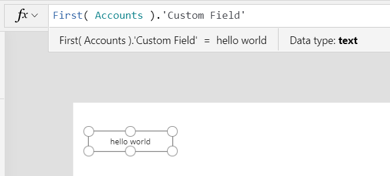
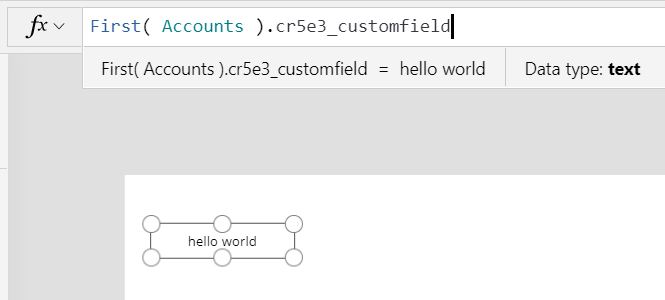
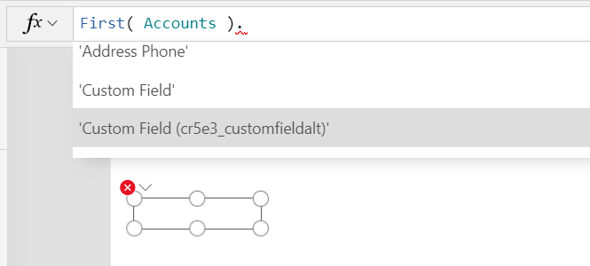

# Operators and Identifiers in Power Apps

Some of these operators are dependent on the language of the author.  See [Global apps](../global-apps.md) for more information.


|                               Symbol                                |                        Type                         |                                                                                    Syntax                                                                                    |                                                                                                                           Description                                                                                                                            |
|---------------------------------------------------------------------|-----------------------------------------------------|------------------------------------------------------------------------------------------------------------------------------------------------------------------------------|------------------------------------------------------------------------------------------------------------------------------------------------------------------------------------------------------------------------------------------------------------------|
|                                **.**                                |                  Property Selector                  |                                                               **Slider1.Value<br>Color.Red<br>Acceleration.X**                                                               |                                               Extracts a property from a [table](../working-with-tables.md), control, [signal](signals.md), or enumeration.  For backwards compatibility, **!** may also be used.                                                |
| **.**<br>[[language dependent](../global-apps.md)]  |                  Decimal separator                  |                                                             **1.23**                                                           |                                                                              Separator between whole and fractional parts of a number. The character depends on the language.                                                                              |
|                               **( )**                               |                     Parentheses                     |                                                               **Filter(T, A &lt; 10)**<br><br>**(1 + 2) \* 3**                                                               |                                                                                           Enforces precedence order, and groups sub-expressions in a larger expression                                                                                           |
|                                **+**                                |                Arithmetic operators                 |                                                                                  **1 + 2**                                                                                   |                                                                                                                             Addition                                                                                                                             |
|                                **-**                                |                       &nbsp;                        |                                                                                  **2 - 1**                                                                                   |                                                                                                                       Subtraction and sign                                                                                                                       |
|                              *                               |                       &nbsp;                        |                                                                                  **2 \* 3**                                                                                  |                                                                                                                          Multiplication                                                                                                                          |
|                                **/**                                |                       &nbsp;                        |                                                                                  **2 / 3**                                                                                   |                                                                                                   Division (also see the **[Mod](function-mod.md)** function)                                                                                                    |
|                                **^**                                |                       &nbsp;                        |                                                                                  **2 ^ 3**                                                                                   |                                                                                          Exponentiation, equivalent to the **[Power](function-numericals.md)** function                                                                                          |
|                                **%**                                |                       &nbsp;                        |                                                                                   **20%**                                                                                    |                                                                                                         Percentage (equivalent to &quot;\* 1/100&quot;)                                                                                                          |
|                                **=**                                |                Comparison operators                 |                                                                               **Price = 100**                                                                                |                                                                                                                             Equal to                                                                                                                             |
|                              **&gt;**                               |                       &nbsp;                        |                                                                              **Price &gt; 100**                                                                              |                                                                                                                           Greater than                                                                                                                           |
|                              **&gt;=**                              |                       &nbsp;                        |                                                                             **Price &gt;= 100**                                                                              |                                                                                                                     Greater than or equal to                                                                                                                     |
|                              **&lt;**                               |                       &nbsp;                        |                                                                              **Price &lt; 100**                                                                              |                                                                                                                            Less than                                                                                                                             |
|                              **&lt;=**                              |                       &nbsp;                        |                                                                             **Price &lt;= 100**                                                                              |                                                                                                                      Less than or equal to                                                                                                                       |
|                            **&lt;&gt;**                             |                       &nbsp;                        |                                                                            **Price &lt;&gt; 100**                                                                            |                                                                                                                           Not equal to                                                                                                                           |
|                              **&amp;**                              |            String concatenation operator            |                                                      **&quot;hello&quot; &amp; &quot; &quot; &amp; &quot;world&quot;**                                                       |                                                                                                             Makes multiple strings appear continuous                                                                                                             |
|                      **&amp;&amp;** or **And**                      |                  Logical operators                  |                                       **Price &lt; 100 &amp;&amp; Slider1.Value = 20**<br>or **Price &lt; 100 And Slider1.Value = 20**                                       |                                                                                         Logical conjunction, equivalent to the **[And](function-logicals.md)** function                                                                                          |
|                     **&#124;&#124;** or **Or**                      |                       &nbsp;                        |                                        **Price &lt; 100 &#124;&#124; Slider1.Value = 20** or **Price &lt; 100 Or Slider1.Value = 20**                                        |                                                                                          Logical disjunction, equivalent to the **[Or](function-logicals.md)** function                                                                                          |
|                          **!** or **Not**                           |                       &nbsp;                        |                                                              **!(Price &lt; 100)** or **Not (Price &lt; 100)**                                                               |                                                                                           Logical negation, equivalent to the **[Not](function-logicals.md)** function                                                                                           |
|                             **exactin**                             |  [Membership operators](#in-and-exactin-operators)  |                                                                   **Gallery1.Selected exactin SavedItems**                                                                   |                                                                                       Belonging to a [collection](../working-with-data-sources.md#collections) or a table                                                                                        |
|                             **exactin**                             |                       &nbsp;                        |                                           **&quot;Windows&quot; exactin “To display windows in the Windows operating system...”**                                            |                                                                                                                 Substring test (case-sensitive)                                                                                                                  |
|                               **in**                                |                       &nbsp;                        |                                                                     **Gallery1.Selected in SavedItems**                                                                      |                                                                                                               Belonging to a collection or a table                                                                                                               |
|                               **in**                                |                       &nbsp;                        |                                                      **&quot;The&quot; in &quot;The keyboard and the monitor...&quot;**                                                      |                                                                                                                Substring test (case-insensitive)                                                                                                                 |
|                                **@**                                | [Disambiguation operator](#disambiguation-operator) |                                                                           **MyTable[@fieldname]**                                                                            |                                                                                                                       Field disambiguation                                                                                                                       |
|                                **@**                                |                       &nbsp;                        |                                                                              **[@MyVariable]**                                                                               |                                                                                                                      Global disambiguation                                                                                                                       |
| **,**<br>[[language dependent](../global-apps.md)]  |                   List separator                    | **If( X < 10, "Low", "Good" )**<br>**{ X: 12, Y: 32 }**<br>**[ 1, 2, 3 ]** | Separates: <ul><li>arguments in function calls</li><li>fields in a [record](../working-with-tables.md#elements-of-a-table)</li><li>records in a [table](../working-with-tables.md#inline-value-tables)</li></ul> This character depends on the language. |
| **;**<br>[[language dependent](../global-apps.md)] |                  Formula chaining                   |                                     **Collect(T, A); Navigate(S1, &quot;&quot;)**                                     |                                                                          Separate invocations of functions in behavior properties. The chaining operator depends on the language.                                                                          |
|                             **Parent**                              |         [Parent operator](#parent-operator)         |                                                                               **Parent.Fill**                                                                                |                                                                                                           Access to properties of a control container                                                                                                            |
|                            **ThisItem**                             |       [ThisItem operator](#thisitem-operator)       |                                                                            **ThisItem.FirstName**                                                                            |                                                                                                          Access to fields of a Gallery or form control                                                                                                           |

## in and exactin operators
You can use the **[in](operators.md#in-and-exactin-operators)** and **[exactin](operators.md#in-and-exactin-operators)** operators to find a string in a [data source](../working-with-data-sources.md), such as a collection or an imported table. The **[in](operators.md#in-and-exactin-operators)** operator identifies matches regardless of case, and the **[exactin](operators.md#in-and-exactin-operators)** operator identifies matches only if they're capitalized the same way. Here's an example:

1. Create or import a collection named **Inventory**, and show it in a gallery, as the first procedure in [Show images and text in a gallery](../show-images-text-gallery-sort-filter.md) describes.
2. Set the **[Items](../controls/properties-core.md)** property of the gallery to this formula:
   <br>**Filter(Inventory, "E" in ProductName)**

    The gallery shows all products except Callisto because the name of that product is the only one that doesn't contain the letter you specified.
3. Change the **[Items](../controls/properties-core.md)** property of the gallery to this formula:
   <br>**Filter(Inventory, "E" exactin ProductName)**

    The gallery shows only Europa because only its name contains the letter that you specified in the case that you specified.

## ThisItem operator
You can show data in **[Gallery](../controls/control-gallery.md)**, **[Edit form](../controls/control-form-detail.md)**, or **[Display form](../controls/control-form-detail.md)** controls by binding it to a table or a collection.  These controls are a container for other cards and controls.  Each card or control within the container can access the bound data through the **[ThisItem](operators.md#thisitem-operator)** operator.   

Use the **[ThisItem](operators.md#thisitem-operator)** operator to specify the [column](../working-with-tables.md#columns) of data to be displayed in each card or control within the outer control. For example, that operator in the product gallery for [Show images and text in a gallery](../show-images-text-gallery-sort-filter.md) specified that the image control showed the product design, the upper label showed the product name, and the lower label showed the number of units in stock.

For nested galleries, **[ThisItem](operators.md#thisitem-operator)** refers to the innermost gallery's items. Assuming the row fields in the inner and outer galleries don't conflict, you can also use the unqualified field (column) names directly. This approach enables rules in an inner gallery to refer to an outer gallery's items.

## Parent operator
Some controls host other controls. For example, **[Screen](../controls/control-screen.md)**, **[Gallery](../controls/control-gallery.md)**, **[Card](../controls/control-card.md)**, **[Edit form](../controls/control-form-detail.md)**, and **[Display form](../controls/control-form-detail.md)** controls are all containers for controls. We call the hosting control the "parent" of the controls within.

Any control in Power Apps can be referenced by name from anywhere within the app. **Screen1** may be the name of a screen in your app. To retrieve the background color of this screen, you can use **Screen1.Fill**.

Controls on this screen have another option. They can use a relative reference: **Parent.Fill**. The **[Parent](operators.md#parent-operator)** operator refers to the control that hosts this control, making available all of its properties. Using **[Parent](operators.md#parent-operator)** is helpful because it doesn't depend on the name of the control. You can copy and paste a container control without needing to adjust any references within the container. This operator also makes the relationship between child and parent controls clearer when reading formulas.

## Identifier names

The names of variables, data sources, columns, and other objects can contain any [Unicode](https://en.wikipedia.org/wiki/Unicode).

Use single quotes around a name that contains a space or other special character.  Use two single quotes together to represent one single quote in the name.  Names that do not contain special characters do not require single quotes.

Here are some example column names you might encounter in a table, and how they are represented in a formula:

| Column name in a database   | Column reference in a formula |
|-----------------------------|-------------------------------|
| SimpleName                  | ```SimpleName``` |
| NameWith123Numbers          | ```NameWith123Numbers``` |
| Name with spaces            | ```'Name with spaces'``` |
| Name with "double" quotes   | ```'Name with "double" quotes'``` |
| Name with 'single' quotes   | ```'Name with ''single'' quotes'``` |
| Name with an @ at sign      | ```'Name with an @ at sign'``` |

Double quotes are used to [designate text strings](data-types.md#embedded-text).  

## Display names and logical names
Some data sources such as SharePoint and Common Data Service have two different names to refer to the same table or column of data:

* **Logical name** - A name that is guaranteed to be unique, does not change after being created, usually does not allow spaces or other special characters, and is not localized into different languages.  As a result the name can be somewhat cryptic.  These names are used by professional developers.  For example **cra3a_customfield**.  This name may also be referred to as **schema name** or just **name**.

* **Display name** - A name that is user friendly and intended to be seen by end users.  This name may not be unique, may change over time, may contain spaces and any Unicode character, and may be localized into different languages.  Corresponding to the example above, the display name may be **Custom Field** with a space inbetween the words.
 
Since display names are easier to understand, Canvas apps will suggest them as choices and not suggest logical names.  Although logical names are not suggested, they can still be used if typed in directly.

For example, imagine you have added a **Custom Field** to an entity in Common Data Service.  A logical name will be assigned for you by the system which you can modify only when creating the field.  The result would look similar to:

> [!div class="mx-imgBorder"]  
> 

When authoring a reference to a field of Accounts, the suggestion will be made to use **'Custom Field'** since this is the display name.  Note that the single quotes must be used because this name has a space in it:

> [!div class="mx-imgBorder"]  
> 

After selecting the suggestion, 'Custom Field' is shown in the formula bar and the data is retrieved: 

> [!div class="mx-imgBorder"]  
> 

Although it is not suggested, we could also use the logical name for this field.  This will result in the same data being retrieved.  Note that no single quotes are required since this name does not contain spaces or special characters:

> [!div class="mx-imgBorder"]  
> 

Behind the scenes, a mapping is maintained between the display names seen in formulas and the underlying logical names.  Since logical names must be used to interact with the data source, this mapping is used to convert from the current display name to the logical name automatically and that is what is seen in the network traffic.  This mapping is also used to convert back to logical names in order to switch into new display names, for example if a display name changes or a maker in a different language edits the app.

> [!NOTE] 
> Logical names are not translated when moving an app between environments.  For Common Data Service system entity and field names this should not be a problem as logical names are consistent across environments.  But any custom fields, such as **cra3a_customfield** in this example above, may have a different environment prefix (**cra3a** in this case).  Display names are preferred as they can be matched against display names in the new environment. 

## Name disambiguation
Since display names are not unique, the same display name may appear more than once in the same entity.  When this happens, the logical name will be added to the end of the display name in parenthesis for one of more of the conflicting names.  Building on the example above, if there was a second field with the same display name of **Custom Field** with a logical name of **cra3a_customfieldalt** then the suggestions would show:

> [!div class="mx-imgBorder"]  
> 

Name disambiguation strings are added in other situations where name conflicts occur, such as the names of entities, option sets, and other Common Data Service items. 

## Disambiguation operator
Some functions create [record scopes](../working-with-tables.md#record-scope) for accessing the fields of table while processing each record, such as **Filter**, **AddColumns**, and **Sum**.  Field names added with the record scope override the same names from elsewhere in the app.  When this happens, you can still access values from outside the record scope with the **@** disambiguation operator:

* To access values from nested record scopes, use the **@** operator with the name of the table being operated upon using this pattern:<br>_Table_**[@**_FieldName_**]**
* To access global values, such as data sources, collections, and context variables, use the pattern **[@**_ObjectName_**]** (without a table designation).

For more information and examples, see [record scopes](../working-with-tables.md#record-scope).

