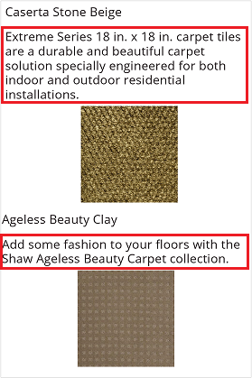
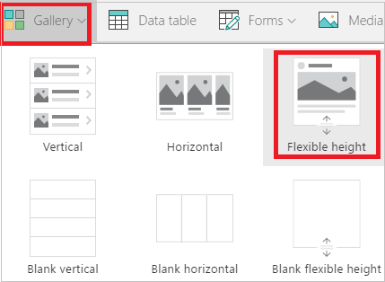
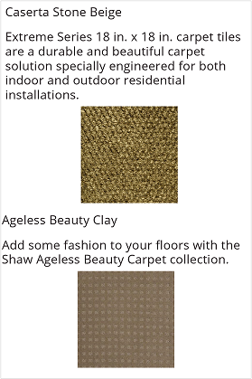

# Show items of different heights in a canvas app gallery

If different items in your data set contain different amounts of data in the same field, you can display items that contain more data without adding extra empty space after items with less data. Add and configure a **Flexible height** gallery control so that you can:

- Configure **Label** controls to expand or shrink based on their contents.
- Position each control so that it automatically appears just below the control above it.

In this article, you show data about flooring products in a **Flexible height** gallery control. The image of each product appears 5 pixels below the overview text, whether that overview is two lines or five.



> [!NOTE]
> If you've never added controls to a gallery, complete the steps in [Show a list of items in a gallery](add-gallery.md) before you proceed.

## Add data to a blank app

1. Download [this Excel file](https://download.microsoft.com/download/5/7/f/57fc6c55-6bb0-479b-a5c5-98fa08ee9efd/FlooringEstimates.xlsx), which contains names, overviews, and image links for flooring products.

1. Upload the Excel file to a cloud-storage account such as OneDrive, SharePoint, Dropbox, or Google Drive.

1. Create a [blank app](create-blank-app.md) with **Phone** layout.

1. Add a connection to the **FlooringEstimates** table in the Excel file.

    For more information, see [Add a data connection](add-data-connection.md).

## Add data to a gallery

1. On the **Insert** tab, select **Gallery** > **Flexible height**.

    

1. Resize the gallery to fill the entire screen.

1. Set the gallery's **[Items](controls/properties-core.md)** property to **FlooringEstimates**.

## Show the product names

1. In the upper-left corner of the gallery, select the pencil icon to enter template editing mode.

1. With the gallery template selected, add a **[Label](controls/control-text-box.md)** control.

1. Set the **Text** property of the **Label** control to:

   ```powerapps-dot
   ThisItem.Name
   ```

## Show the product overviews

1. With the gallery template selected, add a second **Label** control and move it below the first.

1. Set the **Text** property of the second **Label** to:

   ```powerapps-dot
   ThisItem.Overview
   ```

1. With the second **Label** selected, rename it to **OverviewText** using the name-tag icon on the **Content** tab.

1. Set the **AutoHeight** property of **OverviewText** to **true**.

   > [!TIP]
   > Setting **AutoHeight** to **true** on a label causes it to grow or shrink to fit its content. This is the key to making the flexible height gallery work correctly—without it, all items render at the same fixed height.

## Show the product images

1. Make the template taller by dragging its bottom edge down to roughly double its current height.

   You can add controls to the template more easily as you build the app. This change doesn't affect how the app looks when it runs.

1. With the gallery template selected, add an **[Image](controls/control-image.md)** control and position it below the **OverviewText** label.

1. Confirm that the **Image** property of the **Image** control is set to:

   ```powerapps-dot
   ThisItem.Image
   ```

1. Set the **[Y](controls/properties-core.md)** property of the **Image** control to position it dynamically below the overview text:

   ```powerapps-dot
   OverviewText.Y + OverviewText.Height + 5
   ```

    

   Apply the same concept for any additional controls: set each control's **Y** property based on the **Y** and **Height** of the control immediately above it.

## Next steps

- [Add and configure a gallery control](add-gallery.md)
- [Best practices for working with galleries](gallery-best-practice.md)
- [Get started with formulas in canvas apps](working-with-formulas.md)


[!INCLUDE[footer-include](../../includes/footer-banner.md)]