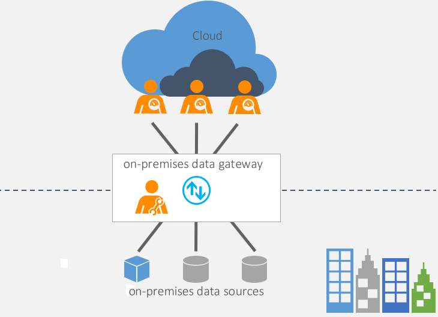

# What is an on-premises data gateway?

The on-premises data gateway acts as a bridge to provide quick and secure data transfer between on-premises data (data that isn't in the cloud) and several Microsoft cloud services. These cloud services include Power BI, Power Apps, Power Automate, Azure Analysis Services, and Azure Logic Apps. By using a gateway, organizations can keep databases and other data sources on their on-premises networks, yet securely use that on-premises data in cloud services.

## How the gateway works

For more information on how the gateway works, see [On-premises data gateway architecture](/data-integration/gateway/service-gateway-onprem-indepth).

## Types of gateways

There are two different types of gateways, each for a different scenario:

- **On-premises data gateway** allows multiple users to connect to multiple on-premises data sources. You can use an on-premises data gateway with all supported services, with a single gateway installation. This gateway is well-suited to complex scenarios with multiple people accessing multiple data sources.

- **On-premises data gateway (personal mode)** allows one user to connect to sources, and can’t be shared with others. An on-premises data gateway (personal mode) can be used only with Power BI. This gateway is well-suited to scenarios where you’re the only person who creates reports, and you don't need to share any data sources with others.

## Use a gateway

There are four main steps for using a gateway.

1. [Download and install the gateway](/data-integration/gateway/service-gateway-install) on a local computer.
2. [Configure](/data-integration/gateway/service-gateway-app) the gateway based on your firewall and other network requirements.
3. [Add gateway admins](/data-integration/gateway/service-gateway-manage) who can also manage and administer other network requirements.
4. [Troubleshoot](/data-integration/gateway/service-gateway-tshoot) the gateway in case of errors.

## Next steps

- [Install the on-premises data gateway](/data-integration/gateway/service-gateway-install)

[!INCLUDE[footer-include](../../includes/footer-banner.md)]