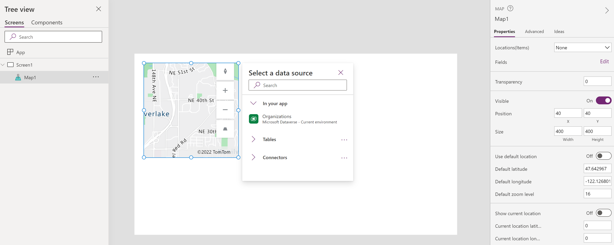
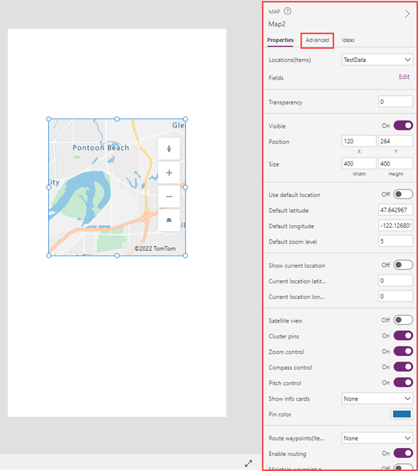

# Map geospatial component

Easily bring dynamic mapping capabilities into your canvas apps. View the physical position of entities by linking to a data source, or by inputting new physical locations. Customize your map view by changing its default location and adding map components. Pan, tilt, zoom, and drag to center your map view.

The dynamic map component can be added to your canvas apps by following the instructions for [adding framework components](/powerapps/developer/component-framework/component-framework-for-canvas-apps#add-components-to-a-canvas-app). 

## Use sample apps to explore the map component

The dynamic map component appears in the following two sample apps:
- Map Sample App: This sample canvas app shows a set of data points in a table, plots them as pins in the dynamic map and centers the map view to show all pins. The user can pan, tilt, zoom, and drag the map view. The map also clusters the data points when the map view is far away enough from the pins.
- Address + Map Sample App: This sample canvas app lets the user type an address in the text input, showing suggestions to autocomplete the address. Once the user selects the address, the address is plotted as a pin in the dynamic map and the map view is centered at this pin. The user can pan, tilt, zoom, and drag the map view.

## Properties

The following properties can be defined and configured in the component's **Controls** pane. 

Note that some properties are only available in the **Advanced** tab on the **Controls** pane, under the **More options** button.

Property | Description | Type | Location
- | - | - | -
Data source(Items) | Data source (table) that lists a pre-defined set of longitudes and latitudes to display as map pin on the map when it's loaded. Map each of the columns in your data with the *ItemsLongitudes*, *ItemsLatitudes*, and *ItemLabels*. | Not applicable | Properties
Transparency | Set the transparency of the map. | Percentage | Properties
Visible | Whether the map should show or not. | Boolean | Properties
Position | Location of the map component (top left corner) on the app's screen, in pixels from the top left corner of the app screen. | Pixels | Properties
Size | The size of the map component on the app's screen. | Pixels | Properties
Use custom location | Whether the map initializes at a custom location set by the user or not. | Boolean | Properties
Custom longitude | Longitude at which the map would go to when it's loaded if **Use custom location** is enabled. | Floating point number | Properties
Custom latitude | Latitude at which the map would go to when it's loaded if **Use custom location** is enabled. | Floating point number | Properties
Custom zoom level | Zoom level at which the map would be set to when it's loaded if **Use custom location** is enabled. | Integer | Properties
Satellite view | Whether the style of the map is a satellite view or a road view. | Boolean | Properties
Cluster pins | Whether the map pins are clustered or not. | Boolean | Properties
Zoom control | Whether the zoom component appears on the map or not. | Boolean | Properties
Compass control | Whether the compass component appears on the map or not. | Boolean | Properties
Pitch control | Whether the pitch component appears on the map or not. | Boolean | Properties
Maximum map pins | Maximum number of pins displayed on the map | Integer | Properties
Border radius | How curved the corners of the map component should appear; higher numbers result in a more distinct curve. | Integer | Properties
Border | Style, thickness, and color of the border. | Multiple | Properties
Tab index | Order in which items on the app screen be tabbed between. | Integer | Properties
ItemsLabels | A column in Items with the strings you want to use as labels for the pins. | TableName.ColumnName | Advanced
ItemsLongitudes | Name of the column in the table in your data source with floating-point numbers that represent the longitude position of the pins. | TableName.ColumnName | Advanced
ItemsLatitudes | Name of the column in the table in your data source with floating-point numbers that represent the latitude position of the pins. | TableName.ColumnName | Advanced
Items_Items | Name of the table in your data source that contains all the records that you want to plot in the map using pins. Each row must have an entry for the label, longitude, and latitude for each row. | TableName | Advanced
Tooltip | Descriptive text that appears when a user navigates to the map component. | String | Advanced

## Known issues

- Localization is not yet supported.
- Model-driven apps are not yet supported.

## Other geospatial components
- [Address input](geospatial-component-input-address.md)

