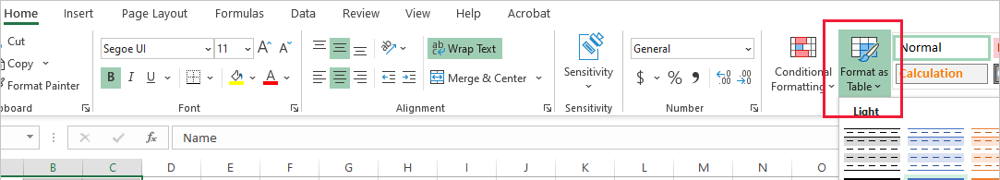

# Use a data source to insert pins

You can load a table that contains existing data into the map component. The component will then plot each row in your table as a map pin.

## Prerequisites
1. Create a Canvas app and make sure it meets the [Geospatial prerequisites](geospatial-overview.md#prerequisites). 
2. In your app, [insert a map](geospatial-component-map.md#use-the-component). 


## Add pin data from an Excel workbook

Your data source needs to contain a named table with the following columns that should then be mapped to the associated property in the component's **Advanced** pane.

Column description | Maps to property | Required
-- | -- | --
Label for the pin | ItemsLabels | Required
Longitude of the pin | ItemsLongitudes | Required
Latitude of the pin | ItemsLatitudes | Required
Color of the pin | ItemsColors | Optional
Icon for the pin | ItemsIcons | Optional


The color field accepts any CSS string, as defined in [Color enumeration and ColorFade, ColorValue, and RGBA functions in Power Apps](/functions/function-colors).

You can use the icons described in the [List of image templates](/azure/azure-maps/how-to-use-image-templates-web-sdk#list-of-image-templates) topic as your icon.


The following Excel table shows the required columns:


:::image type="content" source="media/geospatial/sample-excel.png" alt-text="Sample excel file with a table named TestData and containing Name, Longitude, and Latitude columns":::

You can copy the following sample data to test this functionality:

Name | Longitude | Latitude | Color | Icon
-- | -- | -- | -- | --
Fourth Coffee (sample) | -98.29277 | 26.2774 | Blue | marker-flat
Litware, Inc. (sample) | -96.85572 | 32.55253 | #ffefcd| hexagon-thick
Adventure Works (sample) | -96.99952 | 32.72058 | | car
Fabrikam, Inc. (sample) | -118.30746 | 34.86543 | |
Blue Yonder Airlines (sample) | -118.66184 | 34.17553 | |
City Power & Light (sample) | -113.46184 | 37.15363 | |
Contoso Pharmaceuticals (sample) | -80.26711 | 40.19918 | |
Alpine Ski House (sample) | -102.63908 | 35.20919 | |
A Datum Corporation (sample) | -89.39433 | 40.71025 | |
Coho Winery (sample) | -116.97751 | 32.87466 | |


1. Copy and paste the table into a new data source. In this example, we are using an Excel workbook.  

1. Select one of the cells, and then on the Home tab in the ribbon, select **Format as Table** and choose any style, and then **OK**.

    

1. Select the table, and then go to the **Table Design** tab on the ribbon. Enter a name for the table under **Table Name:**, for example *TestData*.

    

1. Save the workbook.

1. Open or create a new app in Power Apps, and insert the map component.

1. On the **Properties** pane, select the **Locations(Items)** field and then search for *excel* and select **Import from Excel**.

    :::image type="content" source="media/geospatial/select-excel.png" alt-text="Screenshot of the Import from Excel option.":::


1. Locate the Excel workbook and then select **Open**. Select the table that contains the information, **TestData**, and then **Connect**.

    

1. On the **Properties** pane, go to the **Advanced** tab, and select **More options**.

1. Set the following properties:

    - **ItemsLabels** as *"Name"*
    - **ItemsLatitudes** as *"Latitude"*
    - **ItemsLongitudes** as *"Longitude"*
    - (Optional) **ItemsColors** as *"Colors"*
    - (Optional) **ItemsIcons** as *"Icons"*

1. The map component will now show each row in the table as a pin, labeled with its *Name* as defined in the Excel table, and using the provided icons and colors. If an icon or color isn't provided, then the component will use the default icon and color.

    

 >[!NOTE]
 > Each map component has a pin limitation of 5000 pins where it prioritizes latitude and longitude columns over the address column. Within the 5000 pin limitation, up to 50 addresses can be geocoded for each map component. Therefore, for pins with both latitude/longtude and an address bound, the map component will prioritize using the latitude/longitude to avoid geocoding the address. 


## Save geocoded addresses from map component to data source

To avoid geocoding the same set of addresses every time the map component is launched, you can save the geocoded addresses back to the original data source, such that when the map relaunches, it will use the latitude and longitude instead of geocoding the addresses again. 

To do so, add a button to save the geocoded address back to the original data source with the following formula: 

```text
 ForAll(Map1.GeocodedItems, Patch(Accounts1, LookUp(Accounts1, ThisRecord.Address = Address && ThisRecord.Name = Label), {Latitude: Latitude, Longitude: Longitude }))
```


## Other interactive map features

- [Add info cards to pins](geospatial-map-infocards.md)
- [Draw and insert shapes onto maps](geospatial-map-draw-shapes.md)


## Other geospatial components

To see dynamic address suggestions as you type, use the **[Address input](geospatial-component-input-address.md)** component.


[!INCLUDE[footer-include](../../includes/footer-banner.md)]
