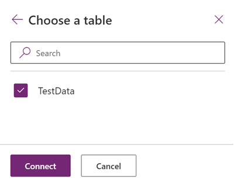

# Insert waypoint pins and draw routes between them (Preview)

[!INCLUDE[Preview disclaimer](../../includes/cc-beta-prerelease-disclaimer.md)]

You can load a table that contains a dataset of waypoints into the map component. The component will then place pins on the map for each waypoint, and it can draw routes between the waypoints.

The component has options to reorder the waypoints or rearrange the route to improve travel time or travel distance.

## Prerequisites
1. Create a Canvas app and make sure it meets the [Geospatial prerequisites](geospatial-overview.md#prerequisites). 
2. In your app, [insert a map](geospatial-component-map.md#use-the-component). 

## Add waypoint data from an Excel workbook

Your data source needs to contain a named table with the following columns that should then be mapped to the associated property in the component's **Advanced** pane.

While all properties are optional, either the address field or the longitude and latitude fields must be provided so that the waypoint locations can be found.

| Column description | Maps to property | Required
| -- | -- | --
| Label for the waypoint | RouteWaypointsLabels | Optional
| Longitude of the waypoint | RouteWaypointsLongitudes | Optional
| Latitude of the waypoint | RouteWaypointsLatitudes | Optional
| Address of the waypoint | RouteWaypointsAddresses | Optional

The following Excel table shows the required columns:

TODO: INSERT SCREENSHOT

You can copy the following sample data to test this functionality:

| Name | Longitude | Latitude
| -- | -- | --
| Work | -122.156481 | 47.663448
| Meet up | -122.221037 | 47.57137
| Swimming | -122.144133 | 47.600373
| Tennis | -122.137265 | 47.616115

1. Copy and paste the table into a new data source. In this example, we are using an Excel workbook.  

1. Select one of the cells, and then on the Home tab in the ribbon, select **Format as Table** and choose any style, and then **OK**.

    

1. Select the table, and then go to the **Table Design** tab on the ribbon. Enter a name for the table under **Table Name:**, for example *TestData*.

    

1. Save the workbook.

1. Open or create a new app in Power Apps, and insert the map component.

1. On the **Properties** pane, select the **Locations(Items)** field and then search for *excel* and select **Import from Excel**.

    TODO: INSERT SCREENSHOT

1. Locate the Excel workbook and then select **Open**. Select the table that contains the information, **TestData**, and then **Connect**.

    

1. On the **Properties** pane, go to the **Advanced** tab, and select **More options**.

1. Set the following properties:

    - **RouteWaypointsLabels** as *"Name"*
    - **RouteWaypointsLatitudes** as *"Latitude"*
    - **RouteWaypointsLongitudes** as *"Longitude"*
    - **RouteWaypointsAddresses** as *"Address"* (Optional, if your dataset has an address field. Note that if your dataset has an address field, then the latitude and longitude fields do not need to be set)

1. The map component will now show each row in the table as a pin, labeled with its *Name* as defined in the Excel table, and numbered in the same order as the given dataset.

    TODO: INSERT SCREENSHOT

## Draw routes between the waypoints
To draw routes between the waypoints on the map and customize how the route is calculated, you need to configure the following settings:

1. Open the **Properties** pane with a map selected.

1. Switch this toggle to **On**:
    -  **Enable routing**
    
    TODO: INSERT SCREENSHOT
    
1. The component will now draw routes between the waypoints on the map.

    TODO: INSERT SCREENSHOT

1. By default, the component will reorder the waypoints to decrease travel time or travel distance. Waypoint order can be kept locked by switching the **Maintain waypoint order** toggle to **On**. 

### Properties

The following properties can configure how the route is calculated or:

| Property | Description | Type | Location
| - | - | -
| Enable routing | Whether routes are drawn between waypoints | Boolean | **Properties** (also in **Advanced** as **UseRouting**)
| Maintain waypoint order | If true, the component will reorder the waypoints to optimize the route based on the **Optimize route** setting. If false, the component will maintain the order that the waypoints have in the dataset, and the **Optimize route** setting will only affect the drawn route. | Boolean | **Properties** (also in **Advanced** as **RouteMaintainOrder**)
| Optimize route | Whether to optimize the route to decrease travel time or decrease travel distance. | Enumeration (TODO: What should this be?) | **Properties** (also in **Advanced** as **RouteOptimization**)
| Route travel mode | Whether the route will be travelled by car or by truck. | Enumeration (TODO: What should this be?) | **Properties** (also in **Advanced** as **RouteTravelMode**)

### Output Properties

The component outputs various properties when the route changes. These properties are all placed in the **RouteDirection** object. The **OnRouteDirectionChange** event is a good way to use the output in other components or to customize the experience.
    
| Property | Description | Type | Location
| - | - | -
| OnRouteDirectionChange | How the app responds when the route is changed | Event | Advanced
| RouteDirection | Object describing all of the routing outputs (TODO: How to format this?) | TODO: ??? | Not applicable (output property only)
