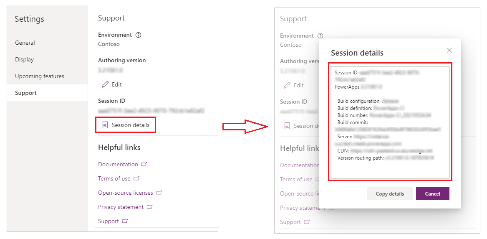

# Get a session ID
If you encounter a problem with an app that was created in PowerApps, you can help Microsoft troubleshoot the problem much more effectively if you provide them with a session ID for that problem.

- When editing an app, select **File**, select **Account**, and then, under **Diagnostics**, select **Session details**.

     

- When running an app in a browser, select the gear icon in the upper-right corner, and then select **Session details**.

     

- When running an app on a phone or a tablet, swipe right, and then tap **Session details**.

     
