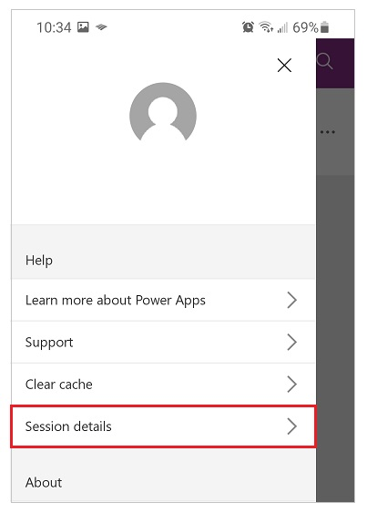

# Get session and app ID details

If you find a problem with an app in Power Apps, you can help Microsoft troubleshoot the problem much more effectively with a session ID, an app ID, or both.

## Get the session ID for a canvas app

### When editing a canvas app

1. In the upper-left corner, select **File**.

1. Select **Account**.

1. Select **Support** > **Session details**.

    

1. Select **Copy details** to copy all session to clipboard.

### When running a canvas app in a browser

1. In the upper-right corner, select .

1. Select **Session details**.

    

### When running a canvas app on a phone or a tablet

1. In the upper-left corner, select .

    

1. Tap **Session details**.

    

### When running an embedded canvas app or form

1. Do one of these steps:

    - While holding down the Alt key, right-click the app or form.
    - Tap the app or form with two fingers for 1-2 seconds, and then release.

1. Select **Session details**.

    

## Get the session ID for a model-driven app

### When editing a model-driven app

1. From the preview pane in app designer, on the command bar in the model-driven app displayed, select **Settings** (gear).
1. Select **About**.

### When running a model-driven app in a browser

1. On the command bar in a model-driven app, select **Settings** (gear).
1. Select **About**.
   :::image type="content" source="media/get-sessionid/session-details-mda.png" alt-text="Session ID displayed with session details":::

## Get the session ID for Power Apps (make.powerapps.com)

1. Sign into Power Apps (make.powerapps.com), and then, on the command bar, select **Settings** (gear).
1. Select the **Session details**.
   :::image type="content" source="media/get-sessionid/session-details-powerapps.png" alt-text="Session details from Power Apps site":::

## Get an app ID

Get the app ID for either a canvas or model-driven app: 
1. [Sign in to Power Apps](https://powerapps.microsoft.com).

1. Near the left edge, select **Apps**.

1. Select  (More Commands).

1. Select **Details**.

    

    The app ID appears at the bottom of the **Details** pane for that app.

    

[!INCLUDE[footer-include](../../includes/footer-banner.md)]