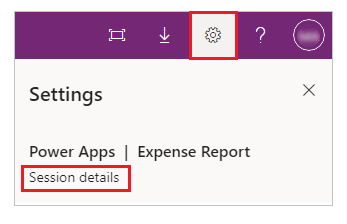

# Get a session ID
If you encounter a problem with an app that was created in PowerApps, you can help Microsoft troubleshoot the problem much more effectively if you provide them with a session ID for that problem.

## When editing an app
1. In the upper-left corner, select **File**.

1. Select **Account**.

1. Under **Diagnostics**, select **Session details**.

     

## When running an app in a browser
1. In the upper-right corner, select the gear icon.

1. Select **Session details**.

     

## When running an app on a phone or a tablet
1. Swipe right.

1. Tap **Session details**.

     

## When running an embedded app or form
1. Perform one of these steps:

    - While holding down the Alt key, right-click the app or form.
    - Tap the app or form with two fingers for 1-2 seconds, and then release.

1. Select **Session details**.

     
