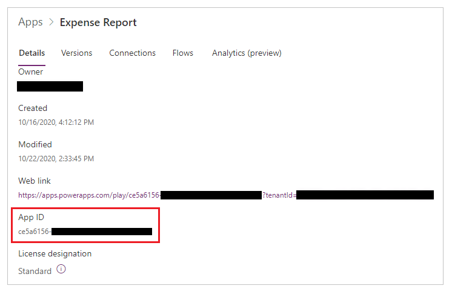

# Get a session ID or a canvas-app ID

If you find a problem with a canvas app in Power Apps, you can help Microsoft troubleshoot the problem much more effectively with a session ID, an app ID, or both.

## Get the session ID

### When editing an app

1. In the upper-left corner, select **File**.

1. Select **Account**.

1. Select **Support** > **Session details**.

    

1. Select **Copy details** to copy all session to clipboard.

### When running an app in a browser

1. In the upper-right corner, select .

1. Select **Session details**.

    

### When running an app on a phone or a tablet

1. In the upper-left corner, select .

    

1. Tap **Session details**.

    

### When running an embedded app or form

1. Do one of these steps:

    - While holding down the Alt key, right-click the app or form.
    - Tap the app or form with two fingers for 1-2 seconds, and then release.

1. Select **Session details**.

    

## Get an app ID

1. [Sign in to Power Apps](https://powerapps.microsoft.com).

1. Near the left edge, select **Apps**.

1. Select  (More Commands).

1. Select **Details**.

    

    The app ID appears at the bottom of the **Details** pane for that app.

    

[!INCLUDE[footer-include](../../includes/footer-banner.md)]