# Create an canvas app from scratch based on Excel data

Create your own canvas app from scratch based on Excel data, formatted as a table, and then add data from other sources if you want. By following this tutorial, you'll create an app that contains two screens. On one screen, users can browse through a set of records. On the other screen, users can create a record, update one or more fields in a record, or delete an entire record. This approach takes more time than [generating an app automatically](get-started-create-from-data.md) does, but experienced app makers can use it to build the best app for their needs.

## Prerequisites

To follow the steps in this tutorial exactly, first create an Excel file using this sample data.

1. Copy this data, and then paste it into an Excel file.

    | StartDay | StartTime | Volunteer | Backup |
    | --- | --- | --- | --- |
    | Saturday |10am-noon |Vasquez |Kumashiro |
    | Saturday |noon-2pm |Ice |Singhal |
    | Saturday |2pm-4-pm |Myk |Mueller |
    | Sunday |10am-noon |Li |Adams |
    | Sunday |10am-noon |Singh |Morgan |
    | Sunday |10am-noon |Batye |Nguyen |

2. Format that data as a table, named **Schedule**, so that PowerApps can parse the information.

    For more information, see [Format a table in Excel](how-to-excel-tips.md).

3. Save the file under the name **eventsignup.xls**, close it, and then upload it to a [cloud-storage account](connections/cloud-storage-blob-connections.md), such as OneDrive.

> [!IMPORTANT]
> You can use your own Excel file and review this tutorial for general concepts only. However, the data in the Excel file must be formatted as a table. For more information, see [Format a table in Excel](how-to-excel-tips.md).

## Open a blank app
1. Sign in to [PowerApps](http://web.powerapps.com?utm_source=padocs&utm_medium=linkinadoc&utm_campaign=referralsfromdoc).

	You can design an app from scratch for phones or for other devices (such as tablets). This topic focuses on designing an app for phones.

1. Under **Make your own app**, hover over the **Start from blank** tile for canvas apps, select the phone icon, and then select **Make this app**.

	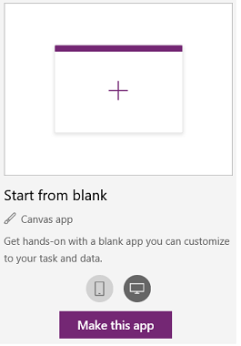

    PowerApps Studio creates a blank app for phones.

1. If the **Welcome to PowerApps Studio** dialog box opens, select **Skip**.

## Connect to data
1. In the middle of the screen, select **connect to data**.

1. In the **Data** pane, select the connection for your cloud-storage account if it appears. Otherwise, follow these steps to add a connection:

    1. Select **New connection**, select the tile for your cloud-storage account, and then select **Create**.
    2. If prompted, provide your credentials for that account.

1. Under **Choose an Excel file**, type or paste the first letters of **eventsignup** to filter the list, and then select the file that you uploaded.

1. Under **Choose a table**, select the checkbox for **Schedule**, and then select **Connect**.

## Create the view screen

1. On the **Home** tab, select the down-arrow next to **New screen** to open a list of screen types, and then select **List screen**.

    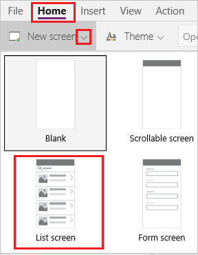

    A screen is added with several default controls, such as a search box and a **[Gallery](controls/control-gallery.md)** control. The gallery covers the entire screen under the search box.

2. Select the gallery by clicking or tapping near its center.

    A selection box with handles surrounds the gallery.

    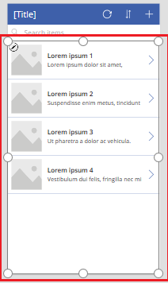

3. In the right-hand pane, select **CustomGallerySample** to open the **Data** pane.

    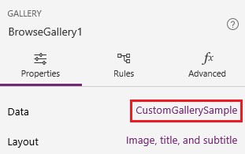

4. Under **Data source**, select the down arrow to open the list of data sources for the app, and then select **Schedule**.

    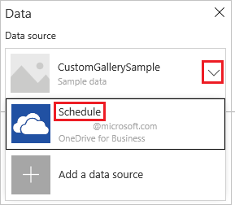

5. Under **Layout**, select the down arrow to open the list of layouts, and then select **Title, subtitle, and body**.

    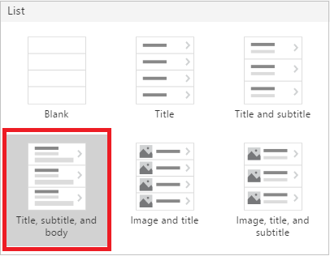

6. Under **Title2**, change the column shown from **Backup** to **Volunteer**.

     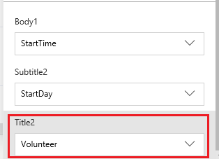

7. Close the **Data** pane by selecting the close icon in the upper-right corner.

    The gallery shows the name of each volunteer and the day and time of that volunteer's shift.

    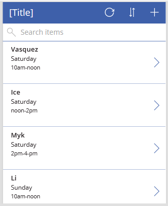

8. Select the gallery, and confirm that the property list shows **[Items](controls/properties-core.md)**.

    As the formula bar shows, the value of that property is **Schedule**.

    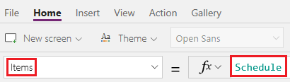

9. Change the value of the **Items** property by copying this formula and pasting it into the formula bar:

    **SortByColumns(Search(Schedule, TextSearchBox1.Text, "Volunteer"), "Volunteer", If(SortDescending1, SortOrder.Descending, SortOrder.Ascending))**

    The gallery shows data in alphabetical order by volunteer name.

    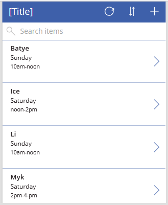

    Users can sort and filter the gallery by volunteer name based on the **SortByColumns** and **Search** functions in that formula.

   - If a user types at least one letter in the search box, the gallery shows only those records for which the **Volunteer** field contains the text that the user typed.
   - If a user selects the sort button, the gallery shows the records in ascending or descending order (depending on how many times the user selects the button) based on the **Volunteer** field.

     For more information about these and other functions, see the [formula reference](formula-reference.md).

10. Type an **i** in the search box, select the sort button by clicking or tapping it, and then select it one more time (or an odd number of additional times).

     The gallery shows these results.

     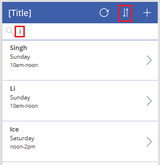

11. Clear all text from the search box.

12. At the top of the screen, select the **[Label](controls/control-text-box.md)** control, and then replace **[Title]** with **View records**.

     

## Create the change screen
1. On the **Home** tab, select the down arrow next to **New screen**, and then select **Form screen**.

     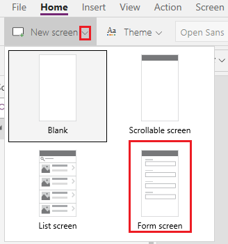

1. In the screen that you just added, select **Connect to data** to open the **Data** pane, and then set the data source to **Schedule**.

1. Under **Fields**, select all the checkboxes to show all the fields in the form.

     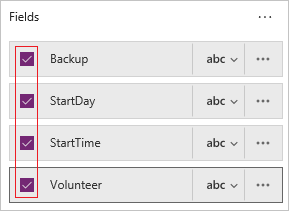

1. Drag the **Volunteer** field up so it appears at the top of the list of fields.

     

1. Select the form, and set its **Item** property to this expression by typing or pasting it in the formula bar: **BrowseGallery1.Selected**

1. At the top of the screen, select the **[Label](controls/control-text-box.md)** control, and then replace **[Title]** with **Change records**.

    

## Delete and rename screens
1. In the left navigation bar, select the ellipsis (...) for **Screen1**, and then select **Delete**.

    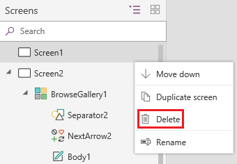

1. Select the ellipsis (...) for **Screen2**, select **Rename**, and then type or paste **ViewScreen**.

1. Select the ellipsis (...) for **Screen3**, select **Rename**, and then type or paste **ChangeScreen**.

## Configure icons on the view screen
1. Near the top of the **ViewScreen**, select the circular-arrow icon.

    

1. Set the **OnSelect** property for that icon to this formula: **Refresh(Schedule)**

    When the user selects this icon, the data from **Schedule** is refreshed from the Excel file.

    For more information about this and other functions, see the [formula reference](formula-reference.md).

1. In the upper-right corner of the **ViewScreen**, select the plus icon.

    

1. Set the **OnSelect** property for that icon to this formula: **NewForm(EditForm1);Navigate(ChangeScreen,ScreenTransition.None)**

    When the user selects this icon, **ChangeScreen** appears with each field empty, so that the user can create a record more easily.

1. Select the right-pointing arrow for the first record in the gallery.

    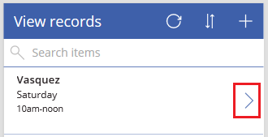

1. Set the **OnSelect** property for the arrow to this formula: **EditForm(EditForm1); Navigate(ChangeScreen, ScreenTransition.None)**

    When the user selects this icon, **ChangeScreen** appears with each field showing the data for the selected record, so that the user can edit or delete the record more easily.

## Configure icons on the change screen
1. On **ChangeScreen**, select the "x" icon in the upper-left corner.

    

1. Set the **OnSelect** property for that icon to this formula: **ResetForm(EditForm1);Navigate(ViewScreen, ScreenTransition.None)**

    When the user selects this icon, any changes that the user made in this screen are discarded, and the view screen opens.

1. In the upper-right corner, select the checkmark icon.

    

1. Set the **OnSelect** property for the checkmark to this formula: **SubmitForm(EditForm1); Navigate(ViewScreen, ScreenTransition.None)**

    When the user selects this icon, any changes that the user made is this screen are saved, and the view screen opens.

1. On the **Insert** tab, select **Icons**, and then select the **Trash** icon.

1. Set the new icon's **Color** property to **White**, and move the new icon so it appears next to the checkmark icon.

    

1. Set the **Visible** property for the trash icon to this formula: **EditForm1.Mode = FormMode.Edit**

    This icon will appear only when the form is in **Edit** mode, not in **New** mode.

1. Set the **OnSelect** property for the trash icon to this formula: **Remove(Schedule, BrowseGallery1.Selected); Navigate(ViewScreen, ScreenTransition.None)**

    When the user selects this icon, the selected record is deleted from the data source, and the view screen opens.

## Test the app
1. Select the **ViewScreen**, and then open Preview by pressing F5 (or selecting the **Preview** icon near the upper-right corner).

    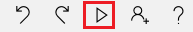

1. Add a record.

1. Update the record that you added, and then save the changes.

1. Update the record that you added, and then cancel the changes.

1. Delete the record that you added.

1. Close Preview mode by pressing Esc (or by selecting the close icon in the upper-right corner).

## Next steps

- Press Ctrl-S to save your app in the cloud so that you can run it from other devices.
- [Share the app](share-app.md) so that other people can run it.
- Learn more about [functions](working-with-formulas.md) such as **Patch**, which you can use to manage data without creating a standard form.
- [Link this app to a solution](add-app-solution.md) so that you can, for example, deploy it to a different environment or publish it on AppSource.
