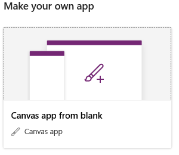

# Create an Excel app from scratch
Create your own app from scratch based on Excel data, formatted as a table, and then add data from other sources if you want. Specify the appearance and behavior of each UI element so that you can optimize the result for your exact goals and workflow. This approach takes much more time than [generating an app automatically](get-started-create-from-data.md), but experienced app makers can build the best app for their needs.

By following this tutorial, you'll create an app that contains two screens. On one screen, users can browse through a set of records. On the other screen, users can create a record, update one or more fields in a record, or delete an entire record.

## Prerequisites
If you're new to PowerApps:

- Learn how to [add a control and set its properties](add-configure-controls.md), which determine how the control appears and behaves.
- Learn how to [add and rename a screen](add-screen-context-variables.md).

> [!IMPORTANT]
> You can use your own Excel file and review this tutorial for general concepts only. However, the data in the Excel file must be formatted as a table. For more information, see [Format a table in Excel](how-to-excel-tips.md).

To follow the steps below exactly, first create an Excel file using this sample data.

1. Copy this data, and then paste it into an Excel file.

   | StartDay | StartTime | Volunteer1 | Volunteer2 |
   | --- | --- | --- | --- |
   | Saturday |10am-noon |Vasquez |Kumashiro |
   | Saturday |noon-2pm |Ice |Singhal |
   | Saturday |2pm-4-pm |Myk |Mueller |
   | Sunday |10am-noon |Li |Adams |
   | Sunday |10am-noon |Singh |Morgan |
   | Sunday |10am-noon |Batye |Nguyen |

2. Format that data as a table, named **Schedule**, so that PowerApps can parse the information.

    For more information, see [Format a table in Excel](how-to-excel-tips.md).

3. Save the file under the name **eventsignup.xls**, and then upload it to a [cloud-storage account](connections/cloud-storage-blob-connections.md), such as OneDrive.

## Open a blank app
1. Sign in to [PowerApps](http://web.powerapps.com).

	

	You can design an app from scratch for phones or for other devices (such as tablets). This topic focuses on designing an app for phones.

1. Under **Make apps like these**, hover over the **Start from blank** tile, select the phone icon, and then select **Make this app**.

	

## Specify a table
1. In the middle of the screen, select **connect to data**.

1. In the **Data** pane, select the connection for your cloud-storage account if it appears. Otherwise, follow these steps to add a connection:

    1. Select **New connection**, select the tile for your cloud-storage account, and then select **Create**.
    2. If prompted, provide your credentials for that account.

1. Under **Choose an Excel file**, type or paste the first letters of **eventsignup** to filter the list, and then select the file that you uploaded.

1. Under **Choose a table**, select the checkbox for **Schedule**, and then select **Connect**.

## Add a browse screen

1. On the **Home** tab, select the down-arrow next to **New screen** to open a list of screen types, and then select **List screen**.

    

    A screen is added with several default controls, such as a search box and a **[Gallery](controls/control-gallery.md)** control. The gallery covers the entire screen under the search box.

2. Select the gallery by clicking or tapping near its center.

    A selection box with handles surrounds the gallery.

    

3. In the right-hand pane, select **CustomGallerySample** to open the **Data** pane.

    

1. Under **Data source**, select the down arrow to open the list of data sources for the app, and then select **Schedule**.

    

1. Under **Layout**, select the down arrow to open the list of layouts, and then select **Title, subtitle, and body**.

    

1. Under **Title2**, change the column shown from **Backup** to **Volunteer**.

     

    The gallery shows the name of each volunteer, the day of that volunteer's shift, and the time when the volunteer's shift starts.

    

    In the next step, you'll enable users to sort and filter the gallery based on the volunteers' names. You'll add a formula to the **[Items](controls/properties-core.md)** property of the gallery. If you're not sure how to configure a control's properties, see [Add and configure controls](add-configure-controls.md).

4. Set the **[Items](controls/properties-core.md)** property of the gallery to this formula:

    **SortByColumns(Search(Schedule, TextSearchBox1.Text, "Volunteer"), "Volunteer", If(SortDescending1, SortOrder.Descending, SortOrder.Ascending))**

    The gallery shows data in alphabetical order by volunteer name.

    

    Users can sort and filter the gallery by volunteer name based on the **SortByColumns** and **Search** functions in that formula.

    - If a user types at least one letter in the search box, the gallery shows only those records for which the **Volunteer** field contains the text that the user typed.
    - If a user selects the sort button, the gallery shows the records in ascending or descending order (depending on how many times the user selects the button) based on the **Volunteer** field.

    For more information about these and other functions, see the [formula reference](formula-reference.md).

5. Type an **i** in the search box, and select the sort button once (or an odd number of times).

    The gallery shows these results.

    

6. At the top of the screen, select the **[Label](controls/control-text-box.md)** control, and then replace **[Title]** with **View records** (retaining the double quotation marks).

    

## Create the ChangeScreen and its banner
1. On the **Home** tab, select the down arrow next to **New screen**, and then select **Form screen**.

     

1. In the screen that you just added, select **Connect to data** to open the **Data** pane, and then select **Schedule**.

1. Under **Fields**, select all the checkboxes to show all the fields in the form.

     

1. Drag the **Volunteer** field up so it appears at the top of the list of fields.

     

1. At the top of the screen, select the **[Label](controls/control-text-box.md)** control, and then replace **[Title]** with **Change records** (retaining the double quotation marks).

    

## Configure navigation between screens
1. In the left navigation bar, select the ellipsis (...) for **Screen1**, and then select **Delete**.

    

1. Select the ellipsis (...) for **Screen2**, select **Rename**, and then type or paste **ViewScreen**.

1. 1. In the left navigation bar, select the ellipsis (...) for **Screen3**, select **Rename**, and then type or paste **ChangeScreen**.

4. In the upper-right corner of **ViewScreen**, select the plus icon.

    

5. Set the **[OnSelect](controls/properties-core.md)** property of the selected icon to this formula:

    **NewForm(Form1);Navigate(ChangeScreen,ScreenTransition.None)**`

     When the user clicks or taps this icon, **ChangeScreen** appears with each field empty, so that the user can create a record more easily.
1. 

## Run the app
As you customize the app, test your changes by running the app in Preview mode, as the steps in this section describe.

1. In the left navigation bar, click or tap the top thumbnail to select the **ViewScreen**.

2. Open Preview mode by pressing F5 (or clicking or tapping the **Preview** icon near the upper-right corner).

    

3. Click or tap the Next arrow for a record to show details about that record.

4. On the **ChangeScreen**, change the information in one or more fields, and then save your changes by clicking or tapping **Save**, or remove the record by clicking or tapping **Remove**.

5. Close Preview mode by pressing Esc (or by clicking or tapping the close icon under the title bar).

    

## Next steps
* Press Ctrl-S to save your app in the cloud so that you can run it from other devices.
* [Share the app](share-app.md) so that other people can run it.
* Learn more about [galleries](add-gallery.md), [forms](add-form.md), and [formulas](working-with-formulas.md).
