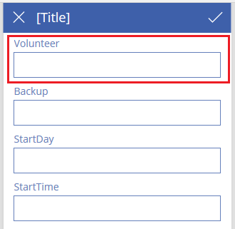
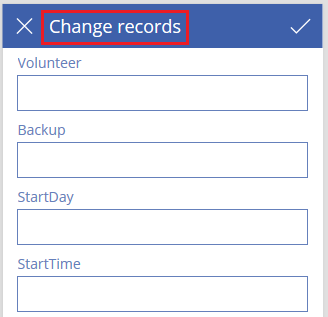
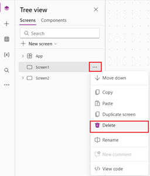
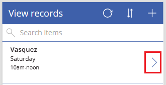

# Create a canvas app based on Excel data

This article shows you how to create a canvas app by using Excel data as the data source. If you already track business data in Excel, Power Apps gives you several ways to turn that data into an app.

You'll learn three ways to work with Excel data:

- Upload an Excel file and create a Dataverse table.
- Connect to an Excel file that stays in cloud storage.
- Start with a blank canvas app and add Excel data yourself.

Before you begin, make sure that your Excel data is formatted as a table. This preparation helps Power Apps read and use the data correctly. For more information, see [Formatted as a table in Excel](https://support.office.com/article/Create-an-Excel-table-in-a-worksheet-E81AA349-B006-4F8A-9806-5AF9DF0AC664).

To create an app by using Excel data, choose one of the following options in [Power Apps](https://make.powerapps.com).

| Create options by using Excel | Benefits | Navigation |
|---|---|---|
| [Upload an Excel or .CSV file to Power Apps](#upload-an-excel-or-csv-file-to-power-apps) | Power Apps converts the uploaded data into a Dataverse table. Use this approach when you want cloud storage, improved security, and a reusable table for other apps and flows. | Select **Start with data** > **Upload file**. |
| [Connect to an external Excel file and use it to create a canvas app](#connect-to-an-external-excel-file-from-power-apps) | The workbook stays in its current cloud location. Use this approach when you want a fast way to create an app from an existing Excel table. | Select **Start with data** > **Excel Online (Business)**. |
| [Create a blank canvas app and then add Excel data](#create-a-blank-canvas-app-and-add-excel-data) | You control the screens, layout, formulas, and data experience. Use this approach when you want the most flexibility. | In the left navigation pane, select **Create** > **Create from blank**. Then select the app size. |

## Upload an Excel or CSV file to Power Apps

When you upload Excel data to Power Apps, Power Apps converts the data into a Dataverse table. This approach makes the data easier to manage in Power Apps and gives you capabilities that go beyond Excel alone. For more information, see [Why use Dataverse?](../data-platform/data-platform-intro.md#why-use-dataverse).

1. Sign in to [Power Apps](https://make.powerapps.com).
1. On the home screen, select **Start with data**.
1. On the **Create an app** page, select **Upload file**.
1. Select **Select from device**, browse to your Excel file, and then upload it.

   > [!NOTE]
   > The maximum file size is 5 GB.

1. When Power Apps creates the table, select a column name or the table name to edit properties as needed. If you change a column data type and some existing values don't match the new type, Power Apps removes those values when it generates the table. For more information, see [Create and edit tables using Power Apps](../data-platform/create-edit-entities-portal.md#create-new-tables).
1. Select **Row ownership** and choose how you want to manage row ownership.
1. When you're done, select **Save and open app**.

Power Apps uploads the first 20 rows so that you can start reviewing the app right away. It uploads the remaining data in the background.

### Known issues

- The current data upload process doesn't take the environment data format setting into account.

## Connect to an external Excel file from Power Apps

Store the Excel file in a cloud storage service such as Dropbox, Google Drive, OneDrive, or OneDrive for Business. Power Apps can connect only to Excel files that are stored in the cloud.

Power Apps includes an Excel connector that lets you access Excel data. The [Excel Online (Business)](/connectors/excelonlinebusiness/) connector provides a fast way to create and deploy apps that use data stored in Excel.

1. Sign in to [Power Apps](https://make.powerapps.com).
1. On the home screen, select **Start with data**.
1. On the **Create an app** page, select **Excel Online (Business)**.
1. If more than one connection is available, select **...** to switch connections or add a new one.
1. Enter the file location, and then select the table.
1. Select **Create app**.

For more information about how to share Excel data, see [Sharing Excel tables](connections/cloud-storage-blob-connections.md#sharing-excel-tables).

## Create a blank canvas app and add Excel data

Use this example to create a two-screen app in which users browse records on one screen and add, edit, or delete records on another screen.

### Prerequisites

1. Copy this data into an Excel file.

   | StartDay | StartTime | Volunteer | Backup |
   |---|---|---|---|
   | Saturday | 10am-noon | Vasquez | Kumashiro |
   | Saturday | noon-2pm | Ice | Singhal |
   | Saturday | 2pm-4pm | Myk | Mueller |
   | Sunday | 10am-noon | Li | Adams |
   | Sunday | noon-2pm | Singh | Morgan |
   | Sunday | 2pm-4pm | Batye | Nguyen |

1. [Format the data as a table in Excel](https://support.office.com/article/Create-an-Excel-table-in-a-worksheet-E81AA349-B006-4F8A-9806-5AF9DF0AC664) and name the table **Schedule** so that Power Apps can read it.
1. Save the file as **eventsignup.xlsx**, close it, and then upload it to a [cloud-storage account](connections/cloud-storage-blob-connections.md) such as OneDrive.

> [!IMPORTANT]
> You can use your own Excel file and follow this example for the general approach. However, the data in the Excel file must be [formatted as a table](https://support.office.com/article/Create-an-Excel-table-in-a-worksheet-E81AA349-B006-4F8A-9806-5AF9DF0AC664).

### Create a blank app and connect to data

1. Sign in to [Power Apps](https://make.powerapps.com).
1. In the left navigation pane, select **Create** > **Start from blank**.
1. Select the **Phone size** layout.

   The app opens in [Power Apps Studio](power-apps-studio.md), where you can add data and start building.

1. In the middle of the screen, select **Connect to data**.
1. In the **Data** pane, select **Add data**. If your cloud-storage connection already appears, select it. Otherwise, add a connection such as OneDrive:
   1. In the search box, enter **OneDrive**, and then select it.
   1. Select **Add a connection**.
   1. On the connection pane, select **Connect**.
   1. If prompted, enter your credentials.
1. Under **Choose an Excel file**, find and select **eventsignup.xlsx**.
1. Under **Choose a table**, select the check box for **Schedule**, and then select **Connect**.
1. In the upper-right corner of the **Data** pane, select the close icon (**X**).

### Create the view screen

1. On the command bar, select **New screen** > **List**.

   Power Apps adds a screen with default controls such as a search box and a **Gallery** control. The gallery covers the entire screen under the search box.

1. At the top of the new screen, select the **[Title]** label control and rename it to **View records**.
1. In **Tree view**, select **BrowseGallery1**.
1. In the gallery's **Properties** pane, set **Layout** to **Title, subtitle, and body**.
1. In the formula bar, replace **CustomGallerySample** with **Schedule**, and replace both instances of **SampleText** with **Volunteer**.
1. On the right edge of the formula bar, select **Expand formula bar**, and then select **Format text**.

   The formula matches this example:

   ```powerfx
   SortByColumns(
       Search(
           Schedule,
           TextSearchBox1.Text,
           "Volunteer"
       ),
       "Volunteer",
       If(
           SortDescending1,
           SortOrder.Descending,
           SortOrder.Ascending
       )
   )
   ```

1. In the **Properties** pane, select **Edit** next to **Fields**.
1. In the **Title2** box, select **Volunteer**. In the **Subtitle2** box, select **StartDay**. In the **Body1** box, select **StartTime**.
1. In the upper-right corner of the **Data** pane, select the close icon (**X**).

   Users can now sort and filter the gallery by volunteer name based on the **SortByColumns** and **Search** functions in the formula.

   - If a user types at least one letter in the search box, the gallery shows only records where the **Volunteer** field contains that text.
   - If a user selects the sort button, the gallery sorts records in ascending or descending order based on the **Volunteer** field.

For more information about these and other functions, see the [formula reference](formula-reference.md).

### Create the change screen

1. On the command bar, select **New screen** > **Form**.
1. In **Tree view**, select **EditForm1**.
1. In the **Properties** pane, select the down arrow next to **Data source**, and then select **Schedule**.
1. Under the data source, select **Edit fields**.
1. In the **Fields** pane, select **Add field**, select the check box for each field, and then select **Add**.
1. Select the arrow next to each field name to collapse it, and then drag **Volunteer** to the top of the list.

   

1. In the upper-right corner of the **Fields** pane, select the close icon (**X**).
1. Set the **Item** property of the form to this expression in the formula bar:

   `BrowseGallery1.Selected`

1. At the top of the screen, select the **[Label](controls/control-text-box.md)** control, and then replace **[Title]** with **Change records**.

   

### Delete and rename screens

1. In **Tree view**, select the ellipsis (...) for **Screen1**, and then select **Delete**.

   

1. Select the ellipsis (...) for **Screen2**, select **Rename**, and then enter **ViewScreen**.
1. Select the ellipsis (...) for **Screen3**, select **Rename**, and then enter **ChangeScreen**.

### Configure icons on the view screen

1. Near the top of **ViewScreen**, select the circular arrow icon.

   

1. Set the **OnSelect** property for that icon to this formula:

   `Refresh(Schedule)`

   When a user selects this icon, the app refreshes data from **Schedule**.

   For more information about this and other functions, see the [formula reference](formula-reference.md).

1. In the upper-right corner of **ViewScreen**, select the plus icon.

   

1. Set the **OnSelect** property for that icon to this formula:

   `NewForm(EditForm1);Navigate(ChangeScreen,ScreenTransition.None)`

   When a user selects this icon, **ChangeScreen** opens with empty fields so that the user can create a record.

1. Select the right-pointing arrow for the first record in the gallery.

   

1. Set the **OnSelect** property for the arrow to this formula:

   `EditForm(EditForm1); Navigate(ChangeScreen, ScreenTransition.None)`

   When a user selects this icon, **ChangeScreen** opens with the selected record so that the user can edit or delete it.

### Configure icons on the change screen

1. On **ChangeScreen**, select the **X** icon in the upper-left corner.

   

1. Set the **OnSelect** property for that icon to this formula:

   `ResetForm(EditForm1);Navigate(ViewScreen, ScreenTransition.None)`

   When a user selects this icon, the app discards changes on this screen and returns to the view screen.

1. In the upper-right corner, select the checkmark icon.

   

1. Set the **OnSelect** property for the checkmark to this formula:

   `SubmitForm(EditForm1); Navigate(ViewScreen, ScreenTransition.None)`

   When a user selects this icon, the app saves changes and returns to the view screen.

1. On the **Insert** tab, select **Icons**, and then select the **Trash** icon.
1. Set the new icon's **Color** property to **White** and move it next to the checkmark icon.

   

1. Set the **Visible** property for the trash icon to this formula:

   `EditForm1.Mode = FormMode.Edit`

   This icon appears only when the form is in **Edit** mode, not when it is in **New** mode.

1. Set the **OnSelect** property for the trash icon to this formula:

   `Remove(Schedule, BrowseGallery1.Selected); Navigate(ViewScreen, ScreenTransition.None)`

   When a user selects this icon, the app deletes the selected record from the data source and opens the view screen.

### Test the app

1. Select **ViewScreen**, and then preview the app by pressing <kbd>F5</kbd> or selecting **Preview**.

   

1. Type one or more letters in the search box to filter the list by volunteer name.
1. Select the sort icon one or more times to sort the data in ascending or descending order by volunteer name.
1. Add a record.
1. Update the record that you added, and then save the changes.
1. Update the record that you added again, and then cancel the changes.
1. Delete the record that you added.
1. Close Preview mode by pressing <kbd>Esc</kbd> or selecting the close icon in the upper-right corner.

## Next steps

- Press <kbd>Ctrl+S</kbd> to save your app in the cloud so that you can run it from other devices.
- [Share the app](share-app.md) so that other people can run it.

[!INCLUDE[footer-include](../../includes/footer-banner.md)]
