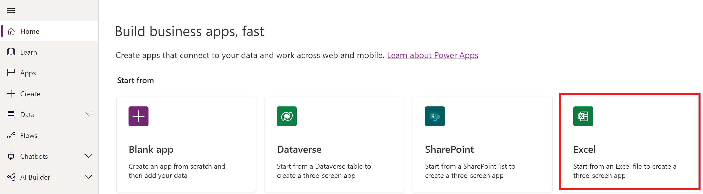
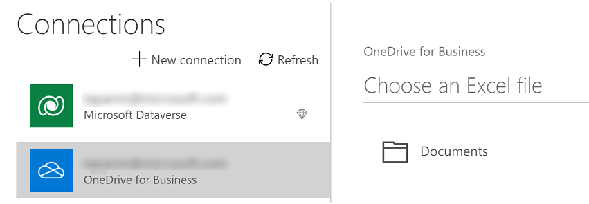
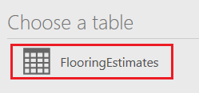
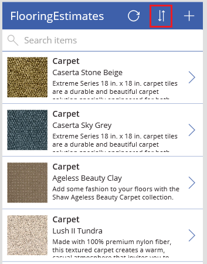
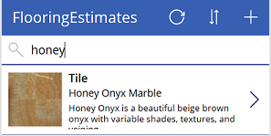

# Create a canvas app with data from an Excel file

In this topic, you'll create your first canvas app in Power Apps using data from an Excel table. You'll select an Excel file, create an app, and then run the app that you create. Every created app includes screens to browse records, show record details, and create or update records. By generating an app, you can quickly get a working app using Excel data, and then you can customize the app to better suit your needs. 

The Excel file must be in a cloud-storage account, such as OneDrive, Google Drive, or Dropbox. This topic uses OneDrive for Business.

If you don't have a license for Power Apps, you can [sign up for free](../signup-for-powerapps.md).

Watch this video to learn how to create a canvas app with data from an Excel file:
> [!VIDEO https://www.microsoft.com/videoplayer/embed/RWLj3l]

## Prerequisites

To follow this topic exactly, download the [Flooring Estimates](https://az787822.vo.msecnd.net/documentation/get-started-from-data/FlooringEstimates.xlsx) file in Excel, and save it in your [cloud storage account](connections/cloud-storage-blob-connections.md).

> [!IMPORTANT]
> - You can use your own Excel file, but the data must be formatted as a table. For more information, see [Format a table](how-to-excel-tips.md).
> - The method in this article uses the latest version of the connector. To learn about different methods and how they affect the version of connector being used, see [Popular connectors - connect to Excel from Power Apps](connections/connection-excel.md).

## Create the app

1. Sign in to [Power Apps](https://make.powerapps.com?utm_source=padocs&utm_medium=linkinadoc&utm_campaign=referralsfromdoc).

1. Under **Start from data**, select **Other data sources**.

    

1. Choose your connection, or select **New connection** to create, and then select **Create**.

    

1. Under **Choose an Excel file**, browse to **FlooringEstimates.xlsx**, and then click or tap it. 

1. Under **Choose a table**, click or tap **FlooringEstimates**, and then click or tap **Connect**.

    

## Run the app

1. Open Preview by pressing F5 (or by clicking or tapping the play icon near the upper-right corner).

    

1. Toggle the sort order by clicking or tapping the sort icon near the upper-right corner.

    

1. Filter the list by typing or pasting one or more characters in the search box.

    For example, type or paste **Honey** to show the only record for which that string appears in the product's name, category, or overview.

    

1. Add a record:

    1. Select the plus icon.

        

    1. Add whatever data you want, and then select the checkmark icon to save your changes.

        

1. Edit a record:

    1. Select the arrow for the record that you want to edit.

        

    1. Select the pencil icon.

        

    1. Update one or more fields, and then select the checkmark icon to save your changes.

        

        As an alternative, select the cancel icon to discard your changes.

1. Delete a record:

    1. Select the next arrow for the record that you want to delete.

        

    1. Select the trash icon.

        

## Next steps

Customize the default browse screen to better suit your needs. For example, you can sort and filter the list by product name only, not category or overview.

> [!div class="nextstepaction"]
> [Customize a default browse screen](customize-layout-sharepoint.md).

[!INCLUDE[footer-include](../../includes/footer-banner.md)]