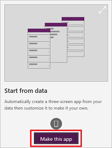

# Create an app from Excel in PowerApps
This topic shows how to automatically generate your first app using Excel table data within PowerApps. In this article, you select an Excel file, create an app, and then see what you created. Every generated app automatically includes screens to browse records, show record details, and create or update records. This is a quick way to get a working app using Excel data. You can also customize the app. 

The Excel file must be in a cloud-storage account, such as OneDrive, Google Drive, or Dropbox. This quickstart uses OneDrive for Business.

To follow this topic, download the [flooring estimates Excel file](https://az787822.vo.msecnd.net/documentation/get-started-from-data/FlooringEstimates.xlsx), and save it in your [cloud storage account](connections/cloud-storage-blob-connections.md). You can use your own Excel file if the data is [formatted as a table](https://support.office.com/article/Create-an-Excel-table-in-a-worksheet-E81AA349-B006-4F8A-9806-5AF9DF0AC664). 

If you don't have a license for PowerApps, you can [sign up for free](../signup-for-powerapps.md).

## Choose a table
1. Sign in to [PowerApps](https://web.powerapps.com).

    

1. Under **Make apps like these**, hover over **Start from data**, and then select **Make this app**.

	

1. Under **Start with your data**, click or tap the **Phone layout** on the tile for your cloud-storage account.

	

1. If prompted, click or tap **Connect**, and provide your credentials for that account.

1. Under **Choose an Excel file**, browse to **FlooringEstimates.xlsx**, and then click or tap it. 

1. Under **Choose a table**, click or tap **FlooringEstimates**, and then click or tap **Connect**.

	

## Run the app
1. Open Preview by pressing F5 (or by clicking or tapping the play icon near the upper-right corner).

	

1. Toggle the sort order by clicking or tapping the sort icon near the upper-right corner.

1. Filter the list by typing or pasting one or more characters in the search box.

1. Click or tap the plus icon to add a record, add whatever data you want, and then click or tap the checkmark icon to save your changes.

1. Click or tap the next arrow for the record that you added, update one or more fields, and then click or tap the checkmark icon to save your changes.

1. Click or tap the next arrow for the record that you added, update one or more fields, and then click or tap the cancel icon to discard your changes.

1. Click or tap the next arrow for the record that you added, and then click or tap the Trash icon to delete that record.

## Next steps
Customize the default browse screen to better suit your needs.

> [!div class="nextstepaction"]
> [Customize a default browse screen](customize-layout-sharepoint.md).