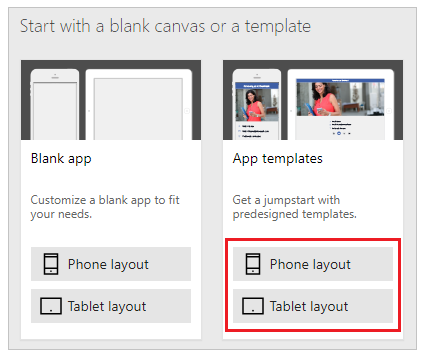
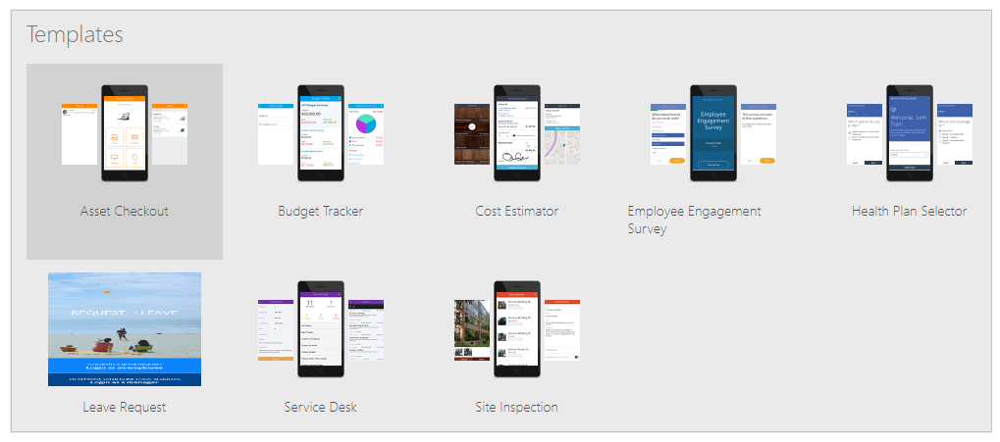

# Create a canvas app from a template in PowerApps

Create a canvas app automatically based on a template for a specific scenario, such as tracking budgets and scheduling vacations, and then run the app to understand its default behavior.

To create an app from a template, you need a cloud-storage account (such as DropBox, OneDrive, or Google Drive) to store the template's sample data.

If you don't have a license for PowerApps, you can [sign up for free](../signup-for-powerapps.md).

## Create an app

1. Sign in to [PowerApps](http://web.powerapps.com?utm_source=padocs&utm_medium=linkinadoc&utm_campaign=referralsfromdoc).

1. Under **Make your own app**, hover over **Start from data**, and then click or tap **Make this app**.

    

1. On the **App templates** tile, click or tap **Phone layout** or **Tablet layout**.

    

4. In the list of templates, click or tap a template, and then click or tap **Use** (near the lower-right corner).

    

    The sample data is copied to your cloud-storage account, the app is created, and its home page appears.

## Run the app
An app from a template opens in the default workspace, where you'll spend most of your time customizing. Before you make any changes to the app, explore how the app works in **Preview** mode.

1. Press F5 (or click or tap the right arrow in the upper-right corner) to open the app in **Preview** mode.

    

    The app is populated with sample data to demonstrate the functionality of the app. For example, the Cost Estimator app contains data for creating appointments and estimating the cost of installing a specific flooring product in a room of a particular size.

4. Explore the app's default behavior by creating, updating, and deleting sample data, and then verify that the data in your cloud-storage account reflects your changes.

    For example, make an appointment, and create a cost estimate in the Cost Estimator app.

5. Return to the default workspace by pressing Esc (or by clicking or tapping the **X** icon near the upper-right corner).

## Next steps
1. Press Ctrl-S, give your app a name, and then click or tap **Save** to save your app to the cloud.

1. [Share your app](share-app.md) with other people in your organization.

> [!IMPORTANT]
> Before you share an app, make sure that the people with whom you're sharing it have access to the data. For example, you must [share an Excel or other file](share-app-data.md) in a cloud-storage account.
