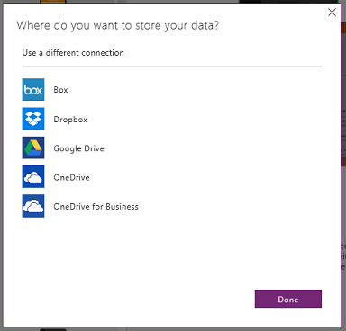

# Create and run an app from a template
Create an app automatically based on a template for specific scenario, and then run it to understand its default behavior. Experiment with how to customize an app, and then save and share it with others.

## Prerequisites
* [Sign up](signup-for-powerapps.md) for PowerApps, [install](http://aka.ms/powerappsinstall) it, open it, and then sign in by providing the same credentials that you used to sign up.

    > [!NOTE]
> To use this feature, make sure that you're running release 2.0.510 or later. To identify your release, open the **File** menu (along the left edge), click or tap **Account**, and then look under **Product information**.

* A cloud-storage account such as DropBox, OneDrive, or Google Drive.

## Create an app
1. From PowerApps Studio for Windows or PowerApps Studio for web, click or tap **New** (near the left edge of the screen).

    
2. On the **App templates** tile, click or tap **Phone layout**.

   > [!NOTE]
> You can also create an app from a template for a tablet layout, but this tutorial focuses on the phone option.

   

   A list of templates appears.

3. If you don't have a connection to a cloud-storage account:

   1. Near the bottom of the screen, click or tap **Choose**.

       
   2. Click or tap the account that you want to use.

       
   3. Provide your credentials, and then click or tap **Use** to grant access.

       Your connection appears near the bottom of the screen.

4. In the list of templates, click or tap a template, and then click or tap **Use** (near the lower-right corner).

    

    The sample data is copied to your cloud-storage account, the app is created, and its home page appears.

## Run the app
An app from a template opens in the default workspace, where you'll spend most of your time customizing. Before you make any changes to the app, follow the steps in this section to explore how the app works in **Preview** mode.

> [!TIP]
> Design and develop apps in the default workspace, but test them in **Preview** mode before you share them with others.

1. If you haven't used PowerApps before, take the intro tour (or click or tap **Skip**).

    

    You can always take the tour later by clicking or tapping the question-mark icon near the upper-right corner and then clicking or tapping **Take the intro tour**.

2. In the left navigation bar, click or tap the screen that's closest to the top.

3. Press F5 (or click or tap the right arrow in the upper-right corner) to open the app in **Preview** mode.

    

    The app is pre-populated with sample data to demonstrate the functionality of the app. For example, the Cost Estimator app contains data for creating appointments and estimating the cost of installing a specific flooring product in a room of a particular size.

4. Explore the app's default behavior, and verify that the data in your cloud account reflects your changes.

    For example, make an appointment, and create a cost estimate in the Cost Estimator app.

5. Return to the default workspace by selecting the **'X'** icon in the upper-right corner (under the PowerApps title bar).

    

## Customize the app
You can customize this or any app in these ways, among others:

* [change the screen size, orientation, or both](set-aspect-ratio-portrait-landscape.md)
* [add another data source](add-data-connection.md)
* [add one or more screens](add-screen-context-variables.md)
* [add and configure more controls](add-configure-controls.md)
* [change how the app behaves](working-with-formulas.md)

## Next steps
1. Press Ctrl-S, give your app a name, and then click or tap **Save** to save your app to the cloud.
2. [Share your app](share-app.md) with other people in your organization.

    > [!NOTE]
> Before you share an app, make sure that the people with whom you're sharing it have access to the data. For example, you must [share an Excel or other file](share-app-data.md) in a cloud-storage account.
