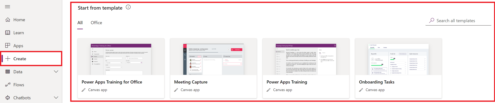

# What are canvas apps?

Design and build a business app from a canvas in Microsoft Power Apps without writing code in a traditional programming language such as C#. Design the app by dragging and dropping elements onto a canvas, just as you would design a slide in PowerPoint. Create Excel-like expressions for specifying logic and working with data. Build apps that integrate business data from a [wide variety of Microsoft and third-party sources](connections-list.md). Share your app so that users can run it in a browser or on a mobile device, and embed your app so that users can run it in SharePoint, Power BI, or Teams.

If you don't need a custom design and your data is in Microsoft Dataverse, you can automatically generate a model-driven app from your business data and processes. This type of app can model forms, views, and other components, and the default UI automatically adjusts to phones, laptops, and other devices. For more information about this type of app, see [Overview of building a model-driven app](../model-driven-apps/model-driven-app-overview.md).

If you are new to Power Apps, and want to learn about how to convert your ideas into a fully working solution using Power Apps, start with [Planning a Power Apps project](../../guidance/planning/introduction.md).

## Build an app
To get started, automatically generate an app from one of these sources, among others:
- [a sample app](open-and-run-a-sample-app.md)
- [a template](get-started-test-drive.md)
- [Dataverse](data-platform-create-app.md)
- [SharePoint](app-from-sharepoint.md)
- [Excel](get-started-create-from-data.md)

[Sign in](https://make.powerapps.com?utm_source=padocs&utm_medium=linkinadoc&utm_campaign=referralsfromdoc) to Power Apps, and then select **Start from data** or a sample app, such as **Service Desk** or **Budget Tracker**.

After you generate an app automatically, customize its default appearance and behavior based on your users' workflows. For example, change which types of data appear, how they're sorted, or even whether users specify a number by typing it or adjusting a slider. Add and customize [screens](add-screen-context-variables.md), [galleries](customize-layout-sharepoint.md), [forms](customize-forms-sharepoint.md), and other controls.

After you've generated an app or two automatically and gained some experience with customization, create an app from scratch based on [Dataverse](data-platform-create-app-scratch.md), [Excel](get-started-create-from-blank.md), or another data source. By working from the ground up, you gain flexibility in app design, flow, and controls, and you can incorporate a larger variety of data sources.

## Share and run an app
When you finish the app and save it to the cloud, [share it with others](share-app.md) in your organization. Specify which users or groups can run the app and whether they can also customize and share it with additional people in the organization.

Run your own apps - and any apps shared with you - on Windows, in a [web browser](../../user/run-app-browser.md), or on an [iOS or Android device](/powerapps/maker/canvas-apps/run-canvas-and-model-apps-on-mobile).

## Learn more
- Ready to convert your ideas into an app? Start here: [Planning a Power Apps project](../../guidance/planning/introduction.md)
- Explore the step-by-step, conceptual, and reference topics in the navigation pane on the left.
- Review [coding standards](https://aka.ms/powerappscanvasguidelines) for maximizing app performance and keeping apps easier to maintain.
- Check out the [webinars and video gallery](https://powerusers.microsoft.com/t5/Webinars-and-Video-Gallery/bd-p/VideoGallery?featured=yes) to help you leverage the features and functions of Power Apps.

## Share your experience
* Read and post in the [Power Apps Community](https://aka.ms/powerapps-community), where anyone who uses Power Apps can post a question and others can answer. Before you post a question, search the community to see whether your question has already been answered.
* Submit an idea for how we can improve Power Apps in [Power Apps Ideas](https://powerusers.microsoft.com/t5/PowerApps-Ideas/idb-p/PowerAppsIdeas).
* Create a [support ticket](https://powerapps.microsoft.com/support/pro/) to get technical assistance. If you're a Power Apps administrator for your organization, you can also open a support ticket in the [Power Platform admin center](https://admin.powerplatform.microsoft.com/support).

## Next steps
- [Planning a Power Apps project](../../guidance/planning/introduction.md)
- [Sign up for a free license](../signup-for-powerapps.md)
- [Sign in to Power Apps](https://make.powerapps.com?utm_source=padocs&utm_medium=linkinadoc&utm_campaign=referralsfromdoc)
- [Open a sample app](open-and-run-a-sample-app.md)

[!INCLUDE[footer-include](../../includes/footer-banner.md)]