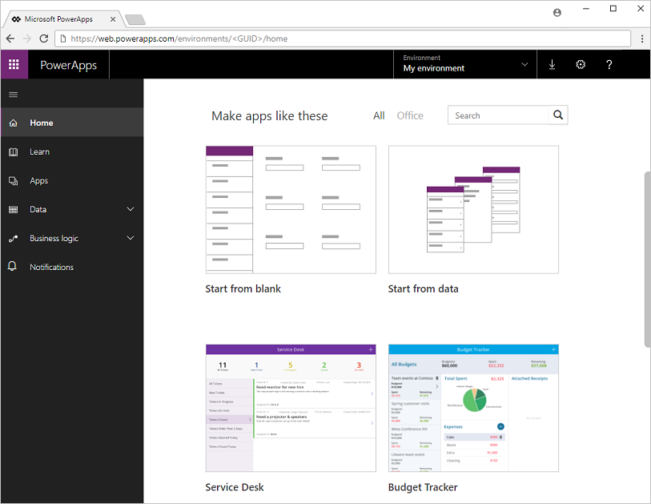

# Introduction to PowerApps
Welcome to PowerApps! PowerApps is a service that lets you build business apps that run in a browser or on a phone or tablet, and no coding experience is required. PowerApps combines visual drag-and-drop concepts from PowerPoint with Excel-like expressions for logic and working with data.

With PowerApps, you can integrate business data from a [wide variety of Microsoft and third-party sources](connections-list.md) into one powerful app. You can also create apps for users to run in SharePoint, Power BI, and Teams.

If you're new to app building, PowerApps provides templates and sample data that you can use to quickly build an app, and then you can customize the app to better suit your business needs. With some experience and creativity, you'll soon be developing your own apps from scratch. If you're a seasoned developer, you can take advantage of the advanced functionality and truly innovate. If you can imagine it, you can build it!

## Generate an app automatically
In PowerApps, you can easily generate an app automatically from these data sources, among others:

* [Common Data Service for Apps](data-platform-create-app.md)
* [SharePoint](app-from-sharepoint.md)
* [Excel](get-started-create-from-data.md)
* [SQL Server](connections/connection-azure-sqldatabase.md)
* [Salesforce](add-manage-connections.md)
* [Dynamics 365](connections/connection-dynamics-crmonline.md)

You can also [generate an app from a template](get-started-test-drive.md). Each template is based on fictitious data in a cloud account, such as Dropbox. Explore specific screens and UI elements (called [controls](reference-properties.md)) to understand how they're configured, and experiment with customization to discover techniques that you can apply to your own apps.

## Customize an app
When you generate an app automatically, PowerApps designs the default interface around your data, but you can customize the app's appearance and behavior based on your users' workflows. For example, you might want to change which types of data appear, how they're sorted, or even whether users specify a number by typing it or adjusting a slider. You can add and customize [screens](add-screen-context-variables.md), [galleries](customize-layout-sharepoint.md), [forms](customize-forms-sharepoint.md), and other controls to optimize your app's performance.

For ideas on how to improve your app even further, you can [open a sample app](open-and-run-a-sample-app.md) to get a sense of what you can do with some creativity and a bit of experience.

## Create an app from scratch
After you've generated an app or two automatically and gained some experience with customization, you can [create an app from scratch](get-started-create-from-blank.md). By working from the ground up, you gain flexibility in app design, flow, and controls, and you can incorporate a larger variety of data sources.

## Share and run an app
When you finish your app and save it to the cloud, you can then share it with others in your organization. You control the level of permissions on your app - you decide which users or groups can run the app, and whether they can also customize it or share it with additional people in the organization.

You can run your own apps - and any apps shared with you - on Windows, iOS, Android, or in a web browser.

For more information, check out the following topics:

* [Share an app with others](share-app.md)
* [Run apps in a web browser](../../user/run-app-browser.md)
* [Run apps on a phone or tablet](../../user/run-app-client.md)

## Get help and support
If you have a question about PowerApps, you can get help in several ways:

* Explore the step-by-step, conceptual, and reference topics in the navigation pane on the left.
* Work through the self-paced [Guided Learning courses](https://docs.microsoft.com/powerapps/guided-learning/).
* Read and post in the [PowerApps Community](https://aka.ms/powerapps-community), where anyone who uses PowerApps can post a question and others can answer. Before you post a question, search the community to see whether your question has already been answered.
* Check out the [upcoming webinars](webinars-listing.md#upcoming-webinars), which can help you leverage the features and functions of PowerApps. You can also access [past webinars](webinars-listing.md#past-webinars) on demand.
* Create a [support ticket](https://powerapps.microsoft.com/support/pro/) to get technical assistance. If you're a PowerApps administrator for your organization, you can also open a support ticket in the [PowerApps admin center](https://portal.office.com/Support/Support.aspx).

In addition, we want your help to make PowerApps even better!

* To submit an idea for how we can improve PowerApps, go to [PowerApps Ideas](https://powerusers.microsoft.com/t5/PowerApps-Ideas/idb-p/PowerAppsIdeas), and tell us about it.
* To report an issue that you're having with PowerApps, go to the [PowerApps Forum](https://powerusers.microsoft.com/t5/General-Discussion/bd-p/PowerAppsForum1), and provide details so that we can look into it.
