# Install and configure the Help Desk sample in Power Apps

Step-by-step instructions for, in Power Apps, installing and configuring the Help Desk sample for canvas apps.

Estimated time to complete these steps: **10-15 minutes**

> [!TIP]
> For a demonstration of installation and setup process, watch this [video](https://youtu.be/z4cdtD6hB_4).

## Overview of the sample

Help Desk provides a user-friendly experience to connect end users with support professionals. Quickly find answers to your most important questions, track progress of open tickets, and review details of previous requests. This app requires a small amount of setup to make it your own.

> [!TIP]
> For an end-to-end demonstration of how to use the Help Desk sample app, watch this [video](https://youtu.be/sl5fXwwnvzI).

## Prerequisites

- [Sign up](https://make.powerapps.com?utm_source=padocs&utm_medium=linkinadoc&utm_campaign=referralsfromdoc) for Power Apps.
- Must have a valid SharePoint Online license and permission to create lists.

## Create the HelpDesk SharePoint list

This list stores the Help Desk tickets.

1. Open a web browser.
1. Go to the SharePoint site where you want to create the HelpDesk list.
1. Sign in with an account that has permission to create lists.
1. Select the **gear icon** in the top-right portion of the web page.
1. Select **Add an app**.
1. In the **Find an app** textbox, enter **Custom**.
1. Select the **search icon**.
1. Select the **Custom List** app.
1. In the **Name** textbox, enter **HelpDesk**.

	> [!IMPORTANT]
	> If you choose a different name for the list make sure you write it down because you will need to substitute it for HelpDesk everywhere you see it during the installation and configuration process.

1. Select **Create**.

### Create Description column

1. Select the ellipsis next to the HelpDesk list and select **Settings**.
2. Select **Create column**.
3. In the Column name textbox, enter **Description**.
4. In the **type of information in this column is** radio button list, select **Multiple lines of text**.
5. In the **Require that this column contains information** radio button list, select **Yes**.
6. In the **Specify the type of text to allow** radio button list, select **Plain text**.
7. Select **OK**.

### Create Category column

1. Select **Create column**.
2. In the Column name textbox, enter **Category**.
3. In the **type of information in this column is** radio button list, select **Choice**.
4. In the **Type each choice on a separate line** textbox enter the following values, each on a separate line: 
	- LAPTOP / PC equipment issue
	- LAPTOP / PC software issue
5. In the **Enforce unique values** radio button list, select **No**.
6. In the **Display choices using** radio button list, select **Drop-down Menu**.
7. In the **Default value** textbox, enter **LAPTOP / PC equipment issue**.
8. Select **OK**.

### Create PercentComplete column

1. Select **Create column**.
2. In the Column name textbox, enter **PercentComplete**.
3. In the **Type of information in this column is** radio button list, select **Number (1, 10, 100)**.
4. In the **Require that this column contains information** radio button list, select **No**.
5. Select **OK**.

### Create Priority column

1. Select **Create column**.
2. In the Column name textbox, enter **Priority**.
3. In the **Type of information in this column is** radio button list, select **Choice**.
4. In the **Type each choice on a separate line** textbox enter the following values, each on a separate line:
	- HIGH
	- MEDIUM
	- LOW
5. In the **Enforce unique values** radio button list, select **No**.
6. In the **Display choices using** radio button list, select **Drop-down Menu**.
7. In the **Default value** textbox, enter **LOW**.
8. Select **OK**.

### Create TaskStatus column

1. Select **Create column**.
2. In the Column name textbox, enter **TaskStatus**.
3. In the **type of information in this column is** radio button list, select **Choice**.
4. In the **Type each choice on a separate line** textbox enter the following values, each on a separate line: 
	- NOT STARTED
	- IN PROGRESS
	- COMPLETED
	- DEFERRED
	- WAITING ON CSR
5. In the **Enforce unique values** radio button list, select **No**.
6. In the **Display choices using** radio button list, select **Drop-down Menu**.
7. In the **Default value** textbox, enter **NOT STARTED**.
8. Select **OK**.

### Create AssignedTo column

1. Select **Create column**.
2. In the Column name textbox, enter **AssignedTo**.
3. In the **type of information in this column is** radio button list, select **Person or Group**.
4. In the **Require that this column contains information** radio button list, select **No**.
5. In the **Allow multiple selections** radio button list, select **NO**.
6. Select **OK**.

### Edit 'Title' column

1. Select the **Title** column link.
2. In the **Require that this column contains information** radio button list, select **No**.
3. Select **OK**.

## Download the app

1.	[Download](https://pappsfeprodwestuscontent.blob.core.windows.net/sampleapps/helpdesk/docs/HelpDesk(SP_List).zip) the Power Apps package and save it to your machine.

## Create connections

1.	Sign in to [Power Apps](https://make.powerapps.com?utm_source=padocs&utm_medium=linkinadoc&utm_campaign=referralsfromdoc).
2.	Sign in by providing the same credentials that you used to sign up.
3.	In the menu on the left, select **Data** then **Connections**.
	
### Create Office 365 Outlook connection

1.	Select **+ New connection**.
2.	In the **Search** textbox, enter **Office 365 Outlook**.
3.	Select **Office 365 Outlook** in the list.
4.	Select **Create**.
5.	In the popup window, select the account you logged in with.

### Create SharePoint connection

1.	Select **+ New connection**.
2.	In the **Search** textbox, enter **SharePoint**.
3.	Select **SharePoint** in the list.
4.	Select **Create**.
5.	In the popup window, select the account you logged in with.

### Create Office 365 Users connection

1.	Select **+ New connection**.
2.	In the **Search** textbox, enter **office 365 users**.
3.	Select **Office 365 Users** in the list.
4.	Select **Create**.
5.	In the popup window, select the account you logged in with.

## Import the app

1. Sign in to [Power Apps](https://make.powerapps.com).
2. Sign in by providing the same credentials that you used to sign up.
3. In the menu on the left, select **Apps**. 
4. Select **Import package(preview)**.
	
   

5. Select the **Upload** button and select the package that you downloaded in the previous steps.
6. For the **App** and **Flow** resource types, set **IMPORT SETUP** to **Create as new**.
7. For the **SharePoint** and **Outlook** connections, set **IMPORT SETUP** to **Select during import**.
	
   

8. Select the **red icon** for the **SharePoint Connection**.
9. In the connections list, select the item with your username.

   

10. Select **Save**.
11. Select the **red icon** for the **Office 365 Outlook Connection**.
12. In the connections list, select the item with your username.

	

13. Select **Save**.

	> [!TIP] 
	> When you are done, it will look like this.

	

14.	Select **Import** and wait until the process is complete.

	

## Configure the app to use the SharePoint list

1. Under Next steps, select **Open app**.
2. Select **Allow** when prompted for permission.

    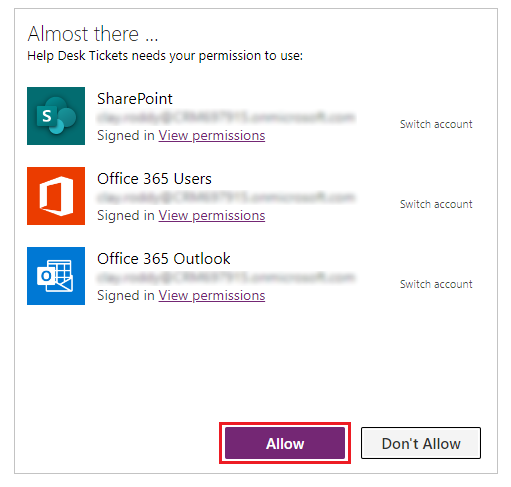

### Delete connections

1. On the **View** tab, select **Data sources**.

    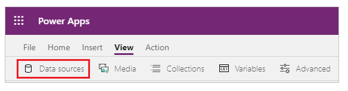
 
1. In the **Data** pane, select the ellipsis (...) next to **HelpDesk**, and then select **Remove**.

    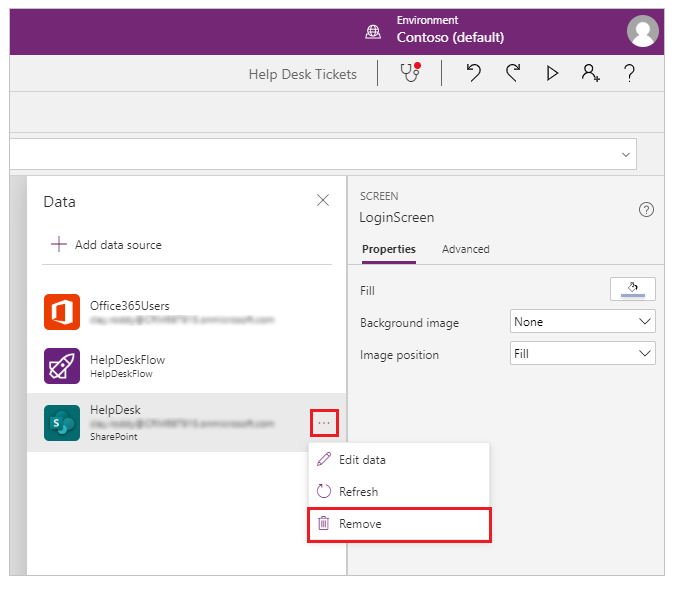

### HelpDesk list

1. On the **View** tab, select **Data sources**.
1. In the **Data** pane, select **Add data source**.
1. Select the SharePoint connection created [earlier](#create-sharepoint-connection).

    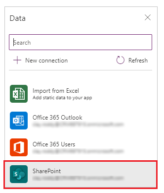

1. In the **Recent sites** list, select the SharePoint site where you created the HelpDesk List.

    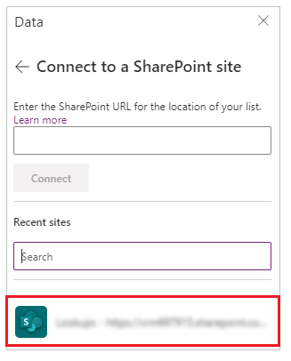

    > [!TIP]
    > If the site doesn't appear in the list, type or paste the URL to the SharePoint site in the textbox, and then select **Go**.

1. Select the **HelpDesk** list. You can also use the search box and enter **Helpdesk** to filter the results.

1. Select the checkbox next to **HelpDesk**, and then select **Connect**.

    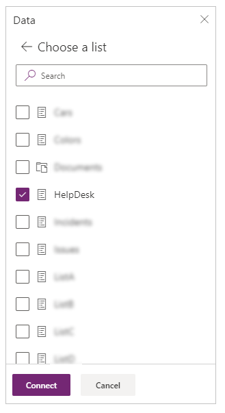

### Update admin list

1. Select **App** from the tree view.
2. Select **OnStart** in the top dropdown property list.
3. Expand the formula window and find the **AdminList** collection.
4. Replace <strong>user@microsoft.com</strong> with your HelpDesk administrator(s).

	
	
   > [!TIP]
   > If you have more than one administrator, use a comma to delimit the list of administrators. Example:
   > "admin1@microsoft.com","admin2@microsoft.com".
   > To ensure the addresses in the AdminList match the format Power Apps expects, select
   > View > Variables > Global > MyProfile and look at the 'Mail' column to see the expected email format.

1. Select **File** > **Save** > **Publish** > **Publish this version** to [save and publish](save-publish-app.md) the app.

## Modify the flow

1.	Sign in to [Power Apps](https://make.powerapps.com).
1.  Select **Flows** from left pane.

    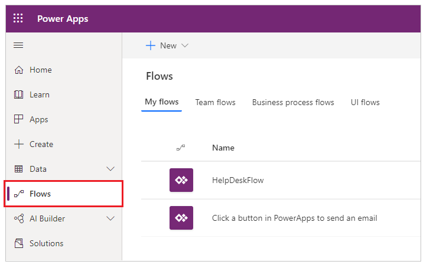

4.	Next to the **HelpDeskFlow** Flow, select the pencil icon to edit the flow.
 
	

5.	Expand the **Get items** action.

    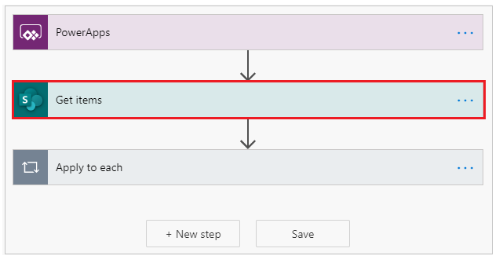
 
6.	Change the **Site Address** and **List Name** to match the HelpDesk SharePoint list you created.
	
	

1.  Expand **Apply to each** action.

    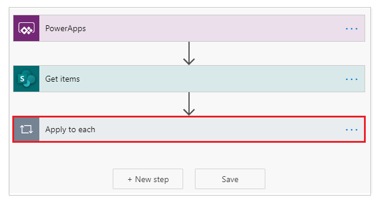

7.	Expand **Switch**.

    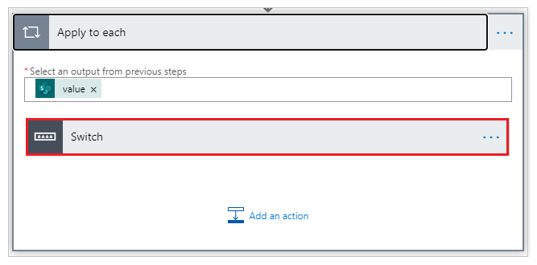

8.	Expand the **NOT STARTED** case.
9.  Expand the **Case not started notification** action.

    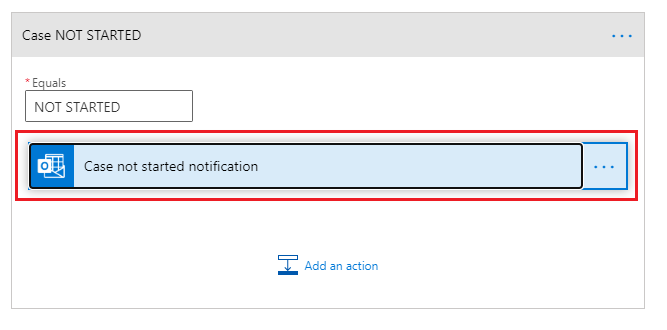

10.	Change the **To** to match the HelpDesk admin email.

	

11.	Select **Save** to save the changes to the flow.

    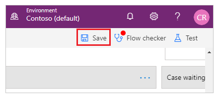 

## Play the app

1. Sign in to [Power Apps](https://make.powerapps.com).
1. Select the **Help Desk Tickets** app to play.

    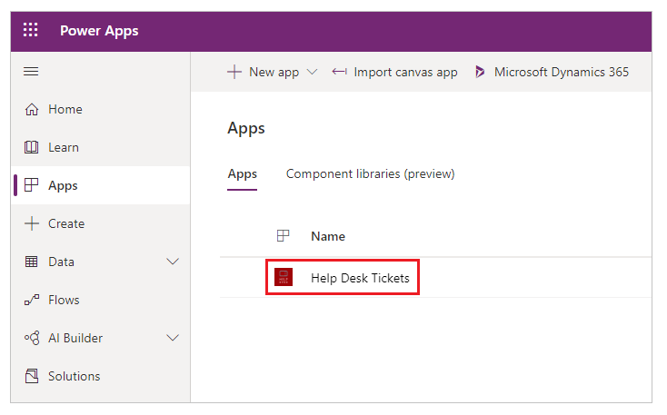 

> [!TIP]
> Watch this [video](https://youtu.be/sl5fXwwnvzI) to see how to use the Help Desk Tickets sample app.

## Next steps

- [Share a canvas app](share-app.md)

### See also

- [SharePoint integration scenarios](sharepoint/scenarios-intro.md)
- [Customize a SharePoint list form](customize-list-form.md)
- [Add and configure a control](add-configure-controls.md)
- [Edit and manage permissions for a SharePoint list or library](https://support.office.com/article/edit-and-manage-permissions-for-a-sharepoint-list-or-library-02d770f3-59eb-4910-a608-5f84cc297782)

[!INCLUDE[footer-include](../../includes/footer-banner.md)]